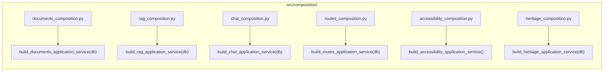
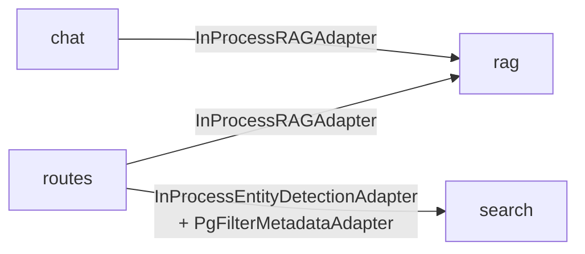
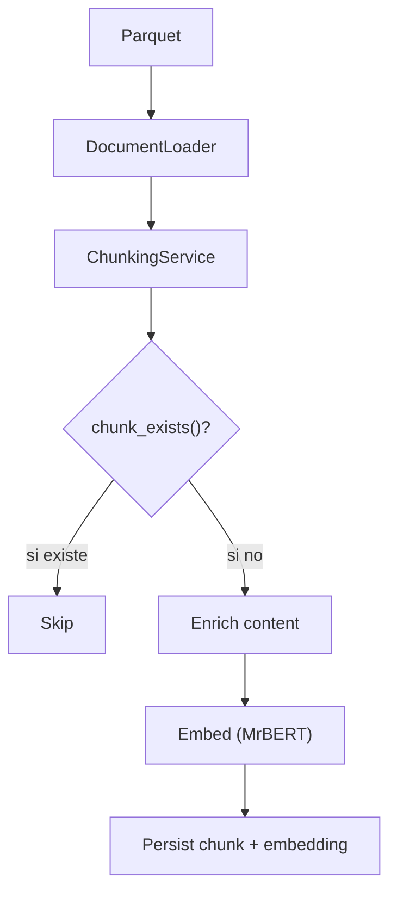

# Arquitectura del backend

El backend sigue estrictamente **arquitectura hexagonal (Ports & Adapters)** con 4 capas.

## Capas

| Capa | Directorio | Responsabilidad | Depende de |
|------|-----------|-----------------|------------|
| **Domain** | `src/domain/{context}/` | Entidades, value objects, puertos (interfaces), servicios de dominio | Nada |
| **Application** | `src/application/{context}/` | Use cases, DTOs, servicios de aplicación | Domain |
| **Infrastructure** | `src/infrastructure/{context}/` | Adaptadores concretos (BD, HTTP, LLM) | Domain, libs externas |
| **API** | `src/api/v1/endpoints/{context}/` | Schemas Pydantic, endpoints FastAPI, deps | Application |

**Regla clave:** Domain y Application nunca importan de Infrastructure. Los use cases reciben puertos abstractos; los adaptadores concretos se inyectan en la capa de composición.

## Bounded contexts

| Contexto | Descripción | Puertos |
|----------|-------------|---------|
| `documents` | Ingesta de parquets, chunking, embedding, persistencia | `DocumentLoader`, `EmbeddingPort`, `DocumentRepository` |
| `rag` | Pipeline de recuperación: embed → search → rerank → LLM | `EmbeddingPort`, `VectorSearchPort`, `TextSearchPort`, `LLMPort` |
| `chat` | Sesiones de conversación con historial | `ChatRepository`, `RAGPort`, `ConversationalLLMPort` |
| `routes` | Rutas virtuales con extracción de query por LLM, selección de paradas previa, narrativa JSON por parada, enriquecimiento con imágenes/coordenadas, y guía interactiva | `RAGPort`, `RouteRepository`, `LLMPort`, `EntityDetectionPort`, `FilterMetadataPort`, `HeritageAssetLookupPort` |
| `accessibility` | Simplificación Lectura Fácil | `LLMPort` |
| `heritage` | Assets enriquecidos de la API IAPH | `HeritageRepository` |

## Puertos (interfaces abstractas)

### Documents

```python
# domain/documents/ports/document_loader.py
class DocumentLoader(ABC):
    def load_documents(source_path, heritage_type) -> Iterator[Document]

# domain/documents/ports/embedding_port.py
class EmbeddingPort(ABC):
    def embed(texts: list[str]) -> list[list[float]]

# domain/documents/ports/document_repository.py
class DocumentRepository(ABC):
    def save_chunk_with_embedding(document, chunk, embedding) -> None
    def chunk_exists(document_id, chunk_index) -> bool
    def get_chunks_by_document(document_id) -> list[Chunk]
    def commit() -> None
```

### RAG

```python
# domain/rag/ports/vector_search_port.py
class VectorSearchPort(ABC):
    def search(query_embedding, top_k, heritage_type?, province?) -> list[RetrievedChunk]

# domain/rag/ports/text_search_port.py
class TextSearchPort(ABC):
    def search(query, top_k, heritage_type?, province?) -> list[RetrievedChunk]

# domain/rag/ports/llm_port.py
class LLMPort(ABC):
    def generate(system_prompt, user_prompt, context_chunks) -> str
```

### Chat

```python
# domain/chat/ports/chat_repository.py
class ChatRepository(ABC):
    def create_session(title) -> ChatSession
    def get_session(session_id) -> ChatSession | None
    def list_sessions() -> list[ChatSession]
    def delete_session(session_id) -> None
    def add_message(session_id, role, content, sources) -> Message
    def get_messages(session_id) -> list[Message]

# domain/chat/ports/rag_port.py
class RAGPort(ABC):
    def query(question, top_k, heritage_type_filter?, province_filter?) -> tuple[str, list[dict]]
```

### Heritage

```python
# domain/heritage/ports/heritage_repository.py
class HeritageRepository(ABC):
    def get_asset(asset_id) -> HeritageAsset | None
    def list_assets(heritage_type?, province?, municipality?, limit, offset) -> list[HeritageAsset]
    def count_assets(heritage_type?, province?, municipality?) -> int
```

## Adaptadores (implementaciones)

| Puerto | Adaptador | Tecnología |
|--------|----------|------------|
| `EmbeddingPort` | `HttpEmbeddingAdapter` | HTTP → servicio MrBERT (puerto 8001) |
| `VectorSearchPort` | `PgVectorSearchAdapter` | pgvector `<=>` coseno |
| `TextSearchPort` | `PgTextSearchAdapter` | PostgreSQL `tsvector` + `plainto_tsquery('spanish')` |
| `LLMPort` (RAG) | `VLLMAdapter` / `GeminiLLMAdapter` | vLLM o Gemini (según `LLM_PROVIDER`) |
| `LLMPort` (Routes) | `VLLMRoutesAdapter` / `GeminiRoutesAdapter` | vLLM con JSON guiado o Gemini |
| `ConversationalLLMPort` | `ConversationalLLMAdapter` / `GeminiConversationalAdapter` | vLLM o Gemini, max_tokens=128 |
| `LLMPort` (Accessibility) | `AccessibilityLLMAdapter` | vLLM, prompts Lectura Fácil |
| `DocumentLoader` | `ParquetDocumentLoader` | pandas + pyarrow |
| `DocumentRepository` | `SqlAlchemyDocumentRepository` | SQLAlchemy async |
| `ChatRepository` | `ChatRepositoryImpl` | SQLAlchemy async |
| `RouteRepository` | `SqlAlchemyRouteRepository` | SQLAlchemy async |
| `HeritageRepository` | `SqlAlchemyHeritageRepository` | SQLAlchemy async + `parse_raw_data()` |
| `RAGPort` (Chat/Routes) | `InProcessRAGAdapter` | Invoca `RAGApplicationService` en proceso |
| `EntityDetectionPort` (Routes) | `InProcessEntityDetectionAdapter` | Invoca `SearchApplicationService` en proceso |
| `HeritageAssetLookupPort` (Routes) | `PgHeritageAssetLookupAdapter` | SQLAlchemy async — imágenes, coordenadas y descripciones completas de heritage_assets |
| `FilterMetadataPort` (Routes/Search) | `PgFilterMetadataAdapter` | SQLAlchemy async — distinct values de heritage_assets |

## Composición (inyección de dependencias)

No se usa framework DI. Cada contexto tiene una función en `src/composition/` que construye el árbol de dependencias manualmente:



Cada endpoint de FastAPI usa `Depends()` para invocar la función de composición:

```python
# api/v1/endpoints/{context}/deps.py
async def get_{context}_service(db = Depends(get_db)):
    return build_{context}_application_service(db)
```

### Dependencias entre contextos



Chat y Routes reutilizan el pipeline RAG completo sin HTTP, a través de `InProcessRAGAdapter` que envuelve `RAGApplicationService`. En Routes, el RAG solo se usa para la **generación** de rutas (recuperar chunks patrimoniales); la **guía interactiva** ya no depende de RAG — en su lugar, enriquece cada parada con descripciones completas de `heritage_assets` vía `HeritageAssetLookupPort`. Routes también depende de Search para la detección de entidades (`InProcessEntityDetectionAdapter` envuelve `SearchApplicationService`) y para obtener valores de filtros (`PgFilterMetadataAdapter`). Routes usa `HeritageAssetLookupPort` (via `PgHeritageAssetLookupAdapter`) para enriquecer las paradas con imágenes, coordenadas y descripciones completas de `heritage_assets`.

## Base de datos

- **Engine:** SQLAlchemy async con `asyncpg`
- **Sesión:** `AsyncSessionLocal` (request-scoped via `get_db()`)
- **Migraciones:** Alembic en `alembic/`
- **Extensiones:** pgvector (búsqueda vectorial), tsvector (full-text)

## Patrón de ingesta idempotente



La ingesta se puede re-ejecutar sin duplicar datos.
