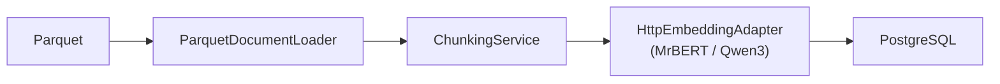
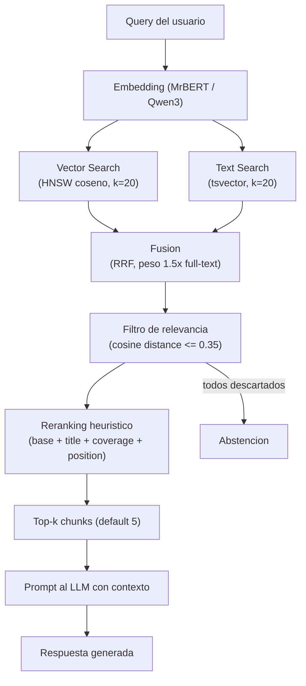

# Modelo de datos

Resumen de los datos almacenados en PostgreSQL (pgvector) por el sistema RAG del IAPH.

## Corpus de origen

Cuatro ficheros parquet de la Guía Digital del Patrimonio de Andalucía (~134K registros, ~66M tokens):

| Dataset | Registros | Tokens | Descripción | Columnas relevantes |
|---------|-----------|--------|-------------|---------------------|
| **Paisaje_Cultural** | 117 | 119K | Demarcaciones paisajísticas de interés cultural | id, url, title, province, landscape_demarcation, area, topic, description, text |
| **Patrimonio_Inmaterial** | ~2K | 5M | Festividades, oficios, saberes tradicionales | id, url, code, title, subject_topic, activity_types, province, district, municipality, date, frequency, description, sources, text |
| **Patrimonio_Inmueble** | ~30K | 20M | Edificios, yacimientos arqueológicos, monumentos | id, url, title, code, characterisation, province, municipality, description, sources, text |
| **Patrimonio_Mueble** | ~100K | 41M | Objetos, obras de arte, documentos, utensilios | id, url, title, code, province, municipality, property, type, disciplines, historic_periods, styles, chronology, iconographies, authors, description, materials, techniques, dimensions, protection, sources, text |

Licencia: uso comercial permitido en todos los casos.

## Tablas en base de datos

### `document_chunks_v1` / `document_chunks_v2` / `document_chunks_v3` / `document_chunks_v4` — Chunks del corpus

Tabla principal del sistema RAG. Cada fila es un fragmento de texto de un bien patrimonial con su embedding vectorial.

| Columna | Tipo | Nullable | Versión | Descripción |
|---------|------|----------|---------|-------------|
| `id` | UUID | NO | v1+ | PK, auto-generado |
| `document_id` | String | NO | v1+ | Identificador del registro en el parquet de origen |
| `heritage_type` | String | NO | v1+ | Tipo patrimonial: `paisaje_cultural`, `patrimonio_inmaterial`, `patrimonio_inmueble`, `patrimonio_mueble` |
| `title` | String | NO | v1+ | Nombre del bien patrimonial |
| `province` | String | NO | v1+ | Provincia andaluza (8 posibles) |
| `municipality` | String | SÍ | v1+ | Municipio (nulo en paisajes culturales) |
| `url` | String | NO | v1+ | Enlace a la ficha en la Guía Digital del IAPH |
| `chunk_index` | Integer | NO | v1+ | Índice secuencial del chunk dentro del documento (base 0) |
| `content` | Text | NO | v1+ | Texto del chunk (en v3 incluye cabecera tipo-específica; en v4 incluye plantilla en lenguaje natural) |
| `token_count` | Integer | NO | v1+ | Conteo de palabras del chunk |
| `embedding` | Vector(`EMBEDDING_DIM`) | NO | v1+ | Embedding vectorial (dimensión configurable: 768 para MrBERT, 1024 para Qwen3) |
| `created_at` | DateTime(tz) | NO | v1+ | Timestamp de creación |
| `search_vector` | tsvector | SÍ | v2+ | Vector de búsqueda full-text (pesos: title='A', content='B'). Actualizado por trigger PL/pgSQL |
| `metadata` | JSONB | SÍ | **v3+** | Campos extra del parquet original (ver detalle por tipo abajo) |

**Índices:**
- B-tree sobre `document_id` — búsqueda por documento
- HNSW sobre `embedding` — búsqueda vectorial por similitud coseno
- GIN sobre `search_vector` — búsqueda full-text (v2+)
- GIN sobre `metadata` — consultas JSONB (v3+)

**Versionado:** Coexisten v1, v2, v3 y v4 (ver `docs/CHUNKS_VERSIONS.md`). Se selecciona mediante `CHUNKS_TABLE_VERSION` en `.env`.

| Versión | Estrategia | Tamaño chunk | Overlap | Enrichment en content | Columna metadata | Registros |
|---------|------------|--------------|---------|----------------------|-----------------|-----------|
| v1 | Ventana fija de palabras | 512 | 64 | No | No | ~149,290 |
| v2 | Por párrafos (`\n\n`) | 1024 | 128 | Básico (título, tipo, provincia) | No | Pendiente |
| v3 | Por párrafos (`\n\n`) | 1024 | 128 | Tipo-específico (autores, estilos, cronología...) | Sí (JSONB) | Pendiente |
| v4 | Por párrafos (`\n\n`) | 1024 | 128 | Plantilla en lenguaje natural por tipo | Sí (JSONB) | Pendiente |

### Contenido de la columna `metadata` JSONB (v3/v4) por tipo de activo

Todos los campos extra del parquet se almacenan en el JSON. Los campos marcados con **E** también se incluyen en la cabecera del `content` (enrichment para embedding + full-text).

| Campo | P. Mueble | P. Inmueble | P. Inmaterial | Paisaje Cultural | En content |
|-------|:---------:|:-----------:|:-------------:|:----------------:|:----------:|
| `code` | x | x | x | | |
| `authors` | x | | | | **E** |
| `styles` | x | | | | **E** |
| `historic_periods` | x | | | | **E** |
| `chronology` | x | | | | **E** |
| `materials` | x | | | | **E** |
| `techniques` | x | | | | **E** |
| `type` | x | | | | **E** |
| `protection` | x | x | | | **E** |
| `iconographies` | x | | | | **E** |
| `property` | x | | | | |
| `disciplines` | x | | | | |
| `dimensions` | x | | | | |
| `description` | x | x | x | x | |
| `sources` | x | x | x | | |
| `characterisation` | | x | | | **E** |
| `activity_types` | | | x | | **E** |
| `subject_topic` | | | x | | **E** |
| `topic` | | | | x | **E** |
| `landscape_demarcation` | | | | x | **E** |
| `area` | | | | x | |
| `district` | | | x | | |
| `date` | | | x | | |
| `frequency` | | | x | | |

### `heritage_assets` — Datos enriquecidos de la API del IAPH

Almacena los datos completos de cada bien patrimonial obtenidos de la API de la Guía Digital del IAPH. Se relaciona con `document_chunks` a través del campo `id` (numérico): el `document_id` de los chunks tiene formato `ficha-{tipo}-{id}`, donde `{id}` coincide con `heritage_assets.id`.

| Columna | Tipo | Nullable | Descripción |
|---------|------|----------|-------------|
| `id` | String | NO | PK. ID del bien en la API (ej. `186297` para inmueble) |
| `heritage_type` | String | NO | Tipo: `inmueble`, `mueble`, `inmaterial`, `paisaje` |
| `denomination` | String | SÍ | Nombre/denominación del bien |
| `province` | String | SÍ | Provincia |
| `municipality` | String | SÍ | Municipio |
| `latitude` | Float | SÍ | Latitud (solo inmueble, parcial). Nota: en la API el campo se llama `longitud_s` (nombres invertidos) |
| `longitude` | Float | SÍ | Longitud. En la API se llama `latitud_s` |
| `image_url` | String | SÍ | URL de la imagen principal |
| `image_ids` | String[] | SÍ | UUIDs de imágenes asociadas |
| `protection` | String | SÍ | Estado de protección legal |
| `raw_data` | JSONB | NO | JSON completo de la API (sin imagen base64). Ver esquema tipado abajo |
| `created_at` | DateTime(tz) | NO | Timestamp de creación |
| `updated_at` | DateTime(tz) | NO | Última actualización |

**Índices:** B-tree sobre `heritage_type` y `province`, GIN sobre `raw_data`.

**Relación con chunks:** `heritage_assets.id` ↔ parte numérica de `document_chunks.document_id`. Ejemplo: asset `id='20831'` corresponde a chunks con `document_id='ficha-inmueble-20831'`.

**Carga de datos:**
- Desde JSON descargados: `cd backend && make load-assets`
- Desde API en vivo: `cd backend && IAPH_API_TOKEN=xxx make fetch-assets`

**API:** `GET /api/v1/heritage` (listado paginado con filtros) y `GET /api/v1/heritage/{id}` (detalle con `raw_data` parseado a modelo tipado).

#### Esquema tipado de `raw_data` por tipo patrimonial

La columna `raw_data` almacena el JSON original de la API del IAPH (limpio de `imagen_base64` y `_version_`). Al exponer vía API, se parsea a un modelo tipado (`details`) cuyo esquema varía según `heritage_type`. Los campos Solr originales (ej. `identifica.denominacion_s`) se mapean a nombres legibles.

**Estructuras compartidas:**

| Estructura | Campos | Descripción |
|------------|--------|-------------|
| `ImageInfo` | `id`, `title`, `author`, `date`, `url` | Imagen asociada al bien. URL construida: `https://guiadigital.iaph.es/sites/default/files/{id}` |
| `BibliographyEntry` | `title`, `author`, `publisher`, `year`, `isbn`, `pages`, `location` | Referencia bibliográfica |
| `TypologyInfo` | `typology`, `style`, `period`, `chrono_start`, `chrono_end` | Clasificación tipológica y cronológica |
| `RelatedAsset` | `code`, `denomination`, `relation_type` | Bien patrimonial relacionado (ej. `PERTENECE`) |

##### Inmueble (`heritage_type = "inmueble"`)

~29,500 registros. Estructura más completa y consistente.

| Campo tipado | Campo Solr original | Tipo | Descripción |
|-------------|---------------------|------|-------------|
| `code` | `identifica.codigo_s` | string | Código SIPHA |
| `other_denominations` | `identifica.otr_denom_s` | string | Otras denominaciones |
| `characterisation` | `identifica.caracterizacion_s` | string | Categorización (ej. "Arquitectónica, Etnológica") |
| `postal_address` | `identifica.dir_postal_s` | string | Dirección postal |
| `historical_data` | `identifica.dat_historico_s` | string | Datos históricos |
| `description` | `clob.descripcion_s` | string | Descripción completa |
| `protection` | `proteccion_s` | string | Estado de protección legal |
| `typologies` | `tipologia.*_smv` | TypologyInfo[] | Tipologías, estilos, periodos |
| `images` | `imagen.*_smv` | ImageInfo[] | Imágenes asociadas |
| `bibliography` | `bibliografia.*_smv` | BibliographyEntry[] | Referencias bibliográficas |
| `related_assets` | `codigo.*_smv` | RelatedAsset[] | Bienes relacionados |
| `historical_periods` | `pHistorico_smv` | string[] | Periodos históricos |

##### Mueble (`heritage_type = "mueble"`)

~107,700 registros. **Atención:** la mayoría de registros contienen solo campos mínimos (`id`, `tipo_contenido`). Solo un subconjunto tiene metadata rica.

| Campo tipado | Campo Solr original | Tipo | Descripción |
|-------------|---------------------|------|-------------|
| `code` | `identifica.codigo_s` | string | Código SIPHA |
| `other_denominations` | `identifica.otr_denom_s` | string | Otras denominaciones |
| `characterisation` | `identifica.caracterizacion_s` | string | Categorización |
| `measurements` | `identifica.medidas_s` | string | Medidas/dimensiones |
| `chronology` | `identifica.cronologia_s` | string | Cronología textual |
| `description` | `clob.descripcion_s` | string | Descripción completa |
| `protection` | `proteccion_s` | string | Estado de protección legal |
| `typologies` | `tipologia.*_smv` | TypologyInfo[] | Tipologías, estilos, periodos |
| `images` | `imagen.*_smv` | ImageInfo[] | Imágenes asociadas |
| `bibliography` | `bibliografia.*_smv` | BibliographyEntry[] | Referencias bibliográficas |
| `related_assets` | `codigo.*_smv` | RelatedAsset[] | Bienes relacionados |

##### Inmaterial (`heritage_type = "inmaterial"`)

~1,900 registros. Mayor riqueza de campos descriptivos (126 campos Solr).

| Campo tipado | Campo Solr original | Tipo | Descripción |
|-------------|---------------------|------|-------------|
| `code` | `identifica.codigo_s` | string | Código SIPHA |
| `other_denominations` | `identifica.otr_denom_s` | string | Otras denominaciones |
| `scope` | `identifica.ambito_s` | string | Ámbito temático (ej. "Rituales festivos") |
| `framework_activities` | `identifica.actmarco_s` | string | Actividades marco |
| `activity_dates` | `identifica.fechasact_s` | string | Fechas de actividad |
| `periodicity` | `identifica.periodicidad_s` | string | Periodicidad (ej. "Anual") |
| `typologies_text` | `identifica.tipologias_s` | string | Tipologías como texto libre |
| `district` | `identifica.comarca_s` | string | Comarca |
| `local_entity` | `identifica.entlocal_s` | string | Entidad local |
| `description` | `clob.descripcion_s` | string | Descripción principal |
| `development` | `clob.desarrollo_s` | string | Desarrollo/despliegue |
| `spatial_description` | `clob.desc_espacio_s` | string | Descripción del espacio |
| `agents_description` | `clob.descripcionagentes_s` | string | Descripción de agentes |
| `evolution` | `clob.evolucion_s` | string | Evolución a lo largo del tiempo |
| `origins` | `clob.origenes_s` | string | Orígenes |
| `preparations` | `clob.preparativos_s` | string | Preparativos |
| `clothing` | `clob.indumentaria_s` | string | Indumentaria |
| `instruments` | `clob.instrumentos_s` | string | Instrumentos |
| `transmission_mode` | `clob.modotransmision_s` | string | Modo de transmisión |
| `transformations` | `clob.transformaciones_s` | string | Transformaciones |
| `protection` | `proteccion_s` | string | Estado de protección |
| `typologies` | `tipologia.*_smv` | TypologyInfo[] | Tipologías |
| `images` | `imagen.*_smv` | ImageInfo[] | Imágenes |
| `bibliography` | `bibliografia.*_smv` | BibliographyEntry[] | Bibliografía |
| `related_assets` | `codigo.*_smv` | RelatedAsset[] | Bienes relacionados |

##### Paisaje (`heritage_type = "paisaje"`)

117 registros. Estructura mínima — la información detallada está en los PDFs enlazados.

| Campo tipado | Campo Solr original | Tipo | Descripción |
|-------------|---------------------|------|-------------|
| `pdf_url` | `pdf_url` | string | URL al PDF completo del paisaje |
| `search_terms` | `busqueda_generica` | string[] | Términos de búsqueda genéricos |

**Nota:** Campos como `demarcacion_paisajistica`, `area`, `descripcion` no están en la API sino que se extraen del PDF.

#### Mapeo de campos Solr → campos tipados (referencia técnica)

El parser vive en `src/domain/heritage/value_objects/raw_data.py`. Las funciones `_parse_images`, `_parse_bibliography`, `_parse_typologies` y `_parse_related_assets` ensamblan arrays paralelos del Solr (ej. `imagen.id_img_smv[0]` + `imagen.titulo_smv[0]` → un `ImageInfo`) en objetos tipados.

### `chat_sessions` — Sesiones de conversación

| Columna | Tipo | Nullable | Descripción |
|---------|------|----------|-------------|
| `id` | UUID | NO | PK |
| `title` | String | NO | Título de la sesión |
| `created_at` | DateTime(tz) | NO | Creación |
| `updated_at` | DateTime(tz) | NO | Última actualización (auto-update) |

### `chat_messages` — Mensajes de chat

| Columna | Tipo | Nullable | Descripción |
|---------|------|----------|-------------|
| `id` | UUID | NO | PK |
| `session_id` | UUID | NO | FK → `chat_sessions.id` (CASCADE delete) |
| `role` | String | NO | `"user"` o `"assistant"` |
| `content` | Text | NO | Texto del mensaje |
| `sources` | JSON | NO | Lista de fuentes recuperadas por el RAG (metadata de los chunks usados) |
| `created_at` | DateTime(tz) | NO | Timestamp |

**Índice:** B-tree sobre `session_id`.

### `virtual_routes` — Rutas virtuales generadas

| Columna | Tipo | Nullable | Descripción |
|---------|------|----------|-------------|
| `id` | UUID | NO | PK |
| `title` | String | NO | Nombre/tema de la ruta |
| `province` | String | NO | Provincia principal |
| `narrative` | Text | NO | Narrativa descriptiva completa de la ruta (compuesta de introducción + segmentos + conclusión) |
| `introduction` | Text | SÍ | Párrafo introductorio generado por el LLM |
| `conclusion` | Text | SÍ | Párrafo de cierre generado por el LLM |
| `total_duration_minutes` | Integer | NO | Duración estimada total |
| `stops` | JSON | NO | Array de paradas (ver estructura abajo) |
| `created_at` | DateTime(tz) | NO | Timestamp |

**Índice:** B-tree sobre `province`.

**Estructura de cada parada** (elemento del array `stops`):
```json
{
  "order": 1,
  "title": "Nombre del bien",
  "heritage_type": "patrimonio_inmueble",
  "province": "Jaén",
  "municipality": "Úbeda",
  "url": "https://guiadigital.iaph.es/...",
  "description": "Descripción resumida del bien (máx 500 chars)...",
  "visit_duration_minutes": 45,
  "heritage_asset_id": "20831",
  "narrative_segment": "Párrafo narrativo generado por el LLM para esta parada...",
  "image_url": "https://guiadigital.iaph.es/imagenes-cache/20831/uuid--fic.jpg",
  "latitude": 37.765,
  "longitude": -3.789
}
```

## Pipeline de ingesta



1. **Carga**: Lee el parquet con pandas. Mapea columnas estándar (`id`, `url`, `title`, `province`, `municipality`, `text`) a la entidad `Document`; el resto va a `metadata` (dict).
2. **Chunking**: Divide el campo `text` en chunks. v1 usa ventana fija de palabras; v2/v3/v4 respetan límites de párrafo.
3. **Idempotencia**: Comprueba si ya existe `(document_id, chunk_index)` en la tabla antes de procesar.
4. **Embedding**: Envía el texto al servicio de embeddings (batch size=2). En v2 se antepone cabecera básica; en v3 se antepone cabecera tipo-específica; en v4 se antepone una plantilla en lenguaje natural por tipo patrimonial.
5. **Persistencia**: Guarda chunk + embedding en la tabla correspondiente. En v3/v4 también guarda la columna `metadata` JSONB con todos los campos extra del parquet.

Comando: `cd backend && make ingest`

## Flujo de recuperación (RAG query)



Los campos de `document_chunks` usados en la respuesta: `title`, `heritage_type`, `province`, `municipality`, `url`, `content` y `metadata` (v3) se devuelven como `sources` en los mensajes del asistente.
