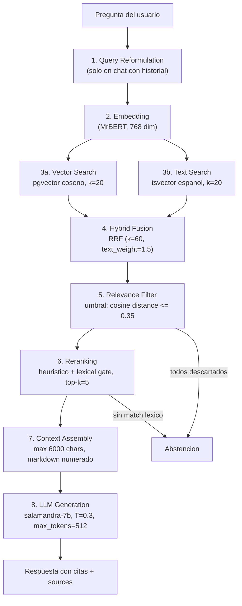

# Pipeline RAG

Flujo completo desde la pregunta del usuario hasta la respuesta generada.

## Diagrama de flujo



## Etapas en detalle

### 1. Query Reformulation

**Fichero:** `domain/chat/services/query_reformulator.py`

Solo se activa en conversaciones con historial. Concatena la última pregunta del usuario con la actual para resolver referencias anafóricas:

```
"castillos en Jaén" + "y en Málaga?" → "castillos en Jaén — y en Málaga?"
```

### 2. Embedding

**Adaptador:** `HttpEmbeddingAdapter` → servicio MrBERT (puerto 8001)

- Modelo: `BSC-LT/MrBERT` (308M params, ModernBERT)
- Dimensión: 768
- Pooling: mean pooling sobre todos los tokens
- Contexto: 8,192 tokens

### 3a. Vector Search (búsqueda semántica)

**Adaptador:** `PgVectorSearchAdapter`

```sql
SELECT ..., embedding <=> :query_vec AS score
FROM document_chunks_{version}
WHERE (heritage_type = :filter OR :filter IS NULL)
ORDER BY score ASC
LIMIT 20
```

- Operador: `<=>` (distancia coseno, pgvector)
- Score: 0 = idéntico, 2 = opuesto. Menor = más relevante
- Filtros opcionales: `heritage_type`, `province`

### 3b. Text Search (búsqueda léxica)

**Adaptador:** `PgTextSearchAdapter`

```sql
SELECT ..., ts_rank_cd(search_vector, query) AS score
FROM document_chunks_{version}
WHERE search_vector @@ plainto_tsquery('spanish', :cleaned_query)
ORDER BY score DESC
LIMIT 20
```

**Preprocesamiento de la query:**
1. Extraer palabras (`\w+`)
2. Lowercase
3. Eliminar stopwords (32 palabras: artículos, pronombres, verbos comunes en español)
4. Filtrar tokens de 1 carácter

**Stopwords eliminadas:** `de, del, la, el, los, las, un, una, en, y, a, que, es, por, con, para, al, se, lo, como, sobre, dame, dime, háblame, cuéntame, información, quiero, saber, necesito...`

### 4. Hybrid Fusion (RRF)

**Servicio:** `domain/rag/services/hybrid_search_service.py`

Combina los resultados de ambas búsquedas con **Reciprocal Rank Fusion**:

```
RRF_score(chunk) = Σ weight / (k + rank + 1)
```

| Parámetro | Valor | Descripción |
|-----------|-------|-------------|
| `k` | 60 | Constante RRF (suaviza diferencias de ranking) |
| `text_weight` | 1.5 | Peso de full-text vs vector (1.0) |

**Normalización post-RRF:**
```
score_normalizado = 1.0 - (rrf_score / max_rrf)
```
Resultado: escala 0 (mejor) → 1 (peor), compatible con cosine distance.

### 5. Relevance Filter

**Servicio:** `domain/rag/services/relevance_filter_service.py`

- **Umbral:** `0.35` (configurable via `RAG_SCORE_THRESHOLD`)
- Descarta chunks con `score > 0.35`
- Si todos se descartan → **abstención** (no hay info relevante)

### 6. Reranking heurístico

**Servicio:** `domain/rag/services/reranking_service.py`

Combina 4 señales con pesos:

| Señal | Peso | Cálculo |
|-------|------|---------|
| **Base** (score híbrido) | 0.4 | `1.0 - cosine_distance` |
| **Title match** | 0.3 | `términos_query_en_título / total_términos_query` |
| **Query coverage** | 0.2 | `términos_query_en_content / total_términos_query` |
| **Position** | 0.1 | `0.5` (neutral) |

```
final = 0.4 * base + 0.3 * title_match + 0.2 * coverage + 0.1 * position
```

**Lexical gate (pre-filtro):** Descarta chunks con title_match = 0 AND coverage = 0. Si todos se descartan → abstención.

**Normalización:** `1.0 - (score / max_score)` → escala 0-1.

### 7. Context Assembly

**Servicio:** `domain/rag/services/context_assembly_service.py`

Ensambla los top-k chunks en texto markdown numerado:

```
[1] Catedral de Jaén (patrimonio_inmueble, Jaén)
La catedral renacentista fue diseñada por Andrés de Vandelvira...
Fuente: https://guiadigital.iaph.es/...
---
[2] Palacio de las Cadenas (patrimonio_inmueble, Jaén)
...
```

- **Presupuesto:** máximo 6,000 caracteres
- Itera chunks en orden; para cuando se excede el límite

### 8. LLM Generation

**Adaptador:** `VLLMAdapter` → vLLM OpenAI-compatible

| Parámetro | Valor |
|-----------|-------|
| Modelo | `BSC-LT/salamandra-7b-instruct` |
| Temperature | 0.3 |
| Max tokens | 512 |
| Timeout | 120s |

**System prompt:** Experto en patrimonio andaluz del IAPH. Instrucciones: respuesta fluida en español, citar fuentes con [N], usar SOLO info del contexto, no inventar datos.

**User prompt:**
```
<contexto>
{chunks ensamblados}
</contexto>

Pregunta del usuario: {query}
```

### Abstención

El pipeline aborta y devuelve un mensaje de abstención cuando:
- No hay chunks tras el relevance filter (score > 0.35 para todos)
- No hay chunks tras el lexical gate del reranking (ningún match léxico)

Mensaje: *"No he encontrado información suficientemente relevante en mis fuentes para responder a esta pregunta."*

## Parámetros configurables

| Variable de entorno | Setting | Default |
|---------------------|---------|---------|
| `RAG_TOP_K` | `rag_top_k` | 5 |
| `RAG_RETRIEVAL_K` | `rag_retrieval_k` | 20 |
| `RAG_SCORE_THRESHOLD` | `rag_score_threshold` | 0.35 |
| `LLM_MAX_TOKENS` | `llm_max_tokens` | 512 |
| `LLM_TEMPERATURE` | `llm_temperature` | 0.3 |
| `EMBEDDING_SERVICE_URL` | `embedding_service_url` | `http://localhost:8001` |
| `LLM_SERVICE_URL` | `llm_service_url` | `http://localhost:8000/v1` |

## Ficheros clave

| Componente | Fichero |
|------------|---------|
| Use case completo | `application/rag/use_cases/rag_query_use_case.py` |
| Prompts | `domain/rag/prompts.py` |
| Hybrid fusion | `domain/rag/services/hybrid_search_service.py` |
| Reranking | `domain/rag/services/reranking_service.py` |
| Relevance filter | `domain/rag/services/relevance_filter_service.py` |
| Context assembly | `domain/rag/services/context_assembly_service.py` |
| Vector search | `infrastructure/rag/adapters/vector_search_adapter.py` |
| Text search | `infrastructure/rag/adapters/text_search_adapter.py` |
| LLM adapter | `infrastructure/rag/adapters/llm_adapter.py` |
| Embedding adapter | `infrastructure/rag/adapters/embedding_adapter.py` |
| Query reformulation | `domain/chat/services/query_reformulator.py` |
