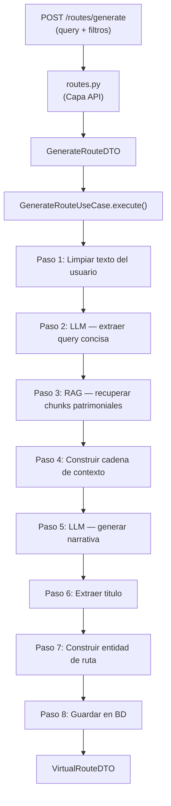

# Pipeline de generacion de rutas

Flujo de `POST /api/v1/routes/generate` desde la peticion HTTP hasta la ruta guardada.

## Peticion

```json
{
  "query": "Me gustaría ver las zambras y cuevas del sacromonte de granada",
  "num_stops": 5,
  "heritage_type_filter": null,
  "province_filter": ["Granada"],
  "municipality_filter": null
}
```

## Pipeline (8 pasos)



---

### Paso 1 — Limpiar texto del usuario

**Servicio:** `QueryExtractionService.clean_query_text()`

Elimina los terminos geograficos que ya estan como filtros activos (provincia, municipio) del texto libre del usuario, para que no se dupliquen. Los terminos de tipo de patrimonio se **mantienen** porque aportan valor semantico a la busqueda por embeddings.

```
Entrada:  "Me gustaría ver las zambras y cuevas del sacromonte de granada"
          province_filter=["Granada"]

Salida:   "Me gustaría ver las zambras y cuevas del sacromonte"
```

Tambien colapsa espacios multiples y elimina preposiciones colgantes (`de`, `del`, `en`, `por`, `a`).

---

### Paso 2 — LLM: Extraer query concisa

**Puerto:** `LLMPort.generate_structured()`
**Prompt:** `QUERY_EXTRACTION_SYSTEM_PROMPT` + `build_query_extraction_prompt()`

El LLM recibe el texto limpio + informacion de filtros activos y produce una consulta corta (10-15 palabras) optimizada para la recuperacion RAG.

```
System: "Eres un asistente experto en patrimonio historico andaluz del IAPH.
         Extrae una consulta de busqueda concisa... Responde SOLO con la consulta."

User:   "Texto del usuario: Me gustaría ver las zambras y cuevas del sacromonte
         Filtros activos: - Provincia: Granada
         La ubicacion YA esta en los filtros, NO la incluyas en la consulta.
         Consulta de busqueda:"

LLM →   "Zambras y cuevas del Sacromonte"
```

La respuesta se limpia de comillas y espacios.

---

### Paso 3 — RAG: Recuperar chunks patrimoniales

**Puerto:** `RAGPort.query()`
**Delega en:** `RAGApplicationService` → `RAGQueryUseCase` (pipeline RAG completo)

Llama al pipeline RAG con la query extraida y todos los filtros del usuario:

- `question` = query extraida del paso 2
- `top_k` = `num_stops * 3` (se recuperan de mas para seleccion diversa despues)
- `heritage_type_filter`, `province_filter`, `municipality_filter` = de la peticion del usuario

El pipeline RAG ejecuta internamente: **embed** → **busqueda hibrida** (vectorial + texto) → **fusion RRF** → **filtro de relevancia** → **reranking** → **ensamblaje de contexto** → **generacion LLM** (respuesta) + devuelve chunks fuente.

Solo se usan los **chunks** (la respuesta RAG se descarta con `_`).

---

### Paso 4 — Construir cadena de contexto

Formatea los chunks recuperados en un bloque de texto numerado para el LLM narrativo:

```
[1] Cueva de la Rocío (patrimonio_inmaterial, Granada)
Las zambras del Sacromonte son una expresión cultural...
Fuente: https://www.iaph.es/...
---
[2] Abadía del Sacromonte (patrimonio_inmueble, Granada)
Conjunto monumental del siglo XVII...
Fuente: https://www.iaph.es/...
```

---

### Paso 5 — LLM: Generar narrativa de la ruta

**Puerto:** `LLMPort.generate_structured()`
**Prompt:** `ROUTE_SYSTEM_PROMPT` + `build_route_prompt()`

El LLM recibe los chunks de contexto y produce una narrativa enriquecida:

```
System: "Eres un experto guia turistico... Estructura:
         1. Titulo atractivo (primera linea)
         2. Parrafo introductorio (3-4 frases)
         3. Para cada parada, un parrafo narrativo..."

User:   "Genera una ruta cultural con 5 paradas.
         Ubicacion: Provincia: Granada
         Tema: Zambras y cuevas del Sacromonte

         Patrimonio disponible:
         [1] Cueva de la Rocío...
         [2] Abadía del Sacromonte...
         ..."

LLM →   "Ruta por el Sacromonte: Zambras y cuevas de Granada

          El barrio del Sacromonte, situado en las colinas...

          Nuestra primera parada nos lleva a la Cueva de la Rocío..."
```

---

### Paso 6 — Extraer titulo

Toma la primera linea de la narrativa, elimina formato markdown (`#`, `"`, `*`) y la usa como titulo de la ruta. Si esta vacia o supera 200 caracteres, usa `"Ruta cultural por {provincia}"` como fallback.

---

### Paso 7 — Construir entidad de ruta

**Servicio:** `RouteBuilderService.build()`

1. **Seleccion diversa de paradas** — Round-robin entre tipos de patrimonio para maximizar variedad. Deduplica por titulo. Selecciona hasta `num_stops` de los chunks recuperados en exceso.

2. **Asignar duraciones de visita** por tipo de patrimonio:
   | Tipo | Minutos |
   |------|---------|
   | patrimonio_inmueble | 60 |
   | patrimonio_inmaterial | 45 |
   | paisaje_cultural | 90 |
   | patrimonio_mueble | 30 |

3. **Ensamblar** entidad `VirtualRoute` con UUID, titulo, provincia, paradas, duracion total y narrativa.

---

### Paso 8 — Guardar en BD y devolver

**Puerto:** `RouteRepository.save_route()`

Persiste en la tabla `virtual_routes` (paradas serializadas como array JSON). Devuelve `VirtualRouteDTO` → mapeado a `VirtualRouteSchema` en la capa API → respuesta JSON.

---

## Proveedor LLM

Configurado via variable de entorno `LLM_PROVIDER`:

| Valor | Adaptador | Servicio |
|-------|-----------|----------|
| `gemini` | `GeminiRoutesAdapter` | API Google Gemini (`gemini-3.1-flash-lite-preview`) |
| `vllm` | `VLLMRoutesAdapter` | vLLM autoalojado (`salamandra-7b-instruct`) |

Ambos implementan la misma interfaz `LLMPort`. Se conmuta en `composition/routes_composition.py`.

---

## Ficheros clave

| Capa | Fichero | Rol |
|------|---------|-----|
| API | `api/v1/endpoints/routes/routes.py` | Endpoint HTTP, validacion de esquemas |
| API | `api/v1/endpoints/routes/schemas.py` | `GenerateRouteRequest` → `GenerateRouteDTO` |
| Aplicacion | `application/routes/use_cases/generate_route.py` | Orquestacion del pipeline (este doc) |
| Dominio | `domain/routes/prompts.py` | Prompts LLM (extraccion + narrativa) |
| Dominio | `domain/routes/services/query_extraction_service.py` | Limpieza de texto |
| Dominio | `domain/routes/services/route_builder_service.py` | Seleccion de paradas + duracion |
| Dominio | `domain/routes/ports/llm_port.py` | Interfaz del puerto LLM |
| Dominio | `domain/routes/ports/rag_port.py` | Interfaz del puerto RAG |
| Infra | `infrastructure/routes/adapters/gemini_llm_adapter.py` | LLM Gemini |
| Infra | `infrastructure/routes/adapters/llm_adapter.py` | LLM vLLM |
| Infra | `infrastructure/routes/adapters/rag_adapter.py` | RAG en proceso |
| Infra | `infrastructure/routes/repositories/route_repository.py` | Persistencia BD |
| Composicion | `composition/routes_composition.py` | Cableado de dependencias |
