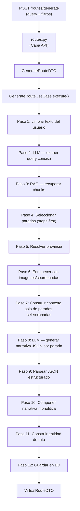

# Pipeline de generacion de rutas

Flujo de `POST /api/v1/routes/generate` desde la peticion HTTP hasta la ruta guardada.

## Peticion

```json
{
  "query": "Me gustaría ver las zambras y cuevas del sacromonte de granada",
  "num_stops": 5,
  "heritage_type_filter": null,
  "province_filter": ["Granada"],
  "municipality_filter": null
}
```

## Pipeline (12 pasos)



**Cambio clave respecto a versiones anteriores:** las paradas se seleccionan **antes** de generar la narrativa (stops-first). El LLM recibe solo las paradas ya elegidas y genera un JSON estructurado con narrativa individual por parada.

---

### Paso 1 — Limpiar texto del usuario

**Servicio:** `QueryExtractionService.clean_query_text()`

Elimina los terminos geograficos que ya estan como filtros activos (provincia, municipio) del texto libre del usuario, para que no se dupliquen. Los terminos de tipo de patrimonio se **mantienen** porque aportan valor semantico a la busqueda por embeddings.

```
Entrada:  "Me gustaría ver las zambras y cuevas del sacromonte de granada"
          province_filter=["Granada"]

Salida:   "Me gustaría ver las zambras y cuevas del sacromonte"
```

Tambien colapsa espacios multiples y elimina preposiciones colgantes (`de`, `del`, `en`, `por`, `a`).

---

### Paso 2 — LLM: Extraer query concisa

**Puerto:** `LLMPort.generate_structured()`
**Prompt:** `QUERY_EXTRACTION_SYSTEM_PROMPT` + `build_query_extraction_prompt()`

El LLM recibe el texto limpio + informacion de filtros activos y produce una consulta corta (10-15 palabras) optimizada para la recuperacion RAG.

```
System: "Eres un asistente experto en patrimonio historico andaluz del IAPH.
         Extrae una consulta de busqueda concisa... Responde SOLO con la consulta."

User:   "Texto del usuario: Me gustaría ver las zambras y cuevas del sacromonte
         Filtros activos: - Provincia: Granada
         La ubicacion YA esta en los filtros, NO la incluyas en la consulta.
         Consulta de busqueda:"

LLM →   "Zambras y cuevas del Sacromonte"
```

La respuesta se limpia de comillas y espacios.

---

### Paso 3 — RAG: Recuperar chunks patrimoniales

**Puerto:** `RAGPort.query()`
**Delega en:** `RAGApplicationService` → `RAGQueryUseCase` (pipeline RAG completo)

Llama al pipeline RAG con la query extraida y todos los filtros del usuario:

- `question` = query extraida del paso 2
- `top_k` = `num_stops * 3` (se recuperan de mas para seleccion diversa despues)
- `heritage_type_filter`, `province_filter`, `municipality_filter` = de la peticion del usuario

El pipeline RAG ejecuta internamente: **embed** → **busqueda hibrida** (vectorial + texto) → **fusion RRF** → **filtro de relevancia** → **reranking** → **ensamblaje de contexto** → **generacion LLM** (respuesta) + devuelve chunks fuente.

Solo se usan los **chunks** (la respuesta RAG se descarta con `_`).

---

### Paso 4 — Seleccionar paradas (stops-first)

**Servicio:** `RouteBuilderService.select_diverse_stops()`

Selecciona `num_stops` paradas **antes** de generar la narrativa. Esto garantiza que el LLM narre exactamente las paradas que apareceran en la ruta final.

- Round-robin entre tipos de patrimonio para maximizar variedad
- Deduplica por titulo
- Selecciona hasta `num_stops` de los chunks recuperados en exceso

---

### Paso 5 — Resolver provincia

Determina la etiqueta de provincia de la ruta: usa el primer filtro de provincia si existe, o la provincia del primer chunk seleccionado, o "Andalucia" como fallback.

---

### Paso 6 — Enriquecer con imagenes y coordenadas

**Puerto:** `HeritageAssetLookupPort.get_asset_previews()`
**Adaptador:** `PgHeritageAssetLookupAdapter`

Extrae los `heritage_asset_id` de cada chunk (formato `ficha-{tipo}-{numero}` → parte numerica) y consulta la tabla `heritage_assets` para obtener:

- `image_url` — construida como `https://guiadigital.iaph.es/imagenes-cache/{id}/{image_id}--fic.jpg`
- `latitude`, `longitude` — coordenadas geograficas

---

### Paso 7 — Construir contexto solo de paradas seleccionadas

Formatea **unicamente** las paradas seleccionadas (no todos los chunks RAG) en un bloque numerado:

```
[Parada 1] Cueva de la Rocío (patrimonio_inmaterial, Granada)
Las zambras del Sacromonte son una expresión cultural...
Fuente: https://www.iaph.es/...
---
[Parada 2] Abadía del Sacromonte (patrimonio_inmueble, Granada)
Conjunto monumental del siglo XVII...
Fuente: https://www.iaph.es/...
```

---

### Paso 8 — LLM: Generar narrativa JSON por parada

**Puerto:** `LLMPort.generate_structured()`
**Prompt:** `ROUTE_SYSTEM_PROMPT` + `build_route_prompt()`

El LLM recibe las paradas seleccionadas y produce un **JSON estructurado** (no texto libre):

```
System: "Eres un experto guia turistico... Responde UNICAMENTE con un objeto JSON:
         { title, introduction, stops: [{order, narrative}], conclusion }"

User:   "Genera una narrativa para una ruta cultural con las siguientes paradas.
         Ubicacion: Provincia: Granada
         Tema: Zambras y cuevas del Sacromonte
         Paradas de la ruta (en orden): ..."

LLM →   {
           "title": "Ruta por el Sacromonte: Zambras y cuevas de Granada",
           "introduction": "El barrio del Sacromonte, situado en las colinas...",
           "stops": [
             {"order": 1, "narrative": "Nuestra primera parada..."},
             {"order": 2, "narrative": "Continuamos hacia..."}
           ],
           "conclusion": "Este recorrido por el Sacromonte..."
         }
```

---

### Paso 9 — Parsear JSON estructurado

**Metodo:** `GenerateRouteUseCase._parse_narrative_json()`

Parsea el JSON del LLM extrayendo: `title`, `introduction`, `{order: narrative}` por parada, y `conclusion`. Si el parseo falla (formato invalido), usa el texto completo como narrativa monolitica (fallback).

---

### Paso 10 — Componer narrativa monolitica

Para compatibilidad con el campo `narrative` de la BD, concatena: `introduction` + segmentos narrativos en orden + `conclusion`, separados por doble salto de linea.

---

### Paso 11 — Construir entidad de ruta

**Servicio:** `RouteBuilderService.build()`

1. **Asignar duraciones de visita** por tipo de patrimonio:
   | Tipo | Minutos |
   |------|---------|
   | patrimonio_inmueble | 60 |
   | patrimonio_inmaterial | 45 |
   | paisaje_cultural | 90 |
   | patrimonio_mueble | 30 |

2. **Enriquecer cada parada** con `heritage_asset_id`, `narrative_segment`, `image_url`, `latitude`, `longitude` de los datos obtenidos en pasos 6 y 9.

3. **Ensamblar** entidad `VirtualRoute` con UUID, titulo, provincia, paradas, duracion total, narrativa, introduccion y conclusion.

---

### Paso 12 — Guardar en BD y devolver

**Puerto:** `RouteRepository.save_route()`

Persiste en la tabla `virtual_routes` (paradas serializadas como array JSON, campos `introduction` y `conclusion` en columnas separadas). Devuelve `VirtualRouteDTO` → mapeado a `VirtualRouteSchema` en la capa API → respuesta JSON.

---

## Proveedor LLM

Configurado via variable de entorno `LLM_PROVIDER`:

| Valor | Adaptador | Servicio |
|-------|-----------|----------|
| `gemini` | `GeminiRoutesAdapter` | API Google Gemini (`gemini-3.1-flash-lite-preview`) |
| `vllm` | `VLLMRoutesAdapter` | vLLM autoalojado (`salamandra-7b-instruct`) |

Ambos implementan la misma interfaz `LLMPort`. Se conmuta en `composition/routes_composition.py`.

---

## Ficheros clave

| Capa | Fichero | Rol |
|------|---------|-----|
| API | `api/v1/endpoints/routes/routes.py` | Endpoint HTTP, validacion de esquemas |
| API | `api/v1/endpoints/routes/schemas.py` | `GenerateRouteRequest` → `GenerateRouteDTO` |
| Aplicacion | `application/routes/use_cases/generate_route.py` | Orquestacion del pipeline (este doc) |
| Dominio | `domain/routes/prompts.py` | Prompts LLM (extraccion + narrativa) |
| Dominio | `domain/routes/services/query_extraction_service.py` | Limpieza de texto |
| Dominio | `domain/routes/services/route_builder_service.py` | Seleccion de paradas + duracion |
| Dominio | `domain/routes/ports/llm_port.py` | Interfaz del puerto LLM |
| Dominio | `domain/routes/ports/rag_port.py` | Interfaz del puerto RAG |
| Dominio | `domain/routes/ports/heritage_asset_lookup_port.py` | Interfaz de busqueda de assets |
| Dominio | `domain/routes/value_objects/asset_preview.py` | Value object con imagen y coordenadas |
| Infra | `infrastructure/routes/adapters/gemini_llm_adapter.py` | LLM Gemini |
| Infra | `infrastructure/routes/adapters/llm_adapter.py` | LLM vLLM |
| Infra | `infrastructure/routes/adapters/rag_adapter.py` | RAG en proceso |
| Infra | `infrastructure/routes/adapters/heritage_asset_lookup_adapter.py` | Lookup de imagenes/coordenadas en heritage_assets |
| Infra | `infrastructure/routes/repositories/route_repository.py` | Persistencia BD |
| Composicion | `composition/routes_composition.py` | Cableado de dependencias |
