# Guía de uso — ALIA Patrimonio de Andalucía

Manual de usuario detallado del demostrador web **ALIA Patrimonio de Andalucía**, asistente conversacional de patrimonio del Instituto Andaluz de Patrimonio Histórico (IAPH), desarrollado por la Universidad de Jaén con motores de IA del proyecto ALIA.

Esta guía cubre todos los flujos disponibles: autenticación, búsqueda semántica, generación y edición de rutas culturales, y el panel de administración (gestión de usuarios y trazabilidad completa del pipeline RAG).

---

## Índice

1. [Inicio de sesión](#1-inicio-de-sesión)
2. [Página principal](#2-página-principal)
3. [Búsqueda semántica](#3-búsqueda-semántica)
   - 3.1 [Vista inicial y panel de filtros](#31-vista-inicial-y-panel-de-filtros)
   - 3.2 [Detección de entidades y panel de clarificación](#32-detección-de-entidades-y-panel-de-clarificación)
   - 3.3 [Resultados y feedback por elemento](#33-resultados-y-feedback-por-elemento)
   - 3.4 [Detalle del bien patrimonial](#34-detalle-del-bien-patrimonial)
4. [Rutas virtuales](#4-rutas-virtuales)
   - 4.1 [Generación de una ruta nueva (streaming)](#41-generación-de-una-ruta-nueva-streaming)
   - 4.2 [Detalle de ruta](#42-detalle-de-ruta)
   - 4.3 [Edición de rutas: añadir y eliminar paradas](#43-edición-de-rutas-añadir-y-eliminar-paradas)
   - 4.4 [Guía interactivo](#44-guía-interactivo)
   - 4.5 [Historial de cambios de una ruta](#45-historial-de-cambios-de-una-ruta-solo-admin)
5. [Panel de administración](#5-panel-de-administración)
   - 5.1 [Gestión de usuarios](#51-gestión-de-usuarios)
   - 5.2 [Tipos de perfil](#52-tipos-de-perfil)
6. [Trazabilidad completa del pipeline](#6-trazabilidad-completa-del-pipeline)
   - 6.1 [Listado de trazas y filtros](#61-listado-de-trazas-y-filtros)
   - 6.2 [Detalle de una traza de búsqueda](#62-detalle-de-una-traza-de-búsqueda)
   - 6.3 [Detalle de una traza de generación de ruta](#63-detalle-de-una-traza-de-generación-de-ruta)
   - 6.4 [Trazas de edición de ruta](#64-trazas-de-edición-de-ruta-add_stop--remove_stop)
7. [Indicador de estado de servicios](#7-indicador-de-estado-de-servicios)
8. [Glosario](#8-glosario)

---

## 1. Inicio de sesión

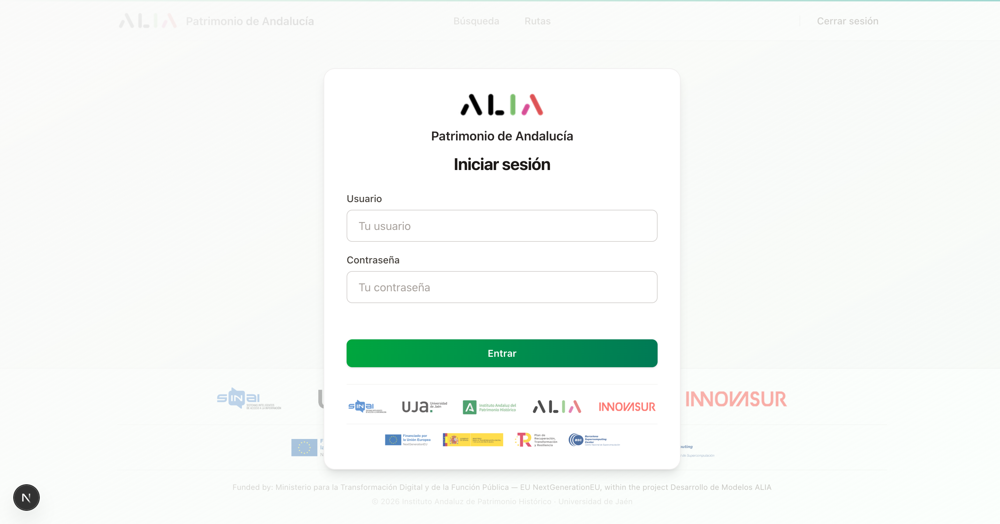

Al acceder a la URL del demostrador, la aplicación redirige automáticamente a `/login`. Todas las secciones requieren autenticación mediante usuario y contraseña.

**Pasos para entrar:**

1. Introduce tu **usuario** en el campo «Tu usuario».
2. Introduce tu **contraseña** en el campo «Tu contraseña».
3. Pulsa el botón verde **Entrar**.

Si las credenciales no son válidas se mostrará el mensaje «Credenciales incorrectas» en rojo bajo el formulario. Si el backend no responde aparecerá «Error de conexión» (esto suele indicar que el servicio de Cloud Run aún está arrancando — espera unos segundos).

> **Sesión:** la autenticación usa tokens JWT con renovación automática. Cuando la sesión caduca, la aplicación redirige al login automáticamente.

En la zona inferior de la pantalla aparecen los logos institucionales (SINAI–UJA, IAPH, ALIA, Innovasur) y los logos de financiación (NextGenerationEU, Ministerio para la Transformación Digital, Plan de Recuperación, BSC). Cada logo es un enlace a la web oficial correspondiente.

---

## 2. Página principal

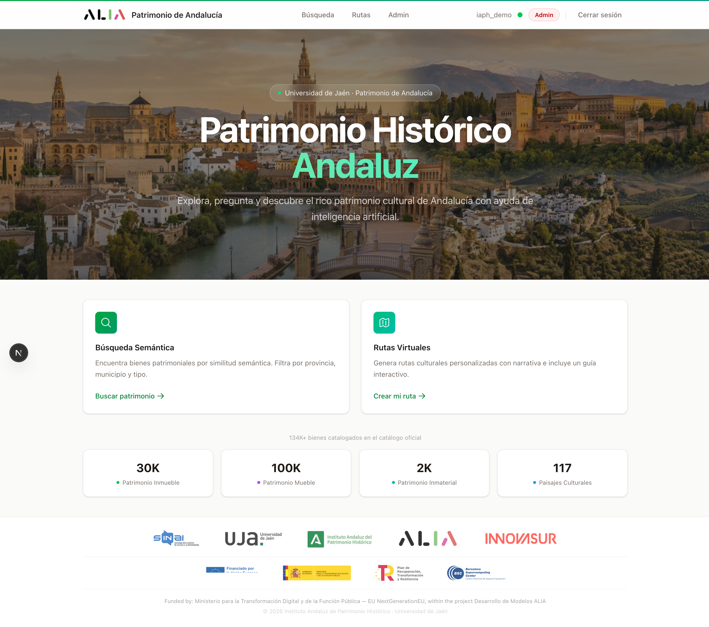

Tras autenticarse se llega a la página principal (`/`), que actúa como punto de entrada a las funcionalidades del demostrador.

**Elementos de la página:**

- **Hero** con título «Patrimonio Histórico Andaluz» y subtítulo descriptivo.
- **Dos tarjetas de acceso rápido:**
  - **Búsqueda Semántica** — encuentra bienes patrimoniales por similitud (botón «Buscar patrimonio»).
  - **Rutas Virtuales** — genera rutas culturales personalizadas con narrativa e incluye un guía interactivo (botón «Crear mi ruta»).
- **Tarjeta de estadísticas del catálogo IAPH:** 30K Inmueble · 100K Mueble · 2K Inmaterial · 117 Paisajes Culturales (134 K bienes catalogados en total).

### Barra de navegación

Visible en todas las páginas. Contiene:

- **Logo ALIA + «Patrimonio de Andalucía»** — vuelve a la página principal.
- **Búsqueda** — abre `/search`.
- **Rutas** — abre `/routes`.
- **Admin** — solo visible para usuarios con perfil **Admin**; abre `/admin`.
- **Indicador de servicios** (punto de color verde/ámbar/rojo) con tooltip de detalle por servicio (LLM, embedding, reranker).
- **Nombre de usuario** y **etiqueta de perfil** (Admin / Investigador / Ciudadano).
- **Cerrar sesión** — termina la sesión actual.

---

## 3. Búsqueda semántica

### 3.1 Vista inicial y panel de filtros

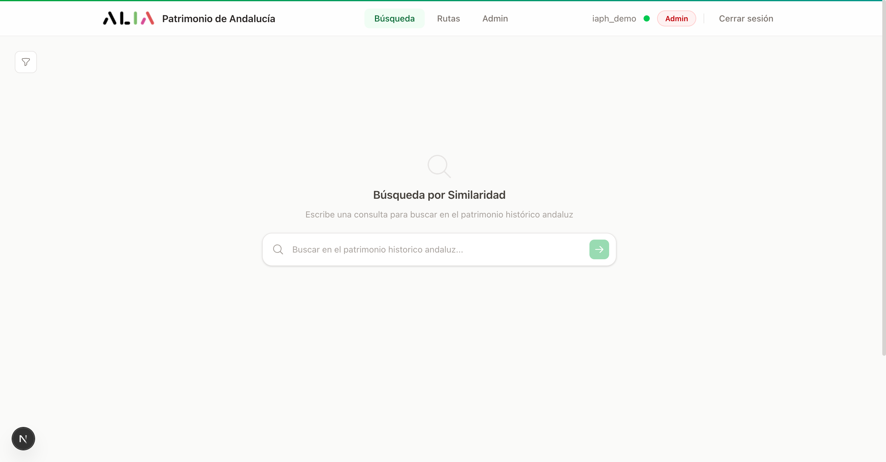

La página `/search` muestra:

- **Encabezado**: «Búsqueda por Similaridad».
- **Cuadro de búsqueda** central con el placeholder «Buscar en el patrimonio histórico andaluz...».
- **Panel de filtros** desplegable a la izquierda con tres bloques:
  - **Tipo de patrimonio** — Inmueble, Mueble, Inmaterial, Paisaje Cultural.
  - **Provincia** — listado completo de provincias y combinaciones (algunos bienes están registrados con varias provincias separadas por comas).
  - **Municipio** — se carga dinámicamente al seleccionar una provincia.

Los filtros aplicados se ven como **chips** sobre la lista de resultados y pueden quitarse uno a uno o todos a la vez.

### 3.2 Detección de entidades y panel de clarificación

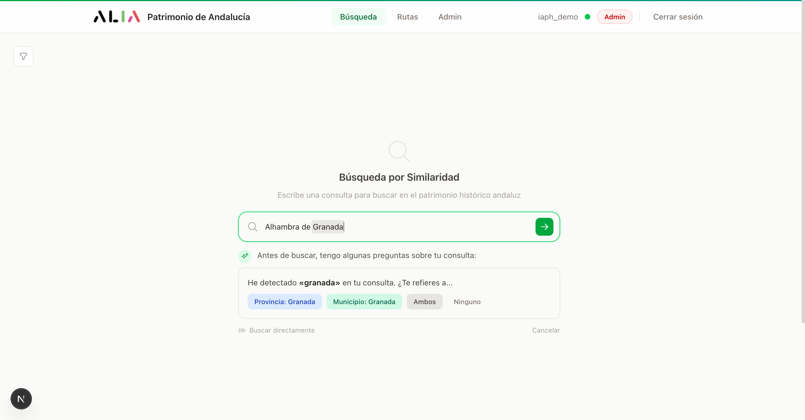

Cuando escribes en el cuadro de búsqueda, el sistema **analiza el texto en tiempo real** y detecta menciones a provincias, municipios o tipos de patrimonio. Si encuentra ambigüedad, aparece un panel azul con la pregunta «Antes de buscar, tengo algunas preguntas sobre tu consulta».

Ejemplo: al escribir «Alhambra de Granada» el sistema detecta «granada» y ofrece:

- **Provincia: Granada** — busca solo en bienes de la provincia Granada.
- **Municipio: Granada** — busca solo en el municipio Granada.
- **Ambos** — aplica los dos filtros.
- **Ninguno** — desactiva la clarificación.

Además del botón verde **Buscar directamente** (ejecuta la búsqueda sin filtros) y **Cancelar**.

### 3.3 Resultados y feedback por elemento

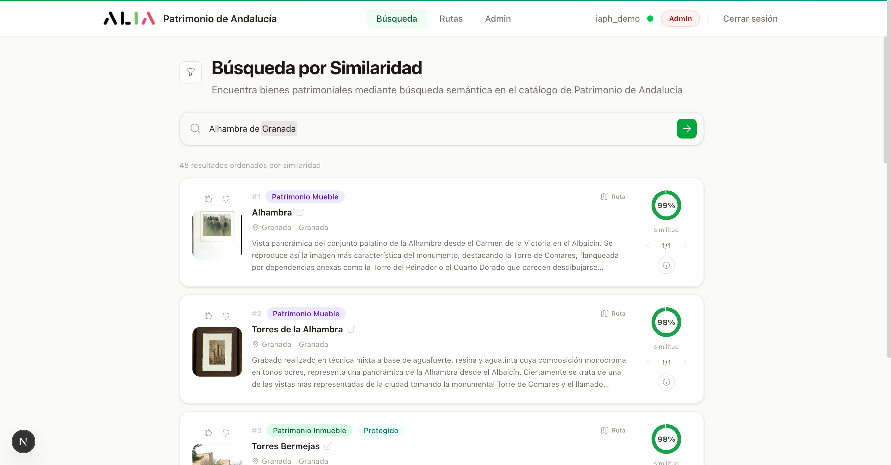

Cada resultado se presenta como una tarjeta con esta estructura:

**Columna izquierda (apilada verticalmente):**

- **Botones de feedback** (👍/👎) por resultado individual. El feedback queda asociado a la query concreta y el documento concreto, no al bien en general — puedes valorar de forma distinta el mismo bien si aparece en búsquedas diferentes.
- **Imagen miniatura** del bien (si existe).

**Columna central:**

- **Rango** (#1, #2, #3...).
- **Etiquetas** de tipo de patrimonio (verde Inmueble, violeta Mueble, turquesa Inmaterial, azul cielo Paisaje Cultural) y, si procede, etiqueta «Protegido» (turquesa).
- **Botón «Ruta»** (esquina superior derecha) para añadir el bien a una ruta existente.
- **Título** del bien (clic para abrir el panel de detalle) y, opcionalmente, un icono externo que abre la ficha pública de la Guía Digital del IAPH.
- **Provincia y municipio**.
- **Coordenadas** (si están disponibles).
- **Descripción** truncada a 3 líneas.

**Columna derecha:**

- **Círculo de similitud** (porcentaje) — convertido desde la distancia coseno del embedding y reranking.
- **Navegador de chunks** (1/N) — muchos bienes tienen el contenido segmentado en varios chunks; las flechas permiten navegar entre ellos.
- **Botón de tooltip ⓘ** que muestra el chunk completo, su `chunk_id` y la distancia exacta.

**Paginación**: 10 resultados por página, con 49 resultados habituales por consulta de demostración.

### 3.4 Detalle del bien patrimonial

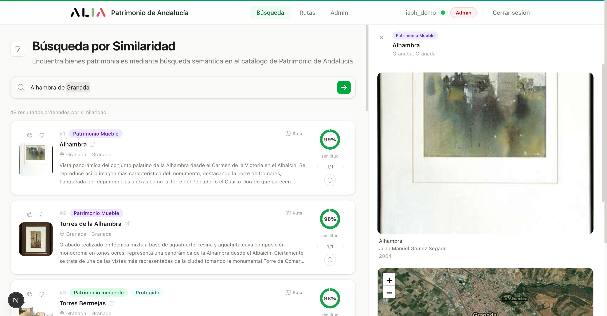

Al pulsar el título de un resultado, se abre un **panel lateral derecho** (en escritorio) o pantalla completa (en móvil) con la ficha enriquecida:

- **Galería de imágenes** con fechas y autorías.
- **Mapa interactivo** Leaflet con la ubicación geográfica del bien (cuando hay coordenadas).
- **Bloques de metadatos** desplegables: identificación, caracterización, niveles de protección, estilos artísticos, periodos históricos, materiales, técnica, descripción extendida, bibliografía y bienes relacionados.
- **Enlace a la ficha oficial** en la Guía Digital del IAPH.

> **Nota técnica**: la ficha procede de la API pública de la Guía Digital y se cruza con los datos vectoriales del catálogo del IAPH (~134 000 bienes). El 96.6 % de los bienes carecen actualmente de coordenadas; el mapa solo aparece cuando el bien tiene geolocalización.

---

## 4. Rutas virtuales

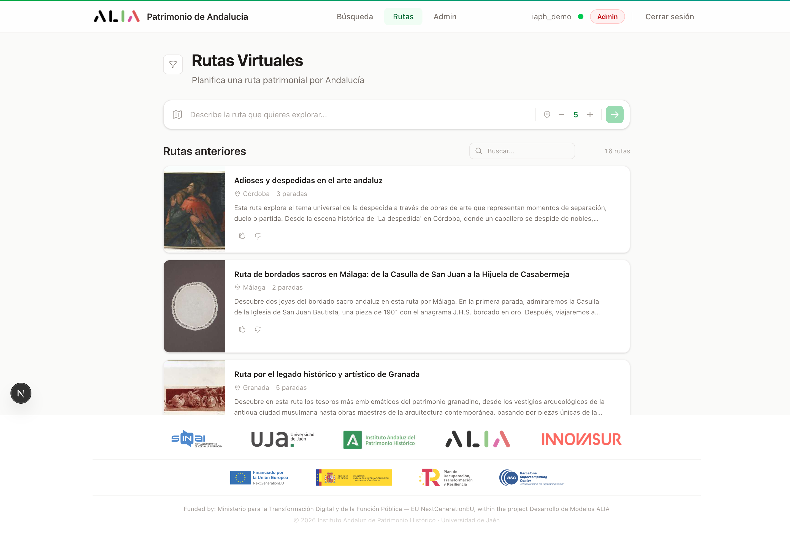

La sección `/routes` permite **generar rutas culturales personalizadas** mediante IA y consultar las rutas guardadas previamente.

### 4.1 Generación de una ruta nueva (streaming)

**Pasos para crear una ruta:**

1. Escribe una **descripción libre** de la ruta deseada en el cuadro central. Ejemplos:
   - «Ruta de arte rupestre por Jaén»
   - «Pintura religiosa barroca en Granada»
   - «Monumentos renacentistas de Úbeda y Baeza»
2. **Selecciona el número de paradas** (entre 2 y 15, valor por defecto 5) en el selector a la derecha.
3. **Aplica filtros opcionales** desde el panel lateral (tipo de patrimonio, provincia, municipio) — son los mismos filtros que en búsqueda.
4. Pulsa el botón verde de envío.

La ruta se genera en **modo streaming**: la introducción aparece primero, luego cada parada se va incorporando con su narrativa generada en tiempo real. Verás:

- Una **barra de progreso** con etapas (extracción de query, RAG, selección de paradas, narrativa por parada, conclusión).
- Cada parada aparece con su tarjeta y narrativa conforme el LLM las produce.

Una vez completa, la ruta se guarda automáticamente y aparece en el listado «Rutas anteriores».

### 4.2 Detalle de ruta

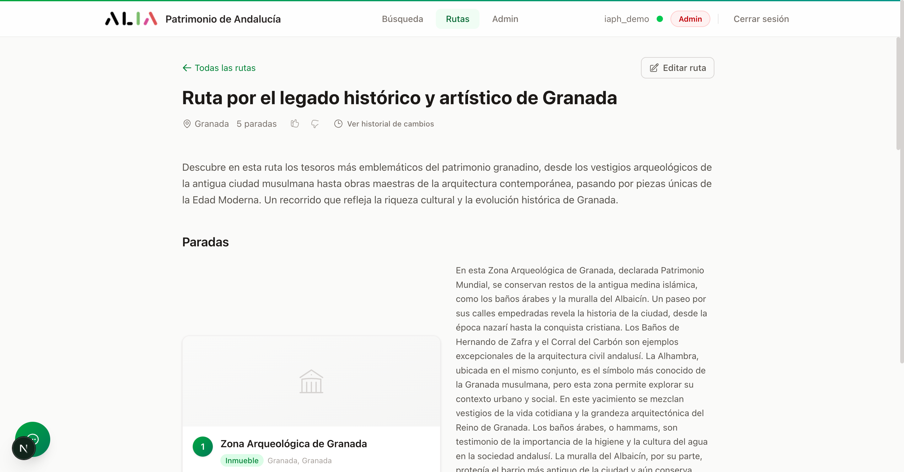

La página de detalle (`/routes/[id]`) muestra:

**Cabecera:**

- Enlace **«Todas las rutas»** para volver al listado.
- Botón **«Editar ruta»** — habilita el modo edición (ver §4.3).
- **Título** generado por el LLM.
- **Provincia** dominante de la ruta.
- **Número de paradas**.
- **Botones de feedback** (👍/👎) sobre la ruta global.
- **Botón «Ver historial de cambios»** — solo visible para administradores (ver §4.5).
- **Introducción narrativa** generada por IA.

**Cuerpo — paradas en formato intercalado:**

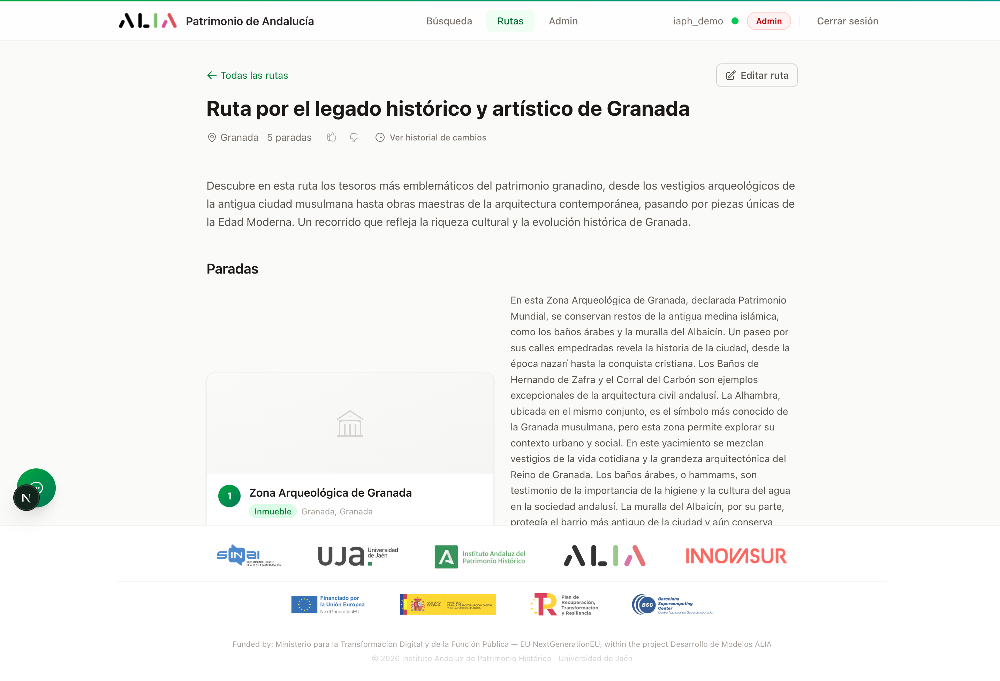

Cada parada incluye:

- **Imagen** del bien patrimonial.
- **Número de orden** dentro de la ruta.
- **Título**, **tipo** (Inmueble / Mueble / etc.) y **municipio, provincia**.
- **Descripción objetiva** del bien (procedente del catálogo).
- **Narrativa** generada por el LLM, contextualizada para esta ruta concreta y autocontenida (no depende de las paradas vecinas, así la edición no rompe la coherencia).

Al final, una **conclusión narrativa** cierra el itinerario.

Al pulsar la imagen o título de una parada se abre el mismo **panel lateral de detalle** de la sección de búsqueda (§3.4).

### 4.3 Edición de rutas: añadir y eliminar paradas

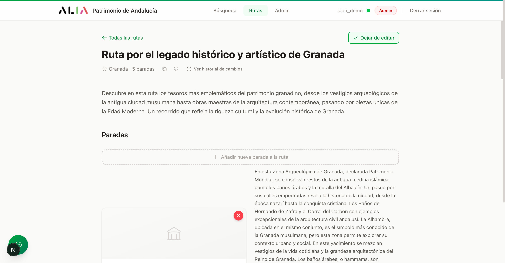

Al pulsar **«Editar ruta»** la página entra en **modo edición**:

- El botón cambia a **«Dejar de editar»**.
- Sobre cada parada aparece un botón **🗑 «Eliminar»** (con confirmación) en la esquina superior derecha de la imagen.
- Entre cada par de paradas (y al final de la lista) aparece un botón horizontal verde **«Añadir nueva parada a la ruta»** que cubre el ancho.

#### Eliminar una parada

Pulsa el botón eliminar de la parada deseada → modal de confirmación → la parada se borra inmediatamente; la narrativa se reordena y la ruta se persiste.

#### Añadir una parada

Al pulsar «Añadir nueva parada a la ruta» se abre un **modal centrado** con un buscador completo:

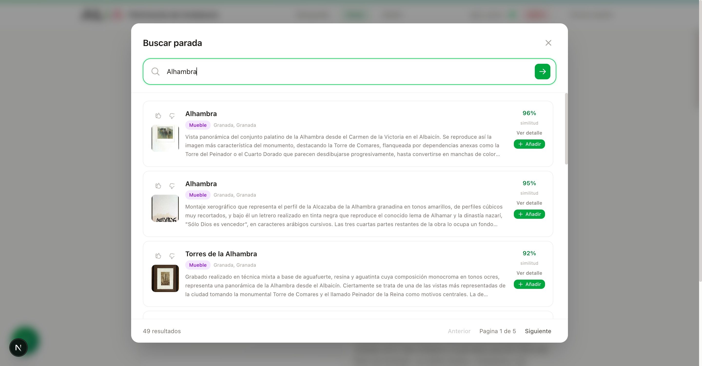

El modal replica las funcionalidades de la página de búsqueda pero adaptado al flujo de edición:

- **Cuadro de búsqueda** con detección de entidades.
- **Panel de filtros** (tipo, provincia, municipio).
- **Resultados paginados** (10 por página, hasta 49 resultados habituales).
- **Cada resultado muestra**:
  - Botones de feedback 👍/👎 (con `context = "route_edit"` registrado en la traza para que la UJA pueda diferenciar este feedback del feedback de búsqueda libre).
  - Imagen, título, etiqueta de tipo, ubicación y descripción truncada.
  - **% de similitud**, botón **«Ver detalle»** (abre el panel lateral del bien sin cerrar el modal) y botón **«Añadir»** (verde) que incorpora la parada a la ruta.

Al pulsar «Añadir», el sistema:

1. Cierra el modal e inmediatamente muestra una notificación toast.
2. Llama al backend con la posición y el `document_id`.
3. El backend genera la narrativa de la nueva parada con el LLM (3-5 segundos).
4. La parada aparece en la ruta con su narrativa en cuanto está lista.

Si añades varias paradas seguidas, la generación de narrativa se ejecuta en paralelo en background — no necesitas esperar a que una termine para añadir la siguiente.

### 4.4 Guía interactivo

En la esquina inferior derecha del detalle de ruta hay un **botón flotante de chat** (icono verde). Al abrirlo aparece el **guía interactivo**:

- Es un chatbot **contextualizado** a la ruta actual: conoce todas las paradas, su narrativa, su descripción y sus metadatos.
- Útil para preguntar detalles sobre un bien concreto, pedir información histórica adicional, comparar paradas o solicitar recomendaciones.
- Botón **«Ampliar ventana»** para usar el guía a pantalla completa.

### 4.5 Historial de cambios de una ruta (solo admin)

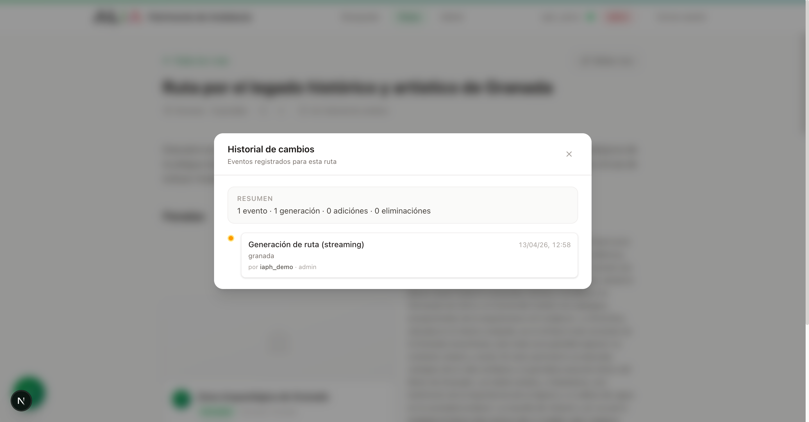

Para usuarios admin, el botón **«Ver historial de cambios»** abre un modal con la cronología completa de eventos de la ruta:

- **Resumen agregado**: total de eventos · número de generaciones · adiciones · eliminaciones.
- **Timeline vertical** ordenado de más antiguo a más reciente con:
  - **Punto de color** (ámbar = generación, verde = adición, rojo = eliminación).
  - **Etiqueta** del tipo de evento (Generación de ruta (streaming) / + Adición / − Eliminación).
  - **Fecha y hora**.
  - **Query o descripción** del evento (p. ej. «+ Casulla de San Juan (posición 3)» o «− Bereavement (posición 4)»).
  - **Usuario** que ejecutó el cambio y su **perfil** en ese momento.
  - **Enlace al detalle completo** de la traza en el panel admin.

> **Por qué es útil:** permite estudiar comportamiento real de usuario sobre las rutas generadas — qué paradas consideran irrelevantes, qué bienes añaden manualmente, qué tipos de patrimonio prefieren. La UJA usa estos datos para evaluar la calidad del prompt de generación.

---

## 5. Panel de administración

Solo accesible con perfil **Admin** desde el enlace «Admin» de la barra de navegación (`/admin`).

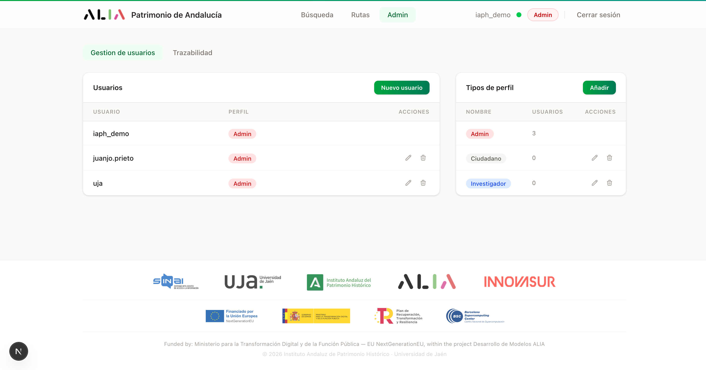

El panel se divide en dos pestañas:

- **Gestión de usuarios** (vista por defecto).
- **Trazabilidad** — enlace al sistema de trazas (ver §6).

### 5.1 Gestión de usuarios

Tabla con las columnas: **Usuario · Perfil · Acciones**.

- Cada fila muestra el nombre y el tipo de perfil asignado.
- **Botón verde «Nuevo usuario»** abre un modal para crear:

  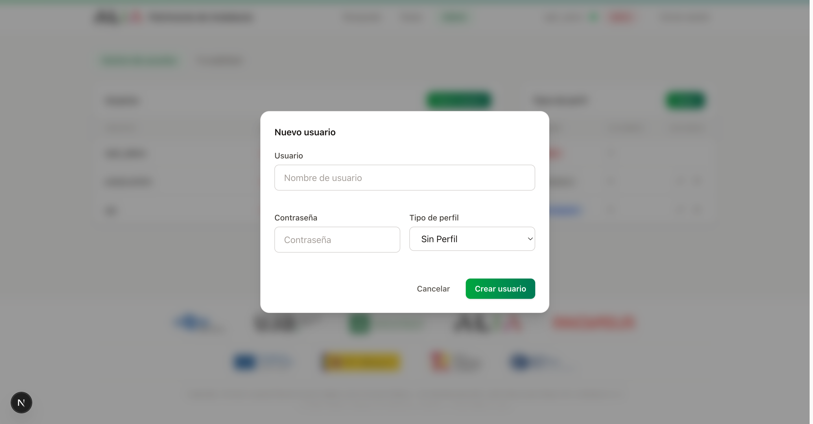

  - **Usuario** (string único)
  - **Contraseña** (texto libre, sin política de complejidad por ahora)
  - **Tipo de perfil** (lista desplegable con los tipos definidos en §5.2)

- **✏️ Editar** — modificar contraseña o perfil de un usuario existente.
- **🗑 Eliminar** — borra el usuario (con confirmación). El propio admin no puede eliminarse a sí mismo.

### 5.2 Tipos de perfil

Tabla con las columnas: **Nombre · Usuarios · Acciones**.

- **Admin** (3 usuarios) — perfil con permisos completos.
- **Ciudadano** (0 usuarios) — perfil estándar de acceso público.
- **Investigador** (0 usuarios) — perfil orientado a investigación; en futuras versiones podrá personalizar el comportamiento del LLM.

- **Botón verde «Añadir»** crea nuevos tipos de perfil.
- **✏️ Renombrar** — cambia el nombre del tipo (la asignación de usuarios se mantiene).
- **🗑 Eliminar** — solo posible si el tipo no tiene usuarios asignados.

> **Nota:** el tipo de perfil del usuario en el momento de cada acción se guarda en la traza correspondiente. Si un usuario cambia de perfil después, el feedback antiguo conserva el perfil que tenía cuando se emitió.

---

## 6. Trazabilidad completa del pipeline

La sección `/admin/traces` proporciona observabilidad **extremo a extremo** sobre el comportamiento de la IA en cada búsqueda y cada ruta. Sirve para depurar resultados inesperados, validar la calidad del LLM y estudiar el comportamiento de usuario.

### 6.1 Listado de trazas y filtros

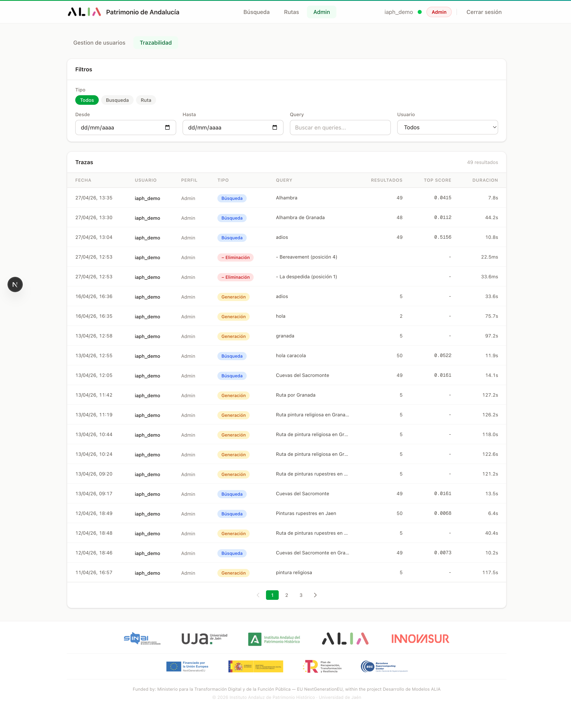

La página muestra una tabla con todas las ejecuciones registradas:

**Columnas:**

- **Fecha** (timestamp en formato local).
- **Usuario** que ejecutó la operación.
- **Perfil** del usuario en ese momento.
- **Tipo** — chip de color según el `pipeline_mode`:
  - **Búsqueda** (azul) — `similarity_search`.
  - **Generación** (ámbar) — `route_generation` / `route_generation_stream`.
  - **+ Adición** (verde) — `route_add_stop`.
  - **− Eliminación** (rojo) — `route_remove_stop`.
- **Query** original del usuario o descripción de la edición.
- **Resultados** — número de resultados o paradas devueltos.
- **Top score** — la mejor distancia obtenida (búsqueda) o `-` (rutas).
- **Duración** — tiempo total de la ejecución (ms o s).

**Filtros disponibles** (panel lateral):

- **Tipo**: Todos, Búsqueda, Ruta.
- **Desde / Hasta**: rango de fechas (selectores DD/MM/AAAA).
- **Query**: texto libre que se busca en la columna Query (ILIKE).
- **Usuario**: combobox con todos los usuarios del sistema; un admin solo ve las trazas de su propio usuario y de los usuarios no admin (las trazas de otros admins quedan ocultas).

**Paginación**: 20 trazas por página.

Al pulsar una fila se despliega el **detalle inline** de esa traza (sin cambiar de página).

### 6.2 Detalle de una traza de búsqueda

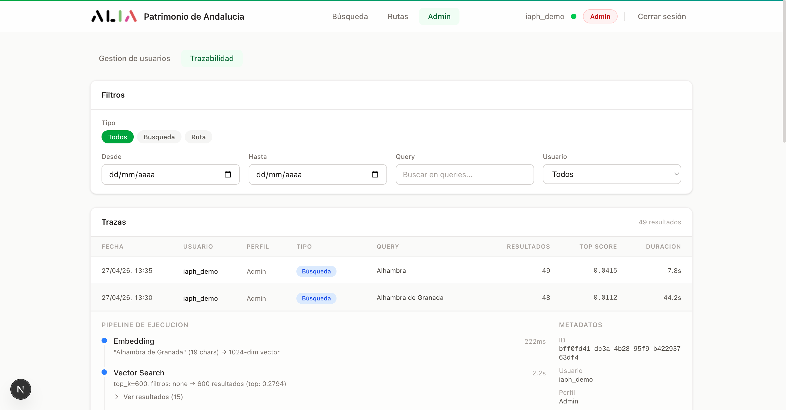

Para una traza de búsqueda se muestran los pasos del pipeline RAG:

1. **Embedding** (~200 ms) — la query se convierte en un vector de 1024 dimensiones por el modelo de encoder.
2. **Vector Search** (~2 s) — búsqueda por similitud coseno en pgvector (top_k=600 chunks). Botón **«Ver resultados (15)»** muestra los 15 mejores hits con su score y título.
3. **Neural Reranker** (~5–40 s, depende del cold start) — los 600 candidatos se reordenan con un cross-encoder. Botón muestra el top 10 reordenado.
4. **Resultados finales** — la lista paginada que ve el usuario, con su feedback 👍/👎 si lo dejó.

**Panel lateral** con metadatos:

- ID de la traza, usuario, perfil, tipo, fecha.
- Si hay feedback, se indica «Sin feedback en resultados» o el número de votos positivos/negativos.

### 6.3 Detalle de una traza de generación de ruta

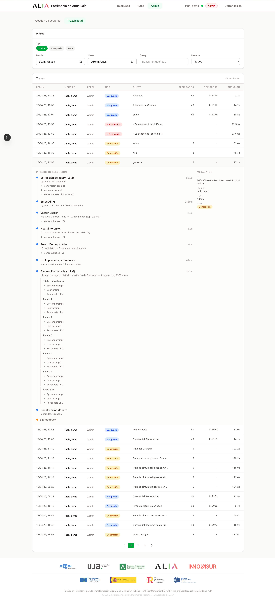

El detalle de una generación de ruta es **mucho más rico** porque cada llamada al LLM se registra con prompts y respuesta cruda. Pasos:

1. **Extracción de query (LLM)** — el LLM convierte el texto del usuario («Ruta por Granada») en una query semántica más concreta. Se pueden expandir:
   - **Ver system prompt** — instrucciones al LLM para esta tarea.
   - **Ver user prompt** — entrada concreta.
   - **Ver respuesta LLM (cruda)** — texto bruto generado.
2. **Embedding** — vector de la query extraída.
3. **Vector Search** — pgvector top_k=100 (con botón «Ver resultados»).
4. **Neural Reranker** — top 15 reordenado.
5. **Selección de paradas** — corta la lista a las N paradas pedidas (5 por defecto). Botón muestra el listado seleccionado.
6. **Lookup assets patrimoniales** — recupera la información detallada (imagen, descripción, coordenadas, etc.) de las paradas seleccionadas.
7. **Generación narrativa (LLM)** — el LLM genera la narrativa completa. Se desglosa en sub-llamadas con sus prompts y respuestas:
   - **Título + Introducción**
   - **Parada 1, 2, 3, ..., N** (una llamada por parada)
   - **Conclusión**
8. **Construcción de ruta** — ensamblaje final.

Esta granularidad permite a la UJA **diagnosticar fallos**: por ejemplo, si la narrativa de una parada se aparta del bien patrimonial real, se puede inspeccionar el system prompt y el user prompt de esa llamada concreta para entender el problema.

### 6.4 Trazas de edición de ruta (`add_stop` / `remove_stop`)

Cuando un usuario añade o elimina paradas en modo edición, se generan trazas separadas con:

- **`pipeline_mode = "route_add_stop"`** o **`"route_remove_stop"`**.
- **Mismo `execution_id`** que la traza original de generación → así se reconstruye la cronología completa de la ruta.
- **Pasos detallados:**
  - `stop_addition_request` / `stop_removal` con la posición y el documento.
  - `heritage_asset_lookup` (solo en add).
  - `narrative_generation` (solo en add) con system prompt, user prompt y la narrativa generada para esa parada concreta.
  - `route_update` con el número de paradas antes y después.
- **Metadata extra**: si el usuario llegó al modal de búsqueda desde una ruta, el feedback que diera lleva `context = "route_edit"` y `route_id` para análisis diferenciado posterior.

---

## 7. Indicador de estado de servicios

En la barra de navegación, junto al nombre de usuario, aparece un **punto de color** que refleja el estado de los servicios externos (LLM y embedding):

- **🟢 Verde — «Servicios listos»**: todos los servicios responden con baja latencia.
- **🟡 Ámbar — «Calentando»**: al menos un servicio está arrancando (probe lento por bufering de Cloud Run en cold start).
- **🔴 Rojo — «No disponible»**: error o timeout.

El tooltip detalla el estado individual de:

- **Embedding** (encoder de Cloud Run).
- **LLM** (llama.cpp con ALIA-40B GGUF Q4_K_M en Cloud Run).
- **Reranker** (co-ubicado con el embedding service).

Mientras estés conectado, el frontend dispara un **keepalive** cada 3 minutos para mantener calientes los Cloud Run y evitar cold starts. La aplicación deja de pinar cuando cierras la sesión, para no incurrir en gasto innecesario.

> **Tip de cold start:** la primera petición tras un periodo de inactividad puede tardar 30–60 segundos en llama.cpp (vs ~5 minutos con vLLM en versiones anteriores). El indicador pasa a ámbar durante ese tiempo. Para búsquedas y generaciones posteriores, los tiempos vuelven a la normalidad (~5–10 s búsquedas, ~30–60 s rutas completas).

---

## 8. Glosario

| Término | Significado |
|---------|-------------|
| **Patrimonio Inmueble** | Edificios, yacimientos arqueológicos, monumentos. |
| **Patrimonio Mueble** | Objetos, obras de arte, documentos. |
| **Patrimonio Inmaterial** | Festividades, oficios, saberes tradicionales. |
| **Paisaje Cultural** | Paisajes con valor histórico-cultural. |
| **Búsqueda semántica** | Búsqueda basada en el significado del texto, no solo en palabras clave. Combina embeddings (similitud coseno) y reranking neuronal. |
| **Detección de entidades** | Reconocimiento automático de provincias, municipios o tipos en la query del usuario para sugerir filtros. |
| **Embedding** | Representación numérica vectorial de un texto que captura su significado. El sistema usa un modelo Qwen-based de 1024 dimensiones. |
| **Reranker** | Modelo cross-encoder que reordena un conjunto de candidatos por relevancia con respecto a la query. Más preciso pero más lento que la búsqueda vectorial. |
| **RAG** | Retrieval-Augmented Generation — el LLM responde apoyándose en pasajes recuperados del catálogo en lugar de en su conocimiento interno. |
| **Streaming** | Modo de generación en el que la respuesta del LLM se va mostrando al usuario conforme se produce, en vez de esperar a tenerla completa. |
| **Pipeline mode** | Etiqueta que identifica el flujo concreto que produjo una traza: `similarity_search`, `route_generation_stream`, `route_add_stop`, `route_remove_stop`, etc. |
| **Traza de ejecución** | Registro inmutable de una operación con todos sus pasos, prompts, latencias y resultados intermedios. Inspeccionable desde el panel admin. |
| **Cold start** | Primer arranque de un servicio Cloud Run tras inactividad: tarda más por carga del modelo. Mitigado con keepalive y modo «baked» (modelo embebido en la imagen). |
| **Guía interactivo** | Chatbot contextualizado disponible dentro de cada ruta. |

---

*Documentación actualizada el 27 de abril de 2026 — versión del demostrador 1.0.8.*
*Capturas de pantalla generadas con Chrome DevTools sobre la versión local de la aplicación.*
