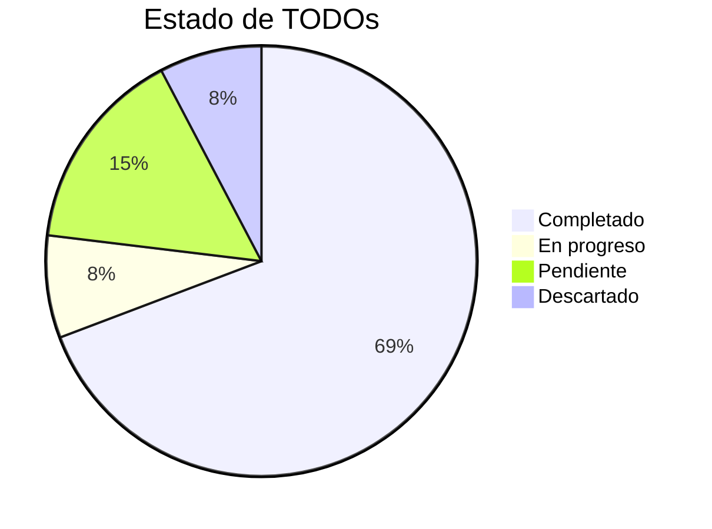
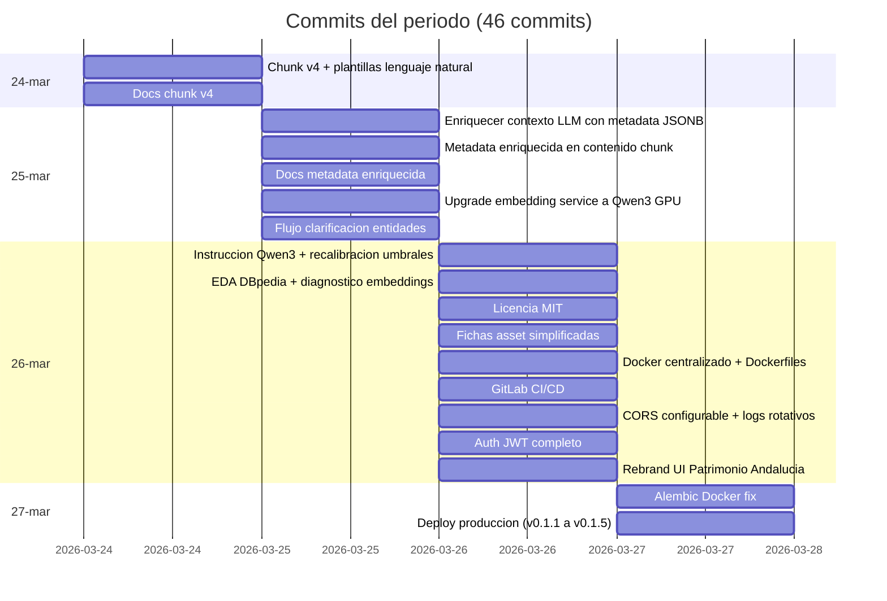
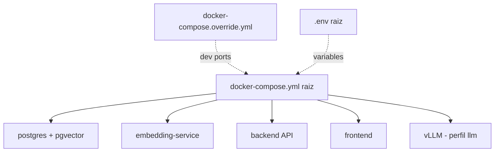
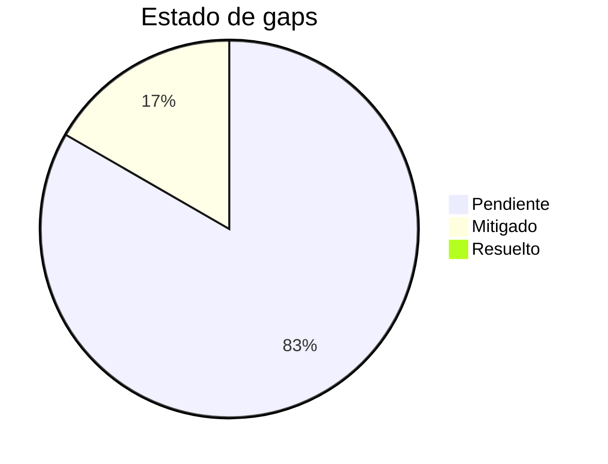
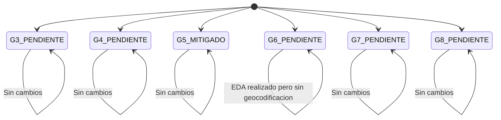

# Informe de Avances 2026-03-27

**Proyecto:** Agente conversacional RAG — Instituto Andaluz de Patrimonio Historico (IAPH)
**Encargo:** Universidad de Jaen
**Rama activa:** `main` · Commit: `8388f1a`
**Informe anterior:** `informe_avances_2026-03-20` · Commit: `8279b86` (rama `main`)
**Periodo:** 2026-03-24 → 2026-03-27
**Commits analizados:** 46
**Version actual:** 0.1.5

---

## 1. Resumen ejecutivo

Desde el ultimo punto de control (2026-03-20) se han realizado **46 commits** que incorporan avances significativos en 7 areas: reindexado con encoder Qwen3, enriquecimiento de chunks con plantillas de contexto, clarificacion conversacional de entidades, infraestructura Docker centralizada, CI/CD para GitLab, autenticacion JWT y despliegue del demostrador en produccion.

Esta semana ha sido especialmente productiva con foco en la **puesta en produccion** del demostrador (accesible en `uja-ai-chat.innovasur.com`) y en la **mejora de la calidad de recuperacion** mediante el reindexado con Qwen3 y plantillas de lenguaje natural para los chunks.

| Metrica | Antes (20-mar) | Ahora (27-mar) | Delta |
|---------|:--------------:|:--------------:|:-----:|
| Bounded contexts | 7 | **8** | +1 (Auth) |
| Tabla de chunks activa | v3 | **v4** | Reindexado completo |
| Encoder activo | MrBERT (768d) | **Qwen3 (1024d)** | Upgrade |
| Migraciones Alembic | 7 | **8** | +1 |
| Tests (funciones) | 78 | **78** | Sin cambios |
| Version | — | **0.1.5** | Versionado semantico |
| CI/CD | Ninguno | **GitLab CI** | Nuevo |
| Autenticacion | Ninguna | **JWT** | Nuevo |
| Demostrador publico | No | **Si** | Desplegado |

---

## 2. TODO compuesto — Estado actual

Esta seccion recoge el listado de tareas acordadas en la reunion de seguimiento y su estado actual.

| # | Responsable | TODO | Estado | Fecha |
|---|------------|------|:------:|:-----:|
| 1 | Arturo | Consultar a Jose Luis (IAPH) sobre enriquecimiento de Wikidata para inmuebles | **PENDIENTE** | — |
| 2 | UJA (Samuel) | Indicar que modelo de Qwen usar para el reindexado | **COMPLETADO** | 2026-03-24 |
| 3 | UJA (Samuel/Arturo) | Disenar plantilla de contexto para los chunks | **COMPLETADO** | 2026-03-24 |
| 4 | Juan Isern | Enriquecer activos inmuebles con geolocalizacion de Wikidata (pendiente confirmacion Arturo) | **DESCARTADO** | — |
| — | *(sustituido por)* | EDA describiendo los datos que hay en DBpedia | **COMPLETADO** | 2026-03-26 |
| 5 | Juan Isern | Estimar coste y horas de inferencia de modelo LLM 40B dentro del presupuesto (CloudRun) | **COMPLETADO** | 2026-03-26 |
| 6 | Juan Isern | Subir en repo GitHub/Gitlab de ALIA el codigo del proyecto | **COMPLETADO** | 2026-03-26 |
| 7 | Juan Isern | Reindexar con encoder Qwen una vez definida la plantilla de contexto | **COMPLETADO** | 2026-03-25 |
| 8 | Juan Isern | Simplificar fichas de resultados (resumen practico para ciudadano) | **COMPLETADO** | 2026-03-27 |
| 9 | Juan Isern | Anadir preguntas tipo agente para el filtrado geografico y por tipo de activo | **COMPLETADO** | 2026-03-25 |
| 10 | Juan Isern | Publicar demostrador accesible desde exterior antes de Semana Santa | **EN PROGRESO** | — |
| 10a | | Front: uja-ai-chat.innovasur.com | **COMPLETADO** | 2026-03-27 |
| 10b | | Backend: uja-ai-chat-backend.innovasur.com | **COMPLETADO** | 2026-03-27 |
| 10c | | Embedder y LLM: CloudRun | **PENDIENTE** | — |

### Distribucion de estado

---

## 3. Linea temporal de commits

---

## 4. Detalle de cambios

### 4.1 Chunks v4 con plantillas de lenguaje natural (TODO #3, #7)

**Commits:** `59da139`, `a96203b`, `c490fae`, `ad2b99e`, `71ef29c`

Se ha implementado una nueva version de chunks (v4) que transforma la informacion estructurada de cada bien patrimonial en **texto narrativo en lenguaje natural**, siguiendo las plantillas de contexto disenadas por la UJA.

**Cambios clave:**
- Nueva migracion Alembic `d4e5f6a7b8c9` que crea la tabla `document_chunks_v4`
- Plantillas de contexto por tipo de patrimonio (inmueble, mueble, inmaterial, paisaje) que convierten metadata JSONB en prosa
- Enriquecimiento del contenido del chunk con metadata especifica del tipo (estilos, periodos, actividades, etc.) desde la columna JSONB de `heritage_assets`
- Flag `--reingest` para re-ingestion limpia (borra chunks existentes antes de reingestar)
- Soporte dual encoder: MrBERT (768d, mean pooling) y Qwen3 (1024d, last-token pooling)

**Configuracion:**
- `CHUNKS_TABLE_VERSION=v4` para usar los nuevos chunks
- `EMBEDDING_DIM=1024` para Qwen3

### 4.2 Upgrade a encoder Qwen3 con GPU (TODO #2, #7)

**Commits:** `56f279e`, `381a592`

- Dockerfile del embedding service actualizado con soporte CUDA/GPU para Qwen3
- Prefijo de instruccion para queries (`embedding_query_instruction`): Qwen3 requiere un prefijo que indica la tarea de recuperacion
- Recalibracion de umbrales de relevancia:
  - `rag_score_threshold`: 0.35 → **0.50**
  - Nuevo `rag_similarity_threshold`: **0.45**
  - Nuevo `rag_similarity_only`: flag para modo solo similaridad vectorial

### 4.3 Clarificacion conversacional de entidades (TODO #9)

**Commit:** `ca0a122`

Reemplaza el menu dropdown de filtros por un **flujo conversacional** donde el sistema detecta entidades ambiguas en la query del usuario y pregunta para clarificar antes de ejecutar la busqueda.

**Nuevos componentes:**
- `ClarificationPanel.tsx`: panel UI para mostrar preguntas de clarificacion
- `useClarification.ts`: hook que gestiona el flujo de clarificacion
- Integrado en Search y Routes stores

### 4.4 Simplificacion de fichas de resultados (TODO #8)

**Commit:** `ce25544`

El panel de detalle de assets se ha rediseñado para separar informacion **practica** (resumen para ciudadano) de informacion **extendida** (datos tecnicos completos). La seccion practica se muestra por defecto y la extendida es colapsable.

**Archivos modificados:** 4 ficheros, +303/-126 lineas

### 4.5 EDA de referencias DBpedia (TODO #4 sustituido)

**Commits:** `8b9d650`, `33a4b47`
**Informe completo:** `backend/docs/EDA_DBPEDIA_IAPH.md`

En lugar de enriquecer directamente con Wikidata (pendiente confirmacion de Arturo con el IAPH), se ha realizado un **analisis exploratorio de datos** sobre las referencias a DBpedia presentes en el endpoint enriquecido de la API IAPH (`/bien/{tipo}/enriquecido/{id}`).

**Muestra:** 500 assets (estratificada proporcional desde `heritage_assets`)

#### Disponibilidad del endpoint enriquecido

| Tipo | Consultados | Con respuesta | Con DBpedia | Sin respuesta (500) |
|------|--------:|--------:|--------:|--------:|
| **inmueble** | 81 | 58 (71,6%) | 58 (71,6%) | 23 (28,4%) |
| **mueble** | 296 | 296 (100%) | 0 (0%) | 0 (0%) |
| **inmaterial** | 5 | 5 (100%) | 0 (0%) | 0 (0%) |
| **paisaje** | 118 | 118 (100%) | 0 (0%) | 0 (0%) |

> **Solo patrimonio inmueble contiene URIs DBpedia.** Mueble, inmaterial y paisaje no aportan ningún enlace.

#### Tipos de URIs encontradas (628 totales, 512 utiles)

| Categoria | Ocurrencias | URIs unicas | Que referencia |
|-----------|--------:|--------:|----------------|
| `tipologia_dbpedia` | 148 | 49 | Conceptos tipologicos via `prov:wasAssociatedWith` |
| `provincia` | 116 | 8 | Provincia del bien |
| `entidad_descripcion` | 113 | 38 | Entidades NER en texto descriptivo |
| `municipio` | 112 | 43 | Municipio del bien |
| `asociacion_dbpedia` | 12 | 2 | Roles profesionales |
| `etnia_dbpedia` | 11 | 5 | Grupos culturales/etnicos |

#### Problemas de calidad detectados

| Problema | Ejemplo | Impacto |
|----------|---------|---------|
| Desambiguacion incorrecta | `Linares_(Salas)` en vez de `Linares_(Jaén)` | Municipio apunta a localidad asturiana |
| Desambiguacion incorrecta | `Carmona_(Cantabria)` en vez de `Carmona_(Sevilla)` | Idem |
| NER ruidoso | `2005`, `Derby`, `Palisandro` | Falsos positivos |
| URIs vacias | `prov:wasAssociatedWith[{"@id":""}]` | Sin enlace |

#### Conclusiones clave

1. **No existen enlaces DBpedia al propio activo patrimonial.** Los bienes del IAPH no tienen correspondencia en DBpedia/Wikipedia como entidades individuales.
2. Las URIs son **auxiliares** (geografia, tipologia, periodos, etnias): utiles para contexto pero no para identificacion.
3. **Recomendacion: no invertir en integracion DBpedia para el RAG actual.** El enriquecimiento mas valioso (tipologias y periodos) ya esta disponible directamente en los datos IAPH. Para geocodificacion, usar Nominatim en vez de las URIs DBpedia mal desambiguadas.

### 4.6 Infraestructura Docker centralizada

**Commits:** `c688f03`, `2ae8793`, `445b946`, `795e0cc`, `10e9e60`, `aa48a3b`, `ad9b916`

Reorganizacion completa de la infraestructura Docker:

- **Embedding service** movido de `backend/docker/` a la raiz (`embedding/`)
- **docker-compose.yml** centralizado en la raiz del monorepo
- **docker-compose.override.yml** para configuracion de desarrollo (puertos expuestos)
- **Frontend Dockerfile** con build multi-stage (standalone output)
- **Backend Dockerfile** en `backend/docker/`
- `.env` centralizado en la raiz para variables compartidas entre servicios
- Makefiles actualizados para usar el compose raiz

### 4.7 GitLab CI/CD (TODO #6)

**Commits:** `a3252c2`, `c6549cc`

Pipeline CI/CD para GitLab con:
- Build de imagenes Docker para cada servicio (backend, frontend, embedding)
- Tagging con semver y commit hash
- Filtros de cambios por directorio (solo rebuild lo que cambia)
- Target: rama `main`

### 4.8 Autenticacion JWT

**Commits:** `4319157`, `0879bfe`, `1f338d5`, `e13278b`

Nuevo bounded context **Auth** con arquitectura hexagonal completa:

| Capa | Componentes |
|------|-------------|
| Domain | `User` entity, `AuthPort`, `TokenPort` |
| Application | `LoginUseCase`, `RefreshTokenUseCase`, `ValidateTokenUseCase` |
| Infrastructure | `HardcodedAuthAdapter`, `JwtTokenAdapter` |
| API | `/api/v1/auth/login`, `/api/v1/auth/refresh`, dependency `get_current_user` |
| Frontend | Login page, `useAuthStore` (Zustand), middleware de proteccion de rutas, token refresh |

Ademas, se han anadido **API keys** para los adaptadores de embedding y LLM service, evitando acceso no autenticado a los servicios de inferencia.

**Nuevos parametros en config:**
- `auth_username`, `auth_password`: credenciales (hardcoded por ahora)
- `jwt_secret_key`, `jwt_algorithm`: configuracion JWT
- `jwt_access_token_expire_minutes`: 30 min
- `jwt_refresh_token_expire_days`: 7 dias
- `embedding_api_key`, `llm_api_key`: API keys para servicios

### 4.9 Rebrand UI — Patrimonio de Andalucia

**Commits:** `b145ada`, `dd77bd9`

- Paleta de colores actualizada: de amber a **colores oficiales de la Junta de Andalucia** (verde institucional)
- Branding: "Patrimonio de Andalucia"
- Boton de logout en la barra de navegacion
- Cambios propagados a todos los componentes del frontend (20+ archivos)

### 4.10 Despliegue en produccion (TODO #10)

**Commits:** `18713c0`, `8f56791`, `745cfbe`, `20ab882`, `c9e3504`, `d7430bb`, `8388f1a` y version bumps

Multiples iteraciones de ajustes para el despliegue en produccion:

- **Alembic**: corregido para respetar `DATABASE_URL` del entorno en Docker
- **Puertos configurables** via variable `PORT` en cada contenedor
- **Backend port**: cambiado de 8080 a 20000 para compatibilidad con Traefik
- **Frontend**: `NEXT_PUBLIC_API_URL` leido desde fichero `API_URL` en lugar de build args (permite cambiar en runtime)
- **Fix login**: redireccion con navegacion completa para que la cookie de auth llegue al middleware
- **5 version bumps** (0.1.1 → 0.1.5) durante el despliegue iterativo

### 4.11 Otros cambios

| Commit | Descripcion |
|--------|-------------|
| `3c7806f` | CORS configurable via `cors_origins` en settings (elimina wildcard hardcoded) |
| `6c737e3` | Log handlers con rotacion diaria para embedding, auth, routes y search |
| `165c2e7` | Campos preview y municipality en logs de infraestructura |
| `bba6bb9` | Licencia MIT anadida al repositorio |
| `7f7f9ec`, `9c9c94b` | Scripts de diagnostico de embeddings y benchmark de retrieval con Qwen3 |
| `8f16c52` | Next.js standalone output + `allowedDevOrigins` configurables |
| `f9f6883` | README actualizado con nueva estructura Docker |

---

## 5. Estado de gaps anteriores

| # | Gap | Estado anterior | Estado actual | Detalle |
|---|-----|:--------------:|:-------------:|---------|
| G3 | Datos sucios (~270 registros) | PENDIENTE | **PENDIENTE** | Sin cambios. No se ha abordado la limpieza de datos |
| G4 | Tests minimos | PENDIENTE | **PENDIENTE** | 78 funciones de test, sin cambios en el periodo |
| G5 | LLM sin fine-tuning | MITIGADO | **MITIGADO** | Sigue con Gemini como alternativa. Fine-tuning Salamandra en progreso por UJA |
| G6 | 96,6% assets sin coordenadas | PENDIENTE (Alta) | **PENDIENTE** | EDA de DBpedia realizado pero geocodificacion no implementada |
| G7 | Paisaje Cultural sin contenido buscable | PENDIENTE (Media) | **PENDIENTE** | Sin cambios |
| G8 | Chat y Accesibilidad desactivados en UI | PENDIENTE (Media) | **PENDIENTE** | Sin cambios |

---

## 6. Nuevos parametros de configuracion

| Parametro | Valor | Descripcion |
|-----------|-------|-------------|
| `embedding_api_key` | *(vacio)* | API key para autenticar contra el embedding service |
| `llm_api_key` | *(vacio)* | API key para autenticar contra el LLM service |
| `embedding_query_instruction` | `"Retrieve relevant heritage documents."` | Prefijo de instruccion Qwen3 para queries |
| `rag_similarity_only` | `False` | Modo solo similaridad vectorial (sin hibrido) |
| `rag_similarity_threshold` | `0.45` | Umbral de similaridad coseno |
| `rag_score_threshold` | **0.50** (era 0.35) | Umbral de puntuacion de relevancia (recalibrado para Qwen3) |
| `cors_origins` | `"*"` | Origenes CORS permitidos (configurable, antes hardcoded) |
| `auth_username` | `"admin"` | Usuario de autenticacion |
| `auth_password` | `"admin"` | Contrasena de autenticacion |
| `jwt_secret_key` | `"change-me-in-production"` | Secreto JWT |
| `jwt_algorithm` | `"HS256"` | Algoritmo JWT |
| `jwt_access_token_expire_minutes` | `30` | Expiracion access token |
| `jwt_refresh_token_expire_days` | `7` | Expiracion refresh token |

---

## 7. Estado de tests

| Metrica | Baseline (20-mar) | Actual (27-mar) | Delta |
|---------|:-----------------:|:---------------:|:-----:|
| Archivos de test | 7 | 7 | 0 |
| Funciones de test | 78 | 78 | 0 |

No se han anadido nuevos tests en este periodo. El gap G4 (tests minimos) persiste. Se recomienda priorizar tests de integracion para los nuevos flujos de autenticacion y el pipeline de chunks v4.

---

## 8. Nueva migracion Alembic

| # | Revision | Descripcion |
|---|----------|-------------|
| 8 | `d4e5f6a7b8c9` | Crea tabla `document_chunks_v4` con plantillas de lenguaje natural |

---

## 9. Nuevos gaps identificados

| # | Gap | Prioridad |
|---|-----|:---------:|
| G9 | **Autenticacion hardcoded** — credenciales en config.py, sin almacen de usuarios | Alta |
| G10 | **Embedder y LLM no desplegados en CloudRun** — demostrador solo funciona con servicios locales | Alta |
| G11 | **Sin tests para auth, chunks v4, clarificacion** — funcionalidades nuevas sin cobertura | Media |

---

## 10. Resumen ejecutivo

El periodo 2026-03-24 al 2026-03-27 ha sido el de mayor avance en preparacion para produccion del proyecto. Se han completado **9 de 12 TODOs** del listado compuesto, incluyendo los mas criticos: reindexado con Qwen3 sobre plantillas de contexto enriquecidas, clarificacion conversacional de entidades, simplificacion de fichas para ciudadanos y despliegue del frontend y backend en dominios publicos.

La calidad de la recuperacion ha mejorado significativamente gracias al cambio de encoder (MrBERT → Qwen3, de 768 a 1024 dimensiones) y a las plantillas de lenguaje natural que transforman la metadata estructurada en texto narrativo. Los umbrales de relevancia han sido recalibrados acorde al nuevo encoder.

Los puntos criticos pendientes son: (1) despliegue del embedder y LLM en CloudRun para que el demostrador sea completamente funcional desde exterior, (2) la consulta de Arturo al IAPH sobre enriquecimiento con Wikidata, y (3) la cobertura de tests que no ha avanzado en este periodo. Se recomienda priorizar el despliegue CloudRun antes de Semana Santa (semana del 30 de marzo).

---

*Informe de avances generado automaticamente — Periodo: 2026-03-20 → 2026-03-27 — Rama `main`, commit `8388f1a`*
