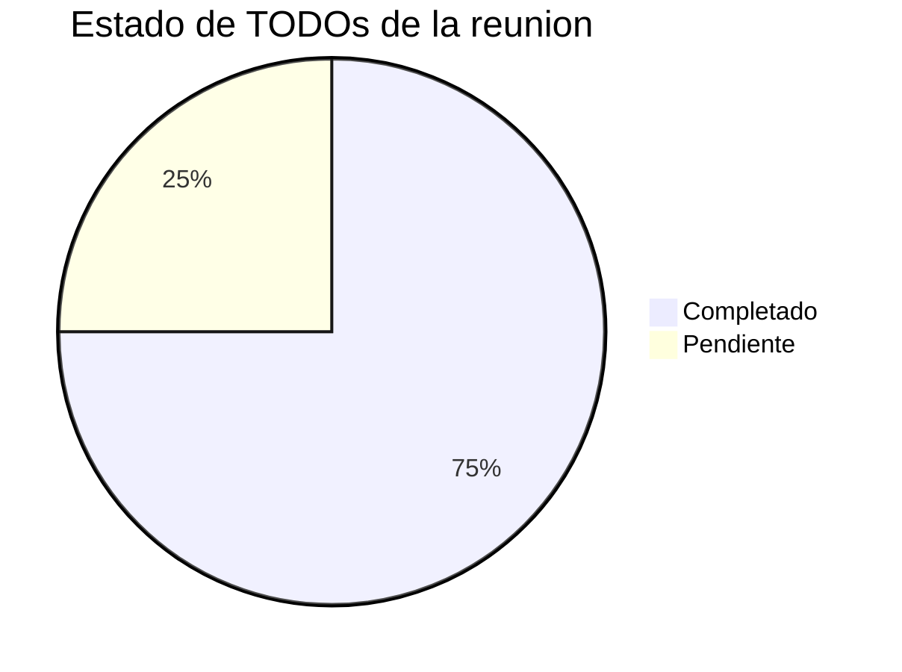
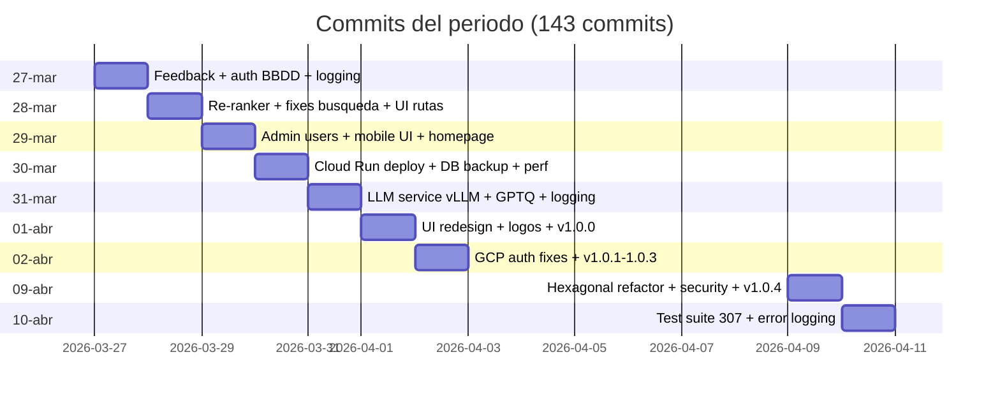
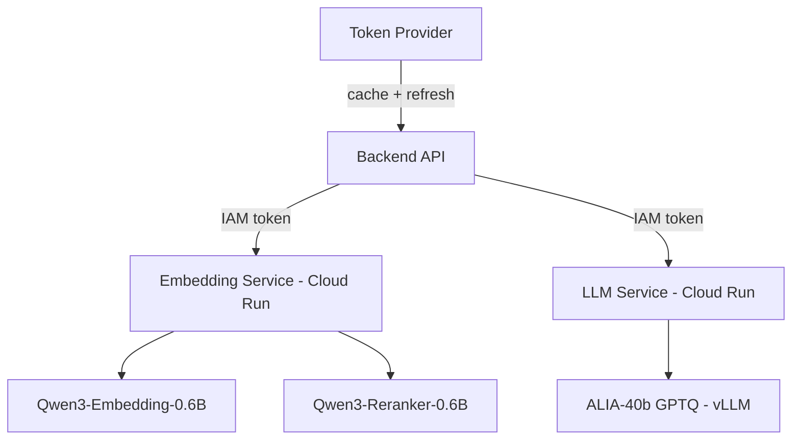
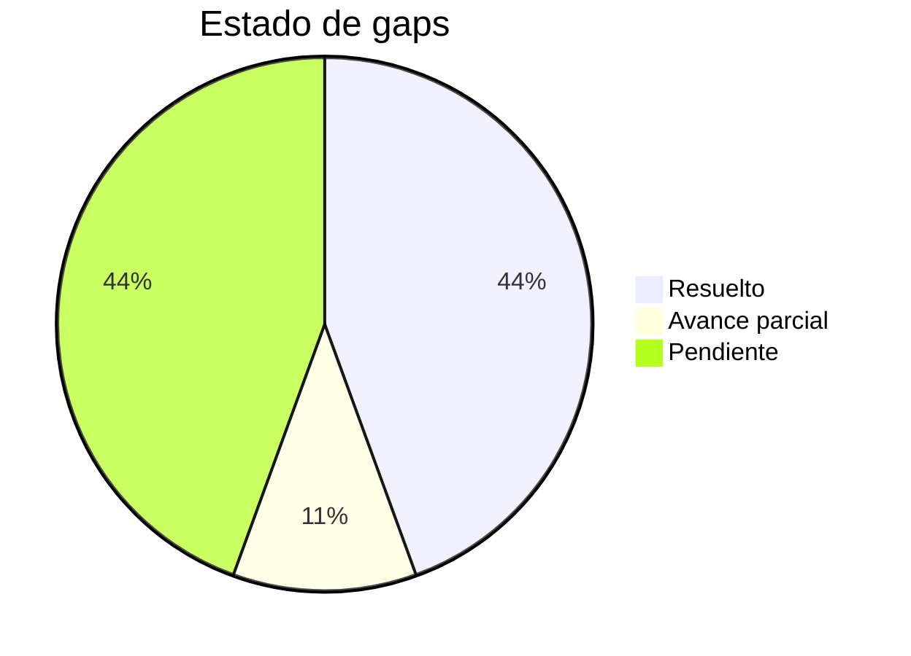
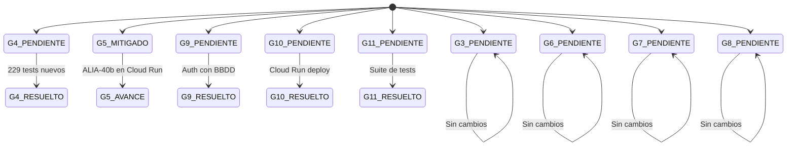

# Informe de Avances 2026-04-10

**Proyecto:** Agente conversacional RAG — Instituto Andaluz de Patrimonio Historico (IAPH)
**Encargo:** Universidad de Jaen
**Rama activa:** `develop` · Commit: `e5c095a`
**Informe anterior:** `informe_avances_2026-03-27` · Commit: `8388f1a` (rama `main`)
**Periodo:** 2026-03-27 → 2026-04-10
**Commits analizados:** 143
**Version actual:** 1.0.4

---

## 1. Resumen ejecutivo

Desde el ultimo punto de control (2026-03-27, commit `8388f1a`) se han realizado **143 commits** que incorporan avances significativos en 9 areas: sistema de feedback de usuario, re-ranker neuronal, despliegue de LLM y embedder en Cloud Run, gestion de usuarios con BBDD, arquitectura hexagonal completa (4 ciclos de auditoria), suite de tests comprehensiva, migracion de auth a async SQLAlchemy, logging integral de infraestructura y mejoras de frontend (logos, responsividad, UX).

Este periodo ha sido el de mayor avance en **calidad de codigo y arquitectura**, con un salto de 78 a **307 funciones de test** y una refactorizacion profunda para alcanzar cumplimiento 10/10 de arquitectura hexagonal en todos los bounded contexts.

| Metrica | Antes (27-mar) | Ahora (10-abr) | Delta |
|---------|:--------------:|:--------------:|:-----:|
| Version | 0.1.5 | **1.0.4** | Salto a 1.x |
| Bounded contexts | 8 | **9** | +1 (Feedback) |
| Migraciones Alembic | 8 | **11** | +3 |
| Tests (funciones) | 78 | **307** | +229 (+294%) |
| Archivos de test | 7 | **34** | +27 |
| Re-ranker | Ninguno | **Qwen3-Reranker-0.6B** | Nuevo |
| Auth backend | Hardcoded | **BBDD + bcrypt** | Upgrade |
| LLM Cloud Run | No | **Si** | Desplegado |
| Embedder Cloud Run | No | **Si** | Desplegado |
| Feedback | No | **Si (thumbs up/down)** | Nuevo |

---

## 2. TODO compuesto — Estado actual

Esta seccion recoge el listado de tareas acordadas en la reunion de seguimiento y su estado actual.

| # | Responsable | TODO | Estado | Detalle |
|---|------------|------|:------:|---------|
| 1 | Juan | Terminar despliegue de LLM y embedder en Google Cloud Run | **COMPLETADO** | Scripts de deploy, Dockerfiles baked, IAM token provider, 11 version bumps |
| 2 | Juan | Integrar re-ranker (modelo de Arturo) | **COMPLETADO** | Qwen3-Reranker-0.6B co-localizado en embedding service con endpoint `/rerank` |
| 3 | Juan | Anadir sistema de feedback basico (thumbs up/down) con trazabilidad en BBDD | **COMPLETADO** | Tabla `user_feedback`, endpoints CRUD, componente `FeedbackButtons.tsx`, `search_id` trazable |
| 4 | Juan | Anadir logos ALIA, UJA, Innovasur y acknowledgement en README y front | **COMPLETADO** | Logos en navbar, footer, login. README con badges y partners |
| 5 | Juan | Incluir selector de perfil de usuario (investigador/ciudadano) en el login | **COMPLETADO** | Panel de administracion con gestion de usuarios y tipos de perfil implementado. CRUD completo de profile types + asignacion de perfil por usuario en `/admin` |
| 6 | Juan | Reportar a Jose Luis (IAPH) los ejemplos concretos de bienes sin datos | **PENDIENTE** | No realizado en este periodo |
| 7 | Samuel | Pasar referencia de acknowledgement/financiacion de ALIA | **COMPLETADO** | Info proporcionada por Samuel, integrada por Juan en front y README |
| 8 | Samuel | Buscar y compartir documento de analisis de perfiles de usuario del IAPH | **COMPLETADO** | Documento recibido por correo electronico post-Semana Santa |
| 9 | Samuel | Analizar que % de inmuebles del IAPH tienen enlace Wikidata | **COMPLETADO** | Analisis completado: 28.798 bienes en Wikidata procedentes del IAPH (inmueble: 26.799 = 90,6%, inmaterial: 1.840 = 95,6%, mueble: 62 = 0,06%). De ellos, 8.478 (29,4%) tienen coordenadas (inmueble: 31,3%, mueble: 87,1%, inmaterial: 0,3%). Dataset CSV entregado |
| 10 | Arturo | Pasar modelo de re-ranker y detalles de cuantizacion de Salamandra 40B | **COMPLETADO** | Modelo integrado: Qwen3-Reranker-0.6B. ALIA-40b con GPTQ |
| 11 | Fernando | Explorar servicios cartograficos de la Junta de Andalucia | **PENDIENTE** | Sin avance |
| 12 | Todos | Reunion con IAPH a la vuelta de Semana Santa | **PENDIENTE** | Por agendar |

### Distribucion de estado

---

## 3. Linea temporal de commits

---

## 4. Detalle de cambios

### 4.1 Sistema de feedback de usuario (TODO #3)

**Commits:** `10cfd2f`, `5c783e4`, `02ac73c`

Nuevo bounded context **Feedback** con arquitectura hexagonal completa:

- **Tabla** `user_feedback` (migracion Alembic `17bdc32dc6df`) con columnas: user_id, item_type, item_id, search_id, vote (up/down), timestamp
- **Domain:** entidad `Feedback`, puerto `FeedbackRepository`
- **Application:** use cases `SubmitFeedback`, `GetFeedback`, `GetFeedbackBatch`, `DeleteFeedback`
- **Infrastructure:** repositorio SQLAlchemy con modelo `UserFeedbackModel`
- **API:** endpoints `/api/v1/feedback/` (POST, GET, DELETE, batch)
- **Frontend:** componente `FeedbackButtons.tsx` integrado en `RouteCard` y `SearchResults`
- **Trazabilidad:** `search_id` unico generado por busqueda para vincular feedback con queries

### 4.2 Re-ranker neuronal con Qwen3-Reranker-0.6B (TODO #2)

**Commits:** `3588f50`, `22aeeb2`, `2f7d8dc`, `ea7ec25`, `0ee0ff1`

Integracion de un cross-encoder neuronal para reordenacion de resultados:

- **Modelo:** Qwen3-Reranker-0.6B co-localizado en el embedding service
- **Endpoint:** `/rerank` en el servicio de embeddings
- **Pipeline:** vector search → reranker → relevance filter (scoring v7)
- **Domain:** nuevo puerto `RerankerPort`, servicio `NeuralRerankingService`
- **Infrastructure:** `RerankerAdapter` usando httpx con la URL configurada
- **Configuracion:** `reranker_enabled`, `reranker_service_url`, `reranker_instruction`, `reranker_top_n`
- **Fix critico:** `hnsw.ef_search` alineado con `retrieval_k` para que pgvector explore suficientes candidatos

### 4.3 Despliegue LLM y Embedder en Cloud Run (TODO #1)

**Commits:** `bb42ce4`, `60a2a4e`, `8ad1668`, `737d28b`, `a522961`, `9000aba`, `57bb881`, `5aa3263`, `e72519a`, `fdacd72`, `a227eee`, `13f8b12`, `235c5d2` y 11 version bumps

Despliegue completo de servicios de inferencia en Google Cloud Run:

- **Embedding service:** Dockerfile baked con modelo pre-descargado, script `deploy.sh` con setup de service accounts
- **LLM service:** nuevo directorio `llm/` con Dockerfile, vLLM + GPTQ (ALIA-40b), GPU RTX PRO 6000
- **Autenticacion IAM:** reemplazo de API keys por Cloud Run IAM token provider (`token_provider.py`)
- **Token provider** compartido: `SharedTokenProvider` con cache de tokens y refresh automatico
- **Version bumps:** 0.1.5 → 0.1.6 → 0.1.7 → 1.0.0 → 1.0.1 → 1.0.2 → 1.0.3 → 1.0.4
- **Fixes Docker:** `--no-sync` en uv run, `--extra gcp` para google-auth, restauracion de transporte HTTP oficial

### 4.4 Arquitectura hexagonal — 4 ciclos de auditoria

**Commits (09-abr):** `5d8d4ef`, `3a03282`, `9feea10`, `171b009`, `2ad1f23`, `36dd194`, `f995afd`, `72ef0d9`, `df65849`, `99ba2fa`, `c16eca8`, `3ce31d5`, `99e51af`, `204e9cb`, `d0c647e`, `b31903a`

Refactorizacion profunda para alcanzar cumplimiento 10/10 de arquitectura hexagonal:

1. **Jerarquia de excepciones tipadas:** `ApplicationError`, `DomainError`, `InfrastructureError` con API exception handlers centralizados
2. **Value objects compartidos:** `AssetId` extraido a `domain/shared/value_objects/`
3. **Ownership de sesiones:** chat y routes verifican que el usuario autenticado es dueno de la sesion
4. **UnitOfWork:** patron implementado en todos los bounded contexts async
5. **Adaptadores compartidos:** `EmbeddingPort` y `HttpEmbeddingAdapter` consolidados en `shared/`
6. **Parser de narrativas:** extraido a `_narrative_parser.py` como modulo reutilizable
7. **Excepciones de servicio:** movidas de infraestructura a capa de aplicacion
8. **Httpx centralizado:** helper compartido `httpx_client.py` para LLM y embedding
9. **Legacy eliminado:** `src/db/` migrado a capas hexagonales
10. **Logger namespaces:** estandarizados con patron `iaph.<context>.<layer>`

### 4.5 Suite de tests comprehensiva (de 78 a 307)

**Commits (10-abr):** `5e96b43`, `b023318`, `490a7c9`, `8bcc674`, `8f6e4b7`

De 78 funciones de test (muchas rotas) a **307 funciones pasando** en 34 archivos:

| Capa | Tests nuevos | Archivos | Cobertura |
|------|:-----------:|:--------:|-----------|
| Domain (unit) | 104 | 9 | IntentClassifier, QueryReformulator, DocumentEnrichment, HybridSearch, RelevanceFilter, Reranking, RouteBuilder, EntityDetection, AssetId |
| Application (unit) | 82 | 8 | Todos los use cases: chat, auth, RAG, feedback, search, documents, accessibility |
| API (integration) | 35 | 5 | chat, search, feedback, auth endpoints + exception handlers |
| Infrastructure (unit) | 16 | 3 | JWT token adapter, embedding adapter, VLLM adapter |
| Pre-existentes (fix) | — | — | 18 tests pre-existentes reparados |

- **Fix previo:** 18 tests pre-existentes que fallaban por cambios de API (commit `5e96b43`)
- **Framework:** pytest con `respx` para mocking de HTTP, fixtures compartidas en `conftest.py`

### 4.6 Migracion de auth a async SQLAlchemy + UnitOfWork

**Commits:** `4d5f34c`, `265a022`, `204e9cb`

- **Auth original:** credenciales hardcoded en config.py, adapter sincrono
- **Auth actual:** tabla `users` con bcrypt, `DbAuthAdapter` asincrono con SQLAlchemy AsyncSession
- **Sync engine:** `database_url_sync` property para operaciones de seed al arranque (ensure_root_admin)
- **UnitOfWork:** patron aplicado en auth, chat, routes, feedback, documents

### 4.7 Gestion de usuarios y admin

**Commits:** `66837a9`, `d3eaf6c`, `be20209`, `1d61c97`, `8015461`, `c70738a`, `a854fce`, `1ab651e`, `0d0975f`

- **Backend:** CRUD completo de usuarios (`/admin/users`), roles (admin/user), profile types
- **Migracion:** `add_users_profile_types_and_user_scoping`, `seed_admin_profile_type`
- **Frontend:** pagina `/admin` con tabla de usuarios, edicion modal, gestion de profile types
- **CLI:** script `manage_users.py` con target Makefile
- **Tests:** 24 tests especificos para endpoints admin (21 en `test_admin.py` + 3 mas)
- **Seguridad:** seed automatico de usuario root-admin al arranque

### 4.8 Logging comprehensivo de infraestructura

**Commits:** `3a18fc9`, `6a34576`, `2f0d485`, `da5abff`, `6548323`, `6706d90`, `9c8144e`, `b7e61d8`

- **Pipeline logging:** timing de cada etapa del RAG pipeline con detalles de chunks
- **LLM logging:** prompts y respuestas a nivel DEBUG, latencia en cada llamada
- **Logger reorganizado:** `llm.log` solo contiene llamadas de inferencia LLM
- **Namespaces estandarizados:** patron `iaph.<context>.<layer>` en todos los modulos
- **Retencion configurable:** `LOG_RETENTION_DAYS` via variable de entorno
- **Error logging:** errores de BBDD traducidos a excepciones tipadas en auth login
- **Excepcion catches:** narrowed de `Exception` a excepciones especificas

### 4.9 Mejoras de frontend

**Commits (28-mar a 01-abr):** multiples commits de UI/UX

- **Logos y branding:** logos ALIA, UJA, Innovasur, SINAI en navbar, footer y login. Acknowledgement de financiacion ALIA
- **Homepage:** hero full-width con imagen, animaciones fadeInUp, stats grid responsive
- **Rutas:** RouteCard rediseñada con thumbnail horizontal, RouteStopCard con modo compacto, detalle con layout roadmap alternado
- **Admin:** pagina rediseñada con edicion modal y tabla simetrica
- **Mobile:** NavBar responsive con hamburger menu, asset detail full-screen en mobile
- **404:** pagina personalizada con estilo visual de la app
- **DeleteConfirmModal:** componente compartido para confirmaciones
- **Filtro de rutas:** busqueda por titulo con highlight, insensible a acentos

### 4.10 Seguridad — autenticacion en todos los endpoints

**Commits:** `a49ae73`, `1d9927a`, `73dda96`, `9feea10`, `bb8475b`, `bd61256`

- **Autenticacion obligatoria** en todos los endpoints: routes, RAG, accessibility, documents, heritage, search
- **Session ownership:** chat sessions y routes vinculadas al usuario autenticado
- **Get messages:** verificacion de ownership en endpoint de mensajes
- **Eliminacion de credenciales hardcoded** de env files y docker-compose

### 4.11 Correccion de narrativas de rutas

**Commit:** `e5c095a`

- **`llm_route_narrative_max_tokens`:** aumentado de 2048 a 8192 para evitar truncamiento
- **Markdown stripping:** parser de narrativas elimina artefactos markdown (`**`, `###`, etc.)
- **Prompt mejorado:** instrucciones explicitas de formato en prompts de generacion de rutas

### 4.12 Runtime API URL injection

**Commit:** `357ec93`

- **Frontend Docker:** `NEXT_PUBLIC_API_URL` inyectado via `entrypoint.sh` en tiempo de ejecucion
- **Antes:** URL hardcodeada en build o leida de fichero `API_URL`
- **Ahora:** variable de entorno inyectada al arrancar el contenedor, permite una imagen Docker para todos los entornos

### 4.13 Otros cambios notables

| Commit | Descripcion |
|--------|-------------|
| `fdfbf89` | Utilidad de backup/restore de BBDD con modos local y Docker |
| `2e2521e` | Reutilizacion de clientes httpx y adaptadores singleton para embedding |
| `5aa3263` | vLLM pinned a v0.18.1 con `--enforce-eager` para reducir cold start |
| `290902b` | Auto-fallback a modo Docker cuando pg_dump no esta instalado |
| `682c979`, `56c9670` | Deduplicacion de peticiones de busqueda y generacion de rutas |
| `68da4c7` | Normalizacion de queries a minusculas para consistencia |
| `6d42af6`, `e0e5255` | Vocabulario expandido de tipos de patrimonio con soporte de plurales |

---

## 5. Estado de gaps anteriores

| # | Gap | Estado anterior | Estado actual | Detalle |
|---|-----|:--------------:|:-------------:|---------|
| G3 | Datos sucios (~270 registros) | PENDIENTE | **PENDIENTE** | Sin cambios |
| G4 | Tests minimos | PENDIENTE | **RESUELTO** | De 78 a 307 tests, 34 archivos, 4 capas cubiertas |
| G5 | LLM sin fine-tuning | MITIGADO | **AVANCE PARCIAL** | ALIA-40b GPTQ desplegado en Cloud Run con vLLM. Fine-tuning pendiente |
| G6 | 96,6% assets sin coordenadas | PENDIENTE | **PENDIENTE** | Sin cambios en geocodificacion |
| G7 | Paisaje Cultural sin contenido buscable | PENDIENTE | **PENDIENTE** | Sin cambios |
| G8 | Chat y Accesibilidad desactivados en UI | PENDIENTE | **PENDIENTE** | Chat y accessibility siguen desactivados en frontend |
| G9 | Autenticacion hardcoded | PENDIENTE | **RESUELTO** | Auth migrada a BBDD con tabla users, bcrypt, roles admin/user |
| G10 | Embedder y LLM no desplegados en CloudRun | PENDIENTE | **RESUELTO** | Ambos desplegados en Cloud Run con IAM token provider |
| G11 | Sin tests para auth, chunks v4, clarificacion | PENDIENTE | **RESUELTO** | 229 tests nuevos cubriendo auth, todos los use cases y servicios de dominio |

### Distribucion de estado

### Transiciones de estado

---

## 6. Nuevos parametros de configuracion

| Parametro | Valor | Descripcion |
|-----------|-------|-------------|
| `reranker_enabled` | `False` | Habilitar/deshabilitar re-ranker neuronal |
| `reranker_service_url` | `http://localhost:18001` | URL del servicio de reranking |
| `reranker_instruction` | `"Given a heritage search query..."` | Instruccion para el reranker |
| `reranker_top_n` | `50` | Numero maximo de resultados tras reranking |
| `gcp_service_account_json` | `""` | JSON de service account GCP para IAM |
| `log_retention_days` | `30` | Dias de retencion de logs (configurable) |
| `admin_username` | `"admin"` | Usuario admin inicial (reemplaza `auth_username`) |
| `admin_password` | `"admin"` | Password admin inicial (reemplaza `auth_password`) |
| `database_url_sync` | *(propiedad)* | URL sincrona derivada de `database_url` |
| `llm_route_narrative_max_tokens` | **8192** (era 2048) | Max tokens para narrativas de rutas |
| `embedding_api_key` | *(eliminado)* | Reemplazado por IAM token provider |

---

## 7. Estado de tests

| Metrica | Baseline (27-mar) | Actual (10-abr) | Delta |
|---------|:-----------------:|:---------------:|:-----:|
| Archivos de test | 7 | **34** | **+27** |
| Funciones de test | 78 | **307** | **+229** (+294%) |
| Domain (unit) | 0 | 104 | +104 |
| Application (unit) | 0 | 82 | +82 |
| API (integration) | 0 | 35 | +35 |
| Infrastructure (unit) | 0 | 16 | +16 |
| Pre-existentes (reparados) | 78 (algunos rotos) | 70 (todos pasando) | 18 reparados |

El gap G4 (tests minimos) queda **RESUELTO**. La cobertura ahora incluye las 4 capas de la arquitectura hexagonal.

---

## 8. Nuevas migraciones Alembic

| # | Revision | Descripcion |
|---|----------|-------------|
| 9 | `17bdc32dc6df` | Crea tabla `user_feedback` para sistema de feedback |
| 10 | `add_users_profile_types_and_user_scoping` | Crea tablas `users`, `profile_types` y scoping de sesiones |
| 11 | `a980e4d9d33f` | Seed de profile type admin |

---

## 9. Nuevos gaps identificados

| # | Gap | Prioridad |
|---|-----|:---------:|
| G12 | **~~Selector de perfil de usuario~~** — RESUELTO. Panel de administracion completo con gestion de usuarios y tipos de perfil en `/admin` | ~~Media~~ → Resuelto |
| G13 | **Chat y Accesibilidad siguen desactivados** — llevan 3 informes como G8, sin avance. Evaluar si se descarta o se prioriza | Baja |

---

## 10. Resumen ejecutivo

El periodo 2026-03-27 al 2026-04-10 ha sido el de mayor avance en **calidad arquitectonica y cobertura de tests** del proyecto. Con 143 commits, se han abordado 4 de los TODOs de la ultima reunion (despliegue Cloud Run, re-ranker, feedback, logos/acknowledgement) y se ha realizado una refactorizacion profunda de la arquitectura hexagonal en 4 ciclos de auditoria que llevan el cumplimiento a 10/10.

El salto de 78 a 307 funciones de test (+294%) resuelve el gap G4 que llevaba 3 informes abierto. La cobertura ahora abarca las 4 capas (domain, application, API, infrastructure) con tests puros de dominio, mocking de dependencias y tests de integracion de endpoints. Ademas, se resolvieron 18 tests pre-existentes que fallaban.

El despliegue de LLM (ALIA-40b GPTQ) y embedder (Qwen3) en Cloud Run resuelve el gap G10 y completa la infraestructura del demostrador en produccion. La autenticacion ha evolucionado de credenciales hardcoded a un sistema completo con tabla de usuarios, bcrypt, roles y gestion admin, resolviendo G9. Samuel completo el analisis de Wikidata: 28.798 bienes del IAPH referenciados (inmueble 90,6%, inmaterial 95,6%), de los cuales 8.478 (29,4%) tienen coordenadas — dato clave para G6. Los puntos criticos pendientes son: (1) reportar a Jose Luis (IAPH) los bienes sin datos, (2) agendar la reunion con IAPH, y (3) la geocodificacion de assets (G6) que lleva 4 informes sin avance pero ahora tiene datos de partida gracias al analisis de Wikidata.

---

*Informe de avances generado automaticamente — Periodo: 2026-03-27 → 2026-04-10 — Rama `develop`, commit `e5c095a`*
