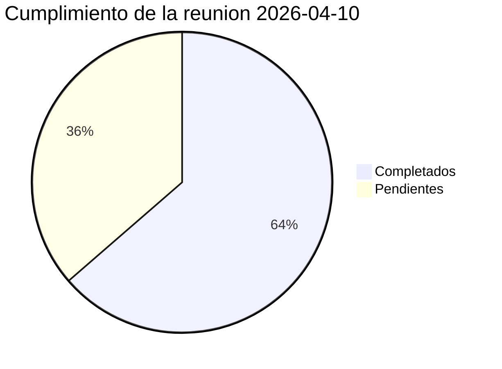
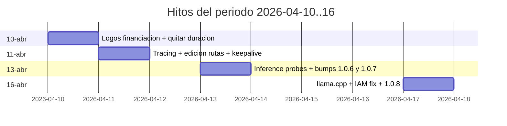
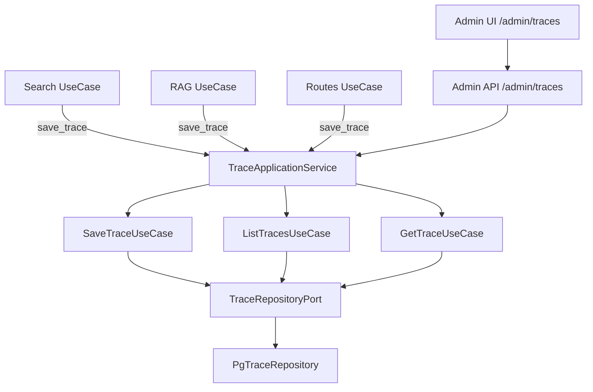
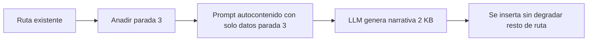
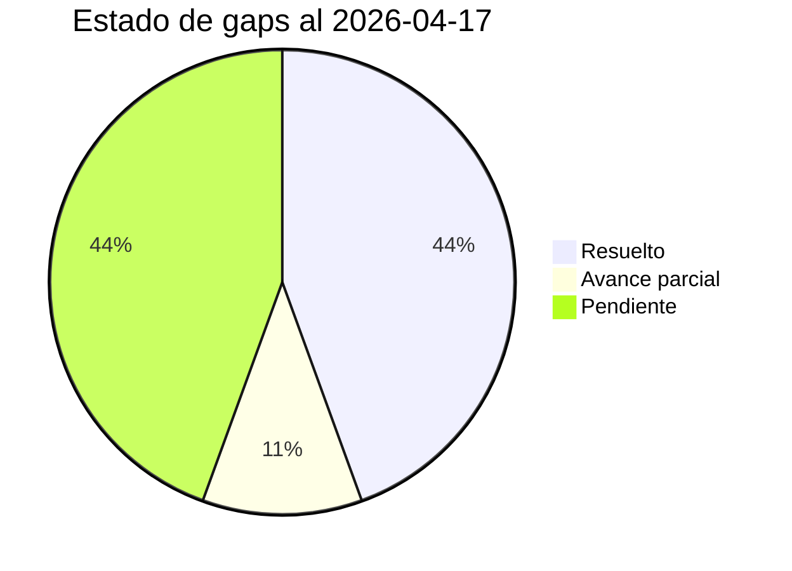
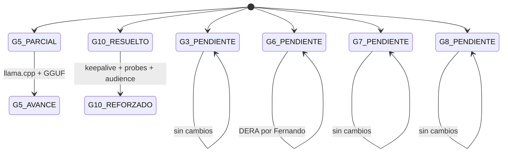

# Informe de Avances 2026-04-17

**Proyecto:** Agente conversacional RAG — Instituto Andaluz de Patrimonio Historico (IAPH)
**Encargo:** Universidad de Jaen
**Rama activa:** `develop` · Commit HEAD: `8812222`
**Informe anterior:** `informe_avances_2026-04-10` · Commit baseline: `e5c095a`
**Periodo:** 2026-04-10 → 2026-04-17 (7 dias)
**Commits analizados:** 27
**Version:** 1.0.4 → **1.0.8**

---

## 1. Resumen ejecutivo

En la semana posterior a la reunion con la UJA del 2026-04-10 se han cerrado las **5 tareas asignadas a Juan** y una tarea de Arturo, ademas de desplegar dos capacidades no previstas pero solicitadas en la reunion:

1. Un **sistema de trazas de ejecucion** con vista de administracion para depurar todo el pipeline (prompts, recuperacion, reranking, LLM)
2. Un motor **llama.cpp** con GGUF que coexiste con vLLM, reduciendo el cold start de ~5 min a ~30-60 s

La semana concentra **27 commits** repartidos en 4 dias de trabajo efectivo (10, 11, 13 y 16 de abril), con 10 `feat`, 5 `fix`, 3 `chore` (version bumps 1.0.5 → 1.0.8), 3 `docs`, 2 `style` y 1 `refactor`. Los grandes hitos son: la **flanbilizacion del demostrador en Cloud Run** (keepalive, inference probes, IAM audience fix), la **edicion de rutas generadas** con SSE streaming, el **feedback por resultado individual**, y la introduccion del **motor llama.cpp** como alternativa para la semana siguiente.

| Metrica | 10-abr | 16-abr | Delta |
|---|:-:|:-:|:-:|
| Version | 1.0.4 | **1.0.8** | +4 bumps |
| Commits en el periodo | — | **27** | — |
| Migraciones Alembic | 11 | **13** | +2 |
| Tests (funciones) | 307 | **308** | +1 |
| Motores LLM disponibles | 1 (vLLM) | **2 (vLLM + llama.cpp)** | +1 |
| Sistema de trazas | No | **Si** | Nuevo |
| Edicion de rutas | No | **Si** | Nuevo |
| Feedback por resultado | No | **Si** | Nuevo |
| TODOs Juan reunion | 0/5 | **5/5** | 100% |

---

## 2. Cumplimiento de la reunion 2026-04-10

Seccion clave del informe: la reunion del 10 de abril con la UJA (Juan Isern, Arturo Montejo, Samuel Sanchez Carrasco, Fernando Martinez Santiago, Sergio Gonzalez) dejo **5 TODOs asignados a Juan**, una tarea a Arturo y 4 tareas de exploracion/coordinacion. El estado al cierre de la semana es:

### 2.1 TODOs de Juan (5/5 cerrados el 2026-04-13 · 1 dia de trabajo)

> *Cita textual de la nota de reunion (Google Drive):*
>
> - Juan: Añadir logos de financiación (Plan Recuperación, BSC, Ministerio, UE) en 2 niveles — inmediato
> - Juan: Mover feedback thumbs up/down a cada resultado individual (no a la lista completa)
> - Juan: Añadir vista de debugging/trazabilidad del pipeline en la sección admin (prompts, RAG, re-ranking, respuesta LLM)
> - Juan: Implementar edición de rutas: eliminar elementos + añadir desde búsqueda
> - Juan: Quitar estimación de tiempo de visita de las rutas

| # | TODO | Fecha cierre | Commits |
|---|------|:-:|---|
| J1 | Logos de financiacion (Plan Recuperacion, BSC, Ministerio, UE, NextGeneration) en 2 niveles | 2026-04-13 | `3f45f70`, `5375566`, `a602ddf`, `855d3b2` |
| J2 | Feedback thumbs up/down por resultado individual (clave compuesta query+document_id) | 2026-04-13 | `cd589ed`, `965cc6a` |
| J3 | Vista admin de trazabilidad del pipeline (backend + frontend) | 2026-04-13 | `c085198`, `1040fa4`, `46ae6e2` |
| J4 | Edicion de rutas: eliminar paradas + añadir desde busqueda | 2026-04-13 / 14 | `67376a7`, `4c683ab`, `2e00f60` |
| J5 | Quitar estimacion de duracion total de visita de las rutas | 2026-04-13 | `4d194bb` (migracion `abf44d053886`) |

### 2.2 TODO de Arturo (cerrado 2026-04-17)

> *Cita textual:* «Arturo: Pasar modelo cuantizado más ligero del ALIA 40B»

| # | TODO | Fecha cierre | Implementacion |
|---|------|:-:|---|
| A1 | Modelo cuantizado mas ligero del ALIA 40B | 2026-04-17 | `c46e0c6` — motor llama.cpp alternativo con GGUF Q4_K_M (24,7 GB vs ~80 GB sin cuantizar). Cold start ~30-60 s vs ~5 min de vLLM con bitsandbytes |

### 2.3 TODOs pendientes (no bloqueantes)

| TODO | Responsable | Estado |
|------|-------------|:-:|
| Consultar a Jose Luis (IAPH) sobre geolocalizacion de catalogo y fuentes alternativas | Arturo | PENDIENTE |
| Explorar fuente DERA (patrimonio) — viabilidad de matching con catalogo IAPH | Fernando | PENDIENTE |
| Preparar informe si DERA viable → posible reunion con IAPH | Fernando | PENDIENTE |
| Reunion con IAPH por agendar (Arturo coordina) | Todos | PENDIENTE |

### 2.4 Items adicionales identificados y resueltos

Ademas de los TODOs formales, dos puntos surgidos en la reunion como «futurible» se han atacado en la semana:

| Item | Estado | Referencia |
|------|:-:|---|
| Encadenar llamadas al LLM (una por parada) para evitar degradacion por contexto largo | **COMPLETADO** 2026-04-13 | `2e00f60` — prompts de narrativa por parada auto-contenidos |
| Evaluar paralelismo con varias GPUs vs cuantizacion mas agresiva | **COMPLETADO** 2026-04-17 | `c46e0c6` — cuantizacion GGUF elegida frente a paralelismo |

### 2.5 Distribucion del cumplimiento



---

## 3. Tabla de commits del periodo

Ordenados cronologicamente (27 commits entre 2026-04-10 tarde y 2026-04-17):

| Hash | Fecha | Tipo | Mensaje |
|------|-------|:-:|---------|
| `01d0772` | 2026-04-10 | docs | add frontend user guide with application screenshots |
| `45f397c` | 2026-04-10 | docs | add progress report 2026-03-27 to 2026-04-10 |
| `12f0cf4` | 2026-04-10 | chore | bump version to 1.0.5 |
| `855d3b2` | 2026-04-10 | feat | add IAPH logo to footer and login page partner logos |
| `a602ddf` | 2026-04-10 | fix | adjust login modal width and logo sizes for 5-logo row layout |
| `5375566` | 2026-04-10 | feat | add institutional logos row and update IAPH link in footer and login |
| `3f45f70` | 2026-04-10 | feat | add institutional partner logo images (IAPH, BSC, Ministerio, NextGen, Plan Recuperacion) |
| `4d194bb` | 2026-04-10 | refactor | remove visit duration estimation from routes across all layers |
| `dfd4ff2` | 2026-04-10 | style | apply ruff linting fixes across backend |
| `cd589ed` | 2026-04-11 | feat | move search feedback to per-result level with composite key |
| `965cc6a` | 2026-04-11 | style | improve feedback button colors and search result card layout |
| `c085198` | 2026-04-11 | feat | add execution tracing system with admin API and search/route instrumentation |
| `1040fa4` | 2026-04-11 | feat | add admin tracing screen with filterable pipeline timeline detail |
| `ad17ac8` | 2026-04-11 | fix | increase vLLM HTTP timeout to 300s to absorb Cloud Run cold starts |
| `46ae6e2` | 2026-04-11 | feat | enrich end-to-end traces with granular pipeline steps, full prompts, and raw LLM responses |
| `67376a7` | 2026-04-11 | feat | add route stop editing and SSE streaming generation with real-time preview |
| `4c683ab` | 2026-04-11 | feat | add-to-route from search results with background processing and hexagonal fixes |
| `f4ec183` | 2026-04-11 | docs | document intentional direct commit in trace_repository as architectural exception |
| `bbf2df5` | 2026-04-11 | feat | add Cloud Run keepalive health checks and service status indicator |
| `2e00f60` | 2026-04-11 | fix | make route stop narrative prompts self-contained per stop |
| `54fe328` | 2026-04-13 | feat | replace metadata health checks with real inference probes for Cloud Run readiness |
| `ffdf856` | 2026-04-13 | chore | bump version to 1.0.6 |
| `aab22c2` | 2026-04-13 | fix | scope gitignore models/ rule to root so ORM model files are tracked |
| `1ac8894` | 2026-04-13 | chore | bump version to 1.0.7 |
| `c46e0c6` | 2026-04-17 | feat | add llama.cpp LLM engine alongside vLLM with GGUF deployment support |
| `954f7ef` | 2026-04-17 | fix | use scheme://host as Cloud Run IAM token audience to avoid 403 |
| `8812222` | 2026-04-17 | chore | bump version to 1.0.8 |

### Linea temporal de hitos



---

## 4. Detalle de cambios

### 4.1 Logos de financiacion (J1)

**Commits:** `3f45f70`, `5375566`, `a602ddf`, `855d3b2`

Se añaden los logos institucionales que exige la financiacion ALIA:

- **Partners (fila superior):** ALIA, UJA, Innovasur, SINAI, IAPH
- **Financiacion (fila inferior):** Plan de Recuperacion, Ministerio, Barcelona Supercomputing Center (BSC), NextGenerationEU, logo IAPH enlazado

Se reajusta el ancho del modal de login y el tamaño de los logos para que quepa la fila de 5 partners (`a602ddf`). El footer y la pagina de login se reestructuran en dos niveles (partners arriba, financiacion abajo) siguiendo el patron de `alia.es`.

**Archivos clave:**

- `frontend/public/images/` — 5 PNGs nuevos (bsc, iaph, ministerio, next-negeration, plan-recuperación)
- `frontend/components/NavBar.tsx`, `frontend/app/login/page.tsx`

### 4.2 Feedback por resultado individual (J2)

**Commits:** `cd589ed`, `965cc6a`

Cambio de alcance del feedback: antes era **un voto por busqueda completa** (lista entera), ahora es **un voto por cada resultado individual** dentro de la lista. La clave primaria se amplia a la tupla `(user_id, search_id, document_id)`:

- `frontend/components/search/SearchResults.tsx` — cada tarjeta lleva su propio `FeedbackButtons`
- `frontend/store/search.ts` — estado de feedback por resultado
- `frontend/store/feedback.ts` — clave compuesta para votos de busqueda
- Tests añadidos en `test_feedback_endpoints.py` y `test_feedback_use_cases.py`

Sigue siendo compatible con el feedback por ruta (una ruta = un voto) gracias a la distincion `item_type`.

### 4.3 Sistema de trazas de ejecucion (J3) — *hito mayor del periodo*

**Commits:** `c085198` (1030 lineas, 29 archivos), `1040fa4` (941 lineas, 5 archivos UI), `46ae6e2` (234 lineas, 12 archivos enriquecimiento)

Nuevo subcontexto compartido **`shared/traces`** con arquitectura hexagonal completa. Captura todo el pipeline de cada busqueda, ruta o chat para que un administrador pueda diagnosticar prompts, tamaños de contexto y respuestas del LLM.

**Migracion Alembic** `f1a2b3c4d5e6_create_execution_traces_table.py`:

```sql
CREATE TABLE execution_traces (
    id UUID PRIMARY KEY,
    execution_type VARCHAR(32) NOT NULL,      -- search | route | chat
    execution_id VARCHAR(128) NOT NULL,
    user_id UUID REFERENCES users(id) ON DELETE SET NULL,
    username VARCHAR(128),
    user_profile_type VARCHAR(64),
    query TEXT,
    pipeline_mode VARCHAR(32),
    steps JSONB NOT NULL DEFAULT '[]',        -- array de etapas con timing
    summary JSONB NOT NULL DEFAULT '{}',
    feedback_value SMALLINT,
    status VARCHAR(16) DEFAULT 'success',
    created_at TIMESTAMPTZ NOT NULL DEFAULT NOW()
);
CREATE INDEX ix_execution_traces_type_date ON execution_traces(execution_type, created_at DESC);
CREATE INDEX ix_execution_traces_user ON execution_traces(user_id, created_at DESC);
CREATE INDEX ix_execution_traces_execution_id ON execution_traces(execution_id);
```

**Arquitectura hexagonal del contexto:**



**API admin:**

- `GET /api/v1/admin/traces` — listado paginado con filtros por tipo (`search|route|chat`), usuario, fecha, query
- `GET /api/v1/admin/traces/{trace_id}` — detalle completo: cada etapa del pipeline con prompts, resultados parciales y timing

**Enriquecimiento** (`46ae6e2`): cada uso caso emite eventos granulares por etapa:
- RAG: `query_embed`, `vector_search`, `text_search`, `rrf_fusion`, `relevance_filter`, `reranking`, `context_assembly`, `llm_call`
- Routes: `llm_query_extract`, `entity_detection`, `asset_selection`, `narrative_generation` (por parada), `enrichment`
- Se guardan **prompts completos** y **respuestas raw** del LLM para diagnostico

**Frontend** (`frontend/app/admin/traces/page.tsx`, 481 lineas; `frontend/components/admin/TraceDetail.tsx`, 362 lineas): pantalla de admin con:
- Tabla filtrable (tipo, usuario, fecha, query) con paginacion
- Detalle tipo «timeline» con cada etapa expandible mostrando prompt, respuesta, chunks recuperados, duracion
- Feedback por resultado si existe

**Excepcion arquitectonica documentada** (`f4ec183`): el `PgTraceRepository` hace commit directo a la sesion en `save_trace` para no perder trazas cuando la transaccion principal hace rollback (un error en el pipeline RAG no debe impedir que la traza del fallo quede registrada). Se documenta explicitamente como excepcion al patron UnitOfWork.

### 4.4 Edicion de rutas generadas (J4) — *hito mayor del periodo*

**Commits:** `67376a7` (2435 lineas, 20 archivos), `4c683ab` (346 lineas, 8 archivos), `2e00f60` (prompts self-contained)

La reunion decidio que el usuario debe poder **eliminar paradas** de una ruta generada por la IA y **añadir paradas desde los resultados de busqueda**. Se implementan dos nuevos casos de uso y se refactoriza la generacion para soportar streaming:

**`RemoveStopUseCase`** (`backend/src/application/routes/use_cases/remove_stop.py`, 132 lineas):

- Valida ownership de la ruta (`route.user_id == current_user.id`)
- Reordena las paradas tras el borrado
- Persiste via `UnitOfWork`

**`AddStopUseCase`** (`backend/src/application/routes/use_cases/add_stop.py`, 269 lineas):

- Acepta `document_id` y `position` opcional
- Consulta el activo patrimonial (`HeritageAssetLookupPort`) para obtener preview (imagenes, coordenadas) y descripcion completa
- Genera narrativa **auto-contenida por parada** con `SINGLE_STOP_NARRATIVE_SYSTEM_PROMPT` y `build_single_stop_narrative_prompt`, evitando degradacion por contexto largo
- Inserta la parada en la posicion indicada y reordena el resto
- Persiste via `UnitOfWork`

**`GenerateRouteStreamUseCase`** (`backend/src/application/routes/use_cases/generate_route_stream.py`, 592 lineas):

- Reimplementacion en **SSE** (Server-Sent Events) de la generacion de rutas
- Stream de eventos: `title_generated`, `introduction_chunk`, `stop_generated` (una por parada), `conclusion_chunk`, `route_complete`
- Permite mostrar la ruta en tiempo real en el frontend mientras el LLM sigue generando

**Frontend** — 3 componentes nuevos:

- `frontend/components/routes/RouteStreamingPreview.tsx` (174 lineas) — vista en vivo durante la generacion
- `frontend/components/routes/SearchStopModal.tsx` (438 lineas) — buscador integrado para añadir paradas
- `frontend/components/search/AddToRouteModal.tsx` (253 lineas) — desde un resultado de busqueda, elegir a que ruta existente añadirlo

**Flujo de auto-contencion de prompts** (`2e00f60`):



Con este cambio se evita que añadir una parada 10 obligue al LLM a re-procesar las 9 paradas anteriores en contexto.

### 4.5 Quitar estimacion de duracion (J5)

**Commit:** `4d194bb` (19 archivos, 59 adiciones, 163 eliminaciones) + migracion `abf44d053886`

Se elimina `total_duration_minutes` de la tabla `virtual_routes` y toda su cadena: DTOs, servicios, UI. Se borra el test `test_route_builder_service.py::test_total_duration_estimation`. Razon de la reunion: sin geolocalizacion no se puede estimar distancia entre paradas; los «8 horas» hardcoded engañan al usuario.

**Migracion Alembic** `abf44d053886_drop_total_duration_minutes_from_.py`:

```python
def upgrade() -> None:
    op.drop_column('virtual_routes', 'total_duration_minutes')
```

### 4.6 Motor llama.cpp con GGUF (A1)

**Commit:** `c46e0c6` (823 lineas, 13 archivos) — respuesta al TODO de Arturo

Se añade un **segundo motor de inferencia** que coexiste con vLLM:

- **Dockerfile.llamacpp** — basado en `ghcr.io/ggml-org/llama.cpp:server-cuda-b4927`
- **Dockerfile.llamacpp.baked** — bakes del GGUF en la imagen (~28 GB, vs ~100 GB de vLLM)
- **Script `scripts/download_alia_gguf.sh`** — descarga `ALIA-40b-instruct-2601.Q4_K_M.gguf` de `mradermacher/ALIA-40b-instruct-2601-GGUF`
- **Cloud Build** — `cloudbuild-llamacpp.yaml` y `cloudbuild-baked-llamacpp.yaml`
- **`scripts/setup.sh` / `scripts/deploy.sh`** — flag `--engine vllm|llamacpp` para elegir motor en deploy
- **Makefile** — nuevos targets `cloud-llm-setup-llamacpp-baked`, `cloud-llm-deploy-llamacpp-baked`, `cloud-llm-setup-llamacpp-model`
- **docker-compose.yml** — perfil `llm-llamacpp` (mutuamente excluyente con `llm`)
- **Documentacion** — `llm/README.md` (153 lineas) y `backend/docs/LLM_ENGINES.md`

El backend **no cambia**: ambos motores exponen el mismo API OpenAI-compatible (`/v1/chat/completions`, `/v1/models`, `/health`). El nombre del modelo se alinea via `LLM_GGUF_ALIAS=ALIA-40b-instruct-2601` (coincide con `LLM_MODEL_NAME`).

| | vLLM (actual) | llama.cpp (nuevo) |
|---|---|---|
| Formato | HF safetensors + GPTQ/bitsandbytes | GGUF Q4_K_M (24,7 GB) |
| Imagen baked | ~100 GB | ~28 GB |
| Cold start | ~5 min con bitsandbytes | ~30-60 s |
| Tok/s A100 | 40-60 | 25-35 |
| `/health` | 200 prematuro | 503 durante load, 200 cuando ready |

Quedan disponibles ambos y la decision de cuando migrar se toma tras una prueba de usuario real.

### 4.7 Keepalive y status indicator de Cloud Run

**Commit:** `bbf2df5` (636 lineas, 8 archivos)

Nuevo endpoint `GET /api/v1/health/services` que hace ping en paralelo a embedding-service y LLM-service, devolviendo el estado de cada uno. En la `NavBar` aparece un **indicador de estado** (verde/ambar/rojo) que permite al usuario ver si los servicios estan calientes antes de lanzar una query.

- **Puerto** `ServiceHealthPort` + servicio de dominio `HealthCheckService`
- **Adaptador** `HealthCheckAdapter` con tokens IAM reutilizados

### 4.8 Inference probes reales (no metadata)

**Commit:** `54fe328` (3 archivos, 124 adiciones)

El `HealthCheckAdapter` dejaba de ser fiable: vLLM responde 200 en `/health` antes de terminar de cargar pesos, y el `/v1/models` solo lee metadata. Se reemplaza por una **prueba real de inferencia** (`POST /v1/chat/completions` con `max_tokens=1`) que es la unica señal fiable de readiness. Se aplica identicamente a vLLM y llama.cpp.

### 4.9 Fix IAM audience (scheme://host)

**Commit:** `954f7ef` (15 lineas en `token_provider_composition.py`)

Bug encontrado en produccion: el token IAM se pedia con audience `https://uja-llm-xxx.run.app/v1`. Cloud Run rechazaba con 403 porque el sufijo `/v1` no es parte del origin. Fix:

```python
def _audience_for(target_url: str) -> str:
    """Return the Cloud Run service origin (scheme://host) as the IAM audience."""
    parsed = urlparse(target_url)
    if parsed.scheme and parsed.netloc:
        return f"{parsed.scheme}://{parsed.netloc}"
    return target_url
```

### 4.10 Otros cambios

| Commit | Descripcion |
|--------|-------------|
| `ad17ac8` | Timeout HTTP de vLLM a 300 s para absorber cold starts de Cloud Run |
| `aab22c2` | `gitignore` ajustado para que `backend/src/infrastructure/*/models.py` (ORM) se rastree pese a la regla general `models/` |
| `dfd4ff2` | Ruff autofix en 45 archivos (207 inserciones, 99 eliminaciones) |
| `01d0772` | Guia de usuario con 9 capturas de pantalla en `frontend/docs/images/` |

---

## 5. Estado de gaps anteriores

| # | Gap | Estado anterior | Estado actual | Detalle |
|---|-----|:--:|:--:|---|
| G3 | Datos sucios (~270 registros) | PENDIENTE | **PENDIENTE** | Sin cambios |
| G4 | Tests minimos | RESUELTO | **RESUELTO** | Estable en 308 funciones (+1 por tests de feedback composite key) |
| G5 | LLM sin fine-tuning / cuantizado mas ligero | AVANCE PARCIAL | **AVANCE** | Motor llama.cpp + GGUF Q4_K_M disponible; modelo ALIA-40b 2601 accesible alternativo |
| G6 | 96,6% assets sin coordenadas | PENDIENTE | **PENDIENTE** | Exploracion DERA por Fernando sigue pendiente |
| G7 | Paisaje Cultural sin contenido buscable | PENDIENTE | **PENDIENTE** | Sin cambios |
| G8 | Chat y Accesibilidad deshabilitados en UI | PENDIENTE | **PENDIENTE** | Chat funciona integrado en rutas; el modulo standalone sigue desactivado |
| G9 | Autenticacion hardcoded | RESUELTO | **RESUELTO** | Estable |
| G10 | Embedder y LLM no desplegados en Cloud Run | RESUELTO | **RESUELTO reforzado** | +keepalive, +inference probes, +status indicator, +IAM audience fix |
| G11 | Sin tests para auth, chunks v4, clarificacion | RESUELTO | **RESUELTO** | Estable |

### Distribucion



### Transiciones



---

## 6. Nuevos gaps y excepciones arquitectonicas

| # | Item | Clasificacion | Estado |
|---|------|:--:|---|
| E1 | Commit directo en `PgTraceRepository` fuera de UnitOfWork | Excepcion arquitectonica documentada | RESUELTO-POR-DISEÑO (`f4ec183`) |

La excepcion E1 se documenta en el codigo y en `backend/docs/`: el repositorio de trazas hace commit directo a la sesion para que un rollback del pipeline principal no borre la propia traza del fallo. Es intencional.

---

## 7. Nuevos parametros y migraciones

### 7.1 Migraciones Alembic (+2)

| # | Revision | Descripcion |
|---|----------|-------------|
| 12 | `abf44d053886_drop_total_duration_minutes_from_.py` | Elimina `virtual_routes.total_duration_minutes` |
| 13 | `f1a2b3c4d5e6_create_execution_traces_table.py` | Crea `execution_traces` con 3 indices |

### 7.2 Variables de entorno

**Backend:** sin cambios. El sistema de trazas reusa la infraestructura existente (misma BBDD, mismo token provider).

**llama.cpp (opcionales, solo si se activa el motor alternativo):**

| Variable | Default | Proposito |
|----------|---------|-----------|
| `LLAMA_CPP_TAG` | `server-cuda-b4927` | Tag de la imagen base de llama.cpp-server |
| `LLM_GGUF_MODEL_DIR` | `ALIA-40b-instruct-2601-GGUF` | Directorio bajo `backend/models/` con el GGUF |
| `LLM_GGUF_FILE` | `ALIA-40b-instruct-2601.Q4_K_M.gguf` | Nombre del archivo GGUF |
| `LLM_GGUF_ALIAS` | `ALIA-40b-instruct-2601` | Nombre reportado por `/v1/models` (debe coincidir con `LLM_MODEL_NAME`) |
| `LLM_CTX_SIZE` | `8192` | Ventana de contexto |
| `LLM_N_GPU_LAYERS` | `999` | Capas que se descargan a GPU (999 = todas) |

---

## 8. Estado de tests

| Metrica | 10-abr | 16-abr | Delta |
|---------|:-:|:-:|:-:|
| Archivos de test | 34 | **34** | 0 |
| Funciones de test | 307 | **308** | +1 |

El delta es pequeño porque la semana priorizo feature delivery tras la reunion. Los tests añadidos cubren:

- `test_feedback_endpoints.py::*` — feedback con clave compuesta (3 tests)
- `test_feedback_use_cases.py::*` — casos de uso con clave compuesta (varios)
- Se elimino `test_route_builder_service::test_total_duration_estimation` (obsoleto tras quitar la feature)

No se observan regresiones en la suite.

---

## 9. Proxima reunion — preparacion

Items a cubrir en la siguiente reunion con UJA/IAPH:

1. **Demo de la vista de trazas** — mostrar a Arturo la pantalla `/admin/traces` con prompts, timing y respuestas raw para que valore si necesita mas granularidad
2. **Demo de edicion de rutas** — eliminar + añadir desde busqueda + SSE streaming
3. **Mostrar llama.cpp** — si esta listo para produccion, comparar cold start y calidad vs vLLM/GPTQ
4. **Pendiente Fernando** — estado de la exploracion de DERA (patrimonio geolocalizado)
5. **Pendiente Arturo** — contacto con Jose Luis (IAPH) sobre fuentes de geolocalizacion
6. **Scheduler Cloud Run** — decision sobre si activar `min-instances=1` en horario laboral para matar el cold start al 100% (con coste)
7. **Fine-tuning ALIA** — estado por parte de la UJA

---

## 10. Resumen ejecutivo

La semana **2026-04-10 al 2026-04-17** se caracteriza por una ejecucion muy ajustada al acta de la reunion del 10 de abril: las 5 tareas que Juan se llevo cerraron al dia siguiente completo de trabajo (13 de abril), dejando el resto de la semana para reforzar la capa de infraestructura (keepalive, inference probes, IAM audience) y abrir la puerta a un motor LLM alternativo (llama.cpp + GGUF) que Arturo habia solicitado como «cuantizado mas ligero».

El **sistema de trazas de ejecucion** es el hito tecnico mas notable: aporta a Arturo y al equipo de UJA una herramienta de diagnostico que cubre todo el pipeline (embed, retrieval, fusion, filtro, rerank, assembly, LLM) y persiste prompts completos y respuestas raw en `execution_traces`. Es una inversion en observabilidad que reducira iteraciones en las proximas sesiones de tuning. Se acompaña de una **excepcion arquitectonica documentada**: el repositorio de trazas hace commit directo para no perder el log cuando el pipeline principal falla.

La **edicion de rutas** (eliminar + añadir desde busqueda + SSE streaming) conecta los dos casos de uso (busqueda + rutas) como pidio Arturo, y prepara el terreno para el futurible de que un tecnico del IAPH o un ayuntamiento pueda crear sus propias rutas. Los prompts de narrativa por parada se hicieron auto-contenidos para evitar degradacion por contexto largo.

Los puntos pendientes son externos al equipo: la consulta de Arturo a Jose Luis (IAPH) sobre geolocalizacion, la exploracion de la fuente **DERA** por Fernando, y el agendamiento de la reunion con IAPH. En el lado tecnico queda abierta la decision de cuando activar llama.cpp en produccion frente a vLLM (la semana anade la capacidad; la prueba de usuario decidira).

---

*Informe de avances generado automaticamente — Periodo: 2026-04-10 → 2026-04-17 — Rama `develop`, commit `8812222`*
