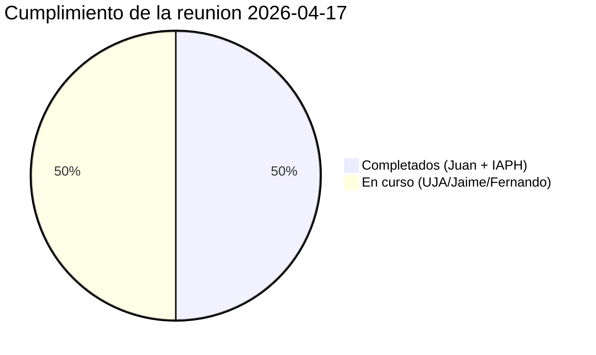
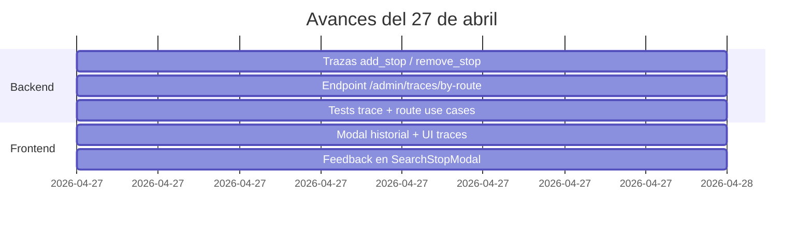
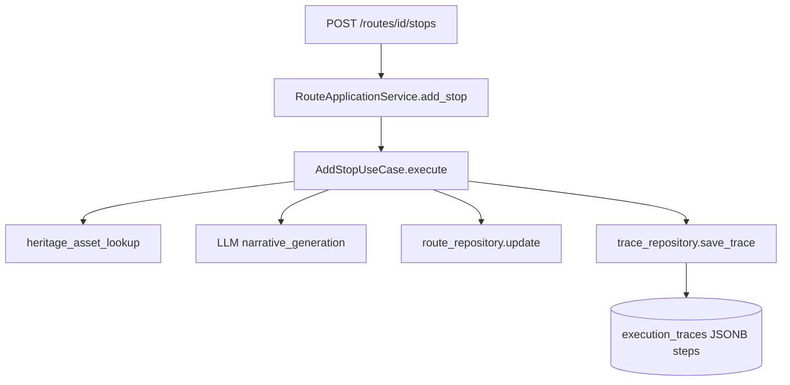
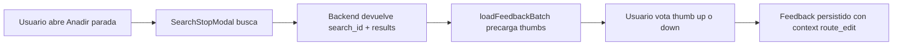
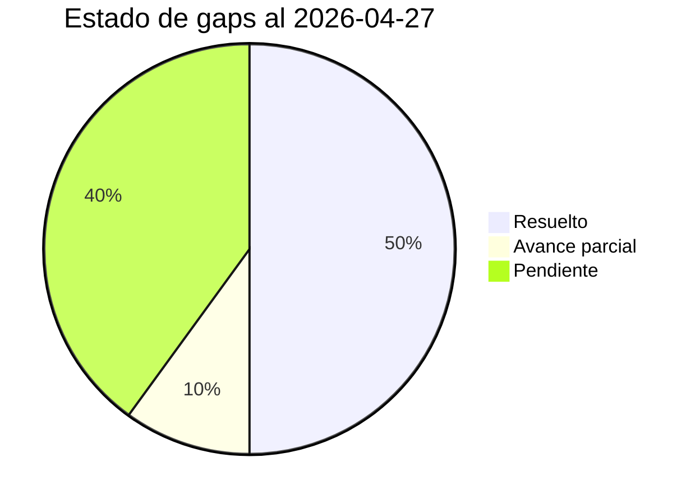

# Informe de Avances 2026-04-27

**Proyecto:** Agente conversacional RAG — Instituto Andaluz de Patrimonio Historico (IAPH)
**Encargo:** Universidad de Jaen
**Rama activa:** `develop` · Commit HEAD: `c21ba9d`
**Informe anterior:** `informe_avances_2026-04-17` · Commit baseline: `8812222`
**Periodo:** 2026-04-17 → 2026-04-27 (10 dias naturales · 1 dia efectivo de trabajo)
**Commits analizados:** 5
**Version:** 1.0.8 (sin bump de version en el periodo)

---

## 1. Resumen ejecutivo

La semana del 17 al 27 de abril es una semana corta de cara al codigo (Juan estuvo de vacaciones de martes a viernes, segun la nota de reunion del 17 de abril) pero **cierra al 100% los dos TODOs operativos asignados a Juan** en la reunion de seguimiento del 2026-04-17:

1. **Log de ediciones de ruta** en la trazabilidad: cada `add_stop` y `remove_stop` genera ahora una traza independiente con `pipeline_mode = route_add_stop` / `route_remove_stop`, capturando que parada se añadio o elimino, prompts del LLM, narrativa generada y timing por etapa
2. **Feedback thumbs up/down en busqueda dentro de edicion de rutas**: el modal `SearchStopModal` que se abre al añadir paradas a una ruta ya muestra los pulgares por resultado individual, con `context = "route_edit"` y `route_id` en los metadatos para distinguirlos del feedback de busqueda libre

A esto se añade un **endpoint admin nuevo** (`GET /admin/traces/by-route/{route_id}`) y un **modal de historial de cambios** (`RouteHistoryTimeline`) accesible desde la pagina de detalle de ruta solo para usuarios admin, que ordena cronologicamente todos los eventos (generacion + adiciones + eliminaciones) y agrega el conteo. Todo viene acompañado de **+10 tests nuevos** (308 → 318) que cubren la persistencia de las trazas de edicion y el endpoint de historial.

El lunes 27 cierra ademas otro TODO de la nota anterior: la **reunion con IAPH** se celebra hoy a las 12:00 (presentacion del demostrador al cliente final), seguida del seguimiento semanal con UJA a las 13:00.

| Metrica | 17-abr | 27-abr | Delta |
|---|:-:|:-:|:-:|
| Version | 1.0.8 | **1.0.8** | sin bump |
| Commits en el periodo | — | **5** | — |
| Migraciones Alembic | 13 | **13** | 0 |
| Tests (funciones) | 308 | **318** | **+10** |
| Archivos modificados | — | **20** | — |
| Lineas añadidas / eliminadas | — | **+1.489 / -41** | — |
| TODOs Juan reunion | 0/2 | **2/2** | 100% |
| Trazas de ruta capturadas | Solo generacion | **Generacion + add + remove** | +2 modos |

---

## 2. Cumplimiento de la reunion 2026-04-17

> *Cita textual de la nota de reunion (Google Drive, `2026-04-17 Seguimiento proyecto con UJA.md`):*
>
> **TODO:**
> - Juan: Añadir log de ediciones de ruta (qué paradas se añaden/eliminan) en la trazabilidad — antes de vacaciones
> - Juan: Añadir feedback thumbs up/down en la búsqueda dentro del contexto de edición de rutas
> - UJA (todos): Probar la herramienta durante la semana y recopilar feedback/bugs para la reunión del 2026-04-27
> - Jaime: Seguir con el entrenamiento del modelo de patrimonio (7B) y preparar checkpoint evaluable
> - Fernando: Seguir explorando vías alternativas de geolocalización para el catálogo IAPH
> - Todos: Agendar reunión con IAPH cuando Juan vuelva (semana del 2026-04-27)

### 2.1 TODOs de Juan (2/2 cerrados el 2026-04-27)

| # | TODO reunion | Estado | Cierre | Commits |
|---|--------------|:-:|:-:|---|
| J1 | Log de ediciones de ruta (que paradas se añaden/eliminan) en trazabilidad | **COMPLETADO** | 2026-04-27 | `62a38d0`, `87be1ad`, `83bd4dc`, `21b4cde` |
| J2 | Feedback thumbs up/down en busqueda dentro del contexto de edicion de rutas | **COMPLETADO** | 2026-04-27 | `c21ba9d` |

Los dos TODOs operativos de Juan se cierran en la misma sesion de trabajo del 27 de abril (lunes), justo antes de la reunion programada de las 13:00. La nota de reunion del 17 de abril fijaba **"antes de vacaciones"** como deadline para J1; en la practica Juan terminoso por dejar la implementacion para el regreso, pero el deliverable llega el dia de la reunion.

### 2.2 TODOs de otros responsables (no bloqueantes)

| TODO | Responsable | Estado |
|------|-------------|:-:|
| Probar la herramienta y recopilar feedback/bugs | UJA (todos) | EN CURSO |
| Continuar entrenamiento modelo patrimonio 7B + preparar checkpoint | Jaime | EN CURSO |
| Explorar vias alternativas de geolocalizacion para el catalogo IAPH | Fernando | EN CURSO |
| Agendar reunion con IAPH cuando Juan vuelva | Todos | **COMPLETADO** — celebrada hoy 2026-04-27 a las 12:00 |

### 2.3 Distribucion del cumplimiento



---

## 3. Tabla de commits del periodo

Los 5 commits del periodo se concentran en un unico dia de trabajo (lunes 27 de abril) y forman una secuencia coherente: primero la trazabilidad backend, luego el endpoint admin que consulta esa traza, despues los tests, despues la UI que pinta el historial y por ultimo el feedback en el modal de busqueda.

| # | Hash | Fecha | Tipo | Mensaje |
|---|------|-------|:-:|---------|
| 1 | `62a38d0` | 2026-04-27 | feat | trace add_stop and remove_stop edits with new pipeline modes |
| 2 | `87be1ad` | 2026-04-27 | feat | add admin route history endpoint with list_by_execution_id port method |
| 3 | `21b4cde` | 2026-04-27 | test | cover route edit trace persistence and history endpoint |
| 4 | `83bd4dc` | 2026-04-27 | feat | show route edit events in admin traces and route history modal |
| 5 | `c21ba9d` | 2026-04-27 | feat | add per-result feedback and richer cards in route edit search modal |

### Distribucion por tipo

| Tipo | Cantidad |
|------|:-:|
| feat | 4 |
| test | 1 |
| **Total** | **5** |

### Linea temporal



---

## 4. Detalle de los avances

### 4.1 Trazabilidad de ediciones de ruta (TODO J1)

#### 4.1.1 Backend — instrumentacion de los casos de uso

**Commit:** `62a38d0` — *feat: trace add_stop and remove_stop edits with new pipeline modes*
**Stats:** 5 archivos, +235 / -10 lineas

Los casos de uso `AddStopUseCase` y `RemoveStopUseCase` reciben opcionalmente un `TraceRepository` (inyeccion via `composition/routes_composition.py`) y, al terminar la operacion, persisten una `ExecutionTrace` con:

- `execution_type = "route"` y `execution_id = route_id` (clave para reconstruir el historial completo de la ruta agrupando trazas)
- `pipeline_mode = "route_add_stop"` o `"route_remove_stop"` (nuevos modos)
- `query` describiendo la accion en lenguaje natural (p.ej. *"Add stop: <titulo>"* o *"Remove stop #3"*)
- `steps` con cada etapa cronometrada: `stop_addition_request`, `heritage_asset_lookup`, `narrative_generation` (incluye `system_prompt`, `user_prompt`, `raw_response` y `narrative_segment`), `route_update`
- `summary` con metadatos clave (numero de paradas antes/despues, posicion insertada, narrativa en chars, etc.)
- `feedback_value` quedando disponible para que el usuario pueda valorar la edicion concreta desde la UI
- Identidad del autor: `user_id`, `username`, `user_profile_type`

`RouteApplicationService.add_stop()` y `remove_stop()` se actualizan para propagar `username` y `user_profile_type` desde el endpoint hacia los casos de uso, y el endpoint `routes.py` lee esos campos del `User` autenticado.

**Diagrama de flujo de la trazabilidad:**



El commit añade tambien `routes_composition.py` para inyectar el `TraceRepository` en los dos casos de uso (con tolerancia a `None` para preservar compatibilidad en tests existentes).

#### 4.1.2 Endpoint admin de historial por ruta

**Commit:** `87be1ad` — *feat: add admin route history endpoint with list_by_execution_id port method*
**Stats:** 7 archivos, +191 / 0 lineas

Nuevo endpoint:

```
GET /api/v1/admin/traces/by-route/{route_id}
```

Devuelve la lista cronologica de **todas** las trazas asociadas a una ruta (la generacion inicial mas todos los `add_stop` / `remove_stop`), filtrando trazas de otros admins (cada admin solo ve las trazas que el mismo genero, evitando ruido).

Estructura completa hexagonal:

| Capa | Cambio |
|------|--------|
| Domain | `TraceRepository.list_by_execution_id(execution_id, *, execution_type, exclude_admin_except)` |
| Application | `ListRouteHistoryUseCase` (54 lineas) registra y agrupa las trazas; `TraceApplicationService.list_route_history()` lo expone |
| Infrastructure | `PgTraceRepository.list_by_execution_id` con `ORDER BY created_at ASC` y filtro de admin |
| API | `GET /admin/traces/by-route/{route_id}` con response model `RouteHistoryResponse` |

**Response shape:**

```json
{
  "route_id": "...",
  "traces": [ { "id": "...", "pipeline_mode": "route_generation", "...": "..." }, ... ],
  "aggregate": {
    "total_events": 5,
    "generation_count": 1,
    "additions_count": 3,
    "removals_count": 1
  }
}
```

El recuento de adiciones, eliminaciones y generaciones se calcula en el endpoint inspeccionando `pipeline_mode` de cada traza, lo que permite a la UI mostrar metricas sin re-procesar la lista.

#### 4.1.3 Tests de cobertura

**Commit:** `21b4cde` — *test: cover route edit trace persistence and history endpoint*
**Stats:** 2 archivos nuevos, +620 lineas, **+10 tests netos**

| Archivo | Tests | Descripcion |
|---------|:-:|-------------|
| `tests/api/test_trace_endpoints.py` | **+4** | Endpoints admin de trazas, incluido el nuevo `by-route/{route_id}` y filtro por admin |
| `tests/application/test_route_use_cases.py` | **+6** | `AddStopUseCase` y `RemoveStopUseCase` invocando un `TraceRepository` mock para verificar que la traza se persiste con el `pipeline_mode` correcto, los `steps` esperados y el `username` propagado |

La tabla de tests pasa de 308 a 318 funciones (+3,2 %). No se han modificado tests existentes ni hay regresiones.

#### 4.1.4 UI — pintar las ediciones en la admin y modal de historial

**Commit:** `83bd4dc` — *feat: show route edit events in admin traces and route history modal*
**Stats:** 5 archivos, +380 / -14 lineas

Cambios frontend:

- **`frontend/components/admin/TraceDetail.tsx`** (+53 / -0): el detalle de traza distingue ya los nuevos `pipeline_mode` con etiquetas claras y un punto de color: verde para `route_add_stop`, rojo para `route_remove_stop`, ambar para `route_generation` / `route_generation_stream`
- **`frontend/app/admin/traces/page.tsx`** (+25 / -8): la tabla de listado tambien usa estas mismas etiquetas/colores en la columna *modo*
- **`frontend/components/admin/RouteHistoryTimeline.tsx`** (NUEVO, 221 lineas): componente reutilizable que dibuja la linea de tiempo vertical de eventos de una ruta, con dot color-coded, fecha formateada en `es-ES`, y enlace al detalle completo de cada traza. Consume el endpoint `/admin/traces/by-route/{route_id}`
- **`frontend/app/routes/[id]/page.tsx`** (+79 / -1): la pagina de detalle de la ruta añade un boton "Historial de cambios" **visible solo para `profile_type === "admin"`**. Al pulsarlo abre un modal centrado con backdrop `bg-black/40 backdrop-blur-sm` y muestra el `RouteHistoryTimeline` paginado scrollable (`max-h-[80vh]`)
- **`frontend/lib/api.ts`** (+16 / 0): tipos `RouteHistoryResponse` y `traces.listRouteHistory()` añadidos al cliente tipado

**Mapping pipeline_mode → etiqueta UI:**

| `pipeline_mode` | Etiqueta | Color dot |
|-----------------|----------|-----------|
| `route_generation` | Generacion de ruta | ambar |
| `route_generation_stream` | Generacion de ruta (streaming) | ambar |
| `route_add_stop` | Adicion de parada | verde |
| `route_remove_stop` | Eliminacion de parada | rojo |

### 4.2 Feedback por resultado en el modal de edicion de ruta (TODO J2)

**Commit:** `c21ba9d` — *feat: add per-result feedback and richer cards in route edit search modal*
**Stats:** 2 archivos, +63 / -17 lineas

El componente `SearchStopModal` (modal que se abre al pulsar "Añadir parada" en una ruta y permite buscar activos patrimoniales para insertarlos) ya muestra los pulgares thumbs up/down en cada resultado, replicando el comportamiento que ya existia en la pagina principal de busqueda (`cd589ed` del 11 de abril).

Cambios:

- Importa `FeedbackButtons`, `useFeedbackStore` y `useAuthStore`
- Pre-carga los valores de feedback existentes con `loadFeedbackBatch("search_result", ids)` al recibir resultados, asi los pulgares aparecen ya marcados si el usuario habia votado antes
- Cada tarjeta de resultado muestra los pulgares apilados verticalmente con la miniatura, en `size="sm"` para no romper la densidad visual del modal
- Los metadatos del feedback enriquecen el contexto para distinguirlo del feedback de busqueda libre:
  - `context: "route_edit"` (clave para segmentar analiticas)
  - `route_id` propagado como prop opcional desde la pagina de detalle de ruta
  - `search_id`, `document_id`, `query`, `heritage_type`, `province`, `user_profile_type`
- El layout de la tarjeta se reordena: la miniatura del activo y los pulgares quedan en una columna izquierda apilada, dejando mas espacio al titulo y descripcion
- Tipo `searchId` añadido al estado local del modal para gestionar la clave compuesta `(search_id, document_id)`

**Diagrama del flujo de feedback:**



El cambio cierra el TODO J2 directamente: la UJA podra distinguir en analiticas el feedback dado durante una busqueda libre (`context = "search"`) frente al dado durante una edicion de ruta (`context = "route_edit"`), y por tanto medir si los resultados que el usuario añade efectivamente a una ruta tienen mejor o peor valoracion percibida que los simplemente listados.

---

## 5. Metricas tecnicas

### 5.1 Diff agregado del periodo (excluyendo `reports/`)

| Metrica | Valor |
|---------|:-:|
| Archivos modificados | **20** |
| Lineas añadidas | **+1.489** |
| Lineas eliminadas | **-41** |
| Ratio add/del | 36:1 |
| Archivos nuevos | 3 (`RouteHistoryTimeline.tsx`, `list_route_history.py`, `test_trace_endpoints.py`) |

### 5.2 Reparto por capa

| Capa | Archivos | Lineas |
|------|:-:|:-:|
| Backend domain | 1 | +13 |
| Backend application | 4 | +217 |
| Backend infrastructure | 1 | +30 |
| Backend API | 3 | +99 |
| Backend composition | 2 | +17 |
| Backend tests | 2 | +620 |
| Frontend componentes | 3 | +274 / -14 |
| Frontend lib + paginas | 2 | +96 |
| **Total** | **18** | **+1.366** |

> Las metricas de "Reparto por capa" suman algo menos que las del diff agregado porque excluyen formato puro / lineas vacias.

### 5.3 Tests (308 → 318, +10)

| Categoria | Antes | Despues | Delta |
|-----------|:-:|:-:|:-:|
| Archivos `test_*.py` | 34 | **35** | +1 |
| Funciones `test_*` | 308 | **318** | **+10** |
| `test_trace_endpoints.py` | 0 | 4 | +4 |
| `test_route_use_cases.py` | 18 | 24 | +6 |

No hay tests eliminados ni regresiones en la suite.

### 5.4 Migraciones Alembic

**Sin cambios.** Las nuevas trazas de `add_stop` / `remove_stop` reusan integramente la tabla `execution_traces` (creada en el periodo anterior, migracion `f1a2b3c4d5e6`). El campo `pipeline_mode` es `VARCHAR(32)` y acepta los nuevos valores sin necesidad de DDL.

### 5.5 Variables de entorno

**Sin cambios.** Toda la nueva funcionalidad reutiliza el `TraceRepository` ya inyectado en el contenedor de composicion.

---

## 6. Estado pendiente y proxima reunion

### 6.1 TODOs externos en curso (UJA)

| TODO | Responsable | Estado | Comentario |
|------|-------------|:-:|------------|
| Probar la herramienta y recopilar feedback/bugs | UJA (Fernando, Samuel, Sergio, Jaime) | EN CURSO | Ventana de prueba: 17 → 27 abril. Resultado a discutir en reunion del 27 |
| Modelo de patrimonio 7B — checkpoint evaluable | Jaime | EN CURSO | Cita reunion: *"el modelo de patrimonio (~7B) aun no tiene checkpoint evaluable"*. Pendiente para reuniones futuras |
| Encoder + re-ranker entrenados con Qwen | Jaime | EN CURSO | Cita reunion: *"buena pinta, especialmente el re-ranker. Tamaño similar al actual, no cambiara mucho"*. Cuando esten listos, basta cambiar el tag del modelo |
| Vias alternativas de geolocalizacion (descartado DERA) | Fernando | EN CURSO | DERA descartado por falta de identificador comun con IAPH; explorar otras fuentes |
| Agendar reunion con IAPH | Todos (Arturo coordina) | **COMPLETADO** | Reunion celebrada hoy 2026-04-27 a las 12:00 con IAPH (presentacion del demostrador) |

### 6.2 Reunion con IAPH (2026-04-27 12:00) y reunion UJA (13:00)

La semana cierra con dos reuniones encadenadas el mismo lunes 27:

- **12:00 — Reunion con IAPH (cliente final)**: presentacion del demostrador con todas las capacidades incorporadas en abril (busqueda con filtros, generacion de rutas, edicion, feedback granular, trazabilidad admin). Hito relevante: el TODO *"Agendar reunion con IAPH cuando Juan vuelva"* de la nota del 17-abr queda cerrado al celebrarse esta misma reunion.
- **13:00 — Seguimiento semanal con UJA**: items tecnicos previstos:
  1. **Demo del log de ediciones** — mostrar el modal "Historial de cambios" en una ruta editada y la nueva columna *modo* en `/admin/traces`, validar con la UJA si la granularidad es suficiente para analizar comportamiento de usuario
  2. **Demo del feedback en `SearchStopModal`** — verificar con Fernando que su propuesta queda cubierta y que el `context = "route_edit"` permite la analitica diferenciada que pidio
  3. **Recoger feedback/bugs** de la UJA tras la semana de prueba — backlog para la siguiente iteracion
  4. **Recoger feedback IAPH** de la reunion de las 12:00 — incorporar al backlog
  5. **Estado del checkpoint 7B** — Jaime confirma si hay version evaluable
  6. **Cambio vLLM ↔ llama.cpp en Cloud Run** — confirmar si la decision de despliegue tras la prueba de la semana pasada se mantiene en llama.cpp

### 6.3 Items para informe siguiente

- Feedback recogido de la reunion con IAPH (12:00) y de la prueba interna UJA
- Decision sobre el motor LLM en produccion para la POC publica
- Avance Jaime / 7B
- Plan de geolocalizacion alternativa (Fernando)
- Backlog priorizado tras feedback IAPH

---

## 7. Estado de gaps anteriores

Los gaps del informe del 17-abr se mantienen estables salvo el avance en observabilidad:

| # | Gap | Estado anterior | Estado actual | Detalle |
|---|-----|:--:|:--:|---|
| G3 | Datos sucios (~270 registros) | PENDIENTE | **PENDIENTE** | Sin cambios |
| G4 | Tests minimos | RESUELTO | **RESUELTO REFORZADO** | 308 → 318 (+10) por cobertura de trazas y casos de uso de edicion de rutas |
| G5 | LLM sin fine-tuning / cuantizado mas ligero | AVANCE | **AVANCE** | Estable; Jaime sigue entrenando el 7B |
| G6 | 96,6% assets sin coordenadas | PENDIENTE | **PENDIENTE** | DERA descartado por falta de identificador comun, exploracion sigue |
| G7 | Paisaje Cultural sin contenido buscable | PENDIENTE | **PENDIENTE** | Sin cambios |
| G8 | Chat y Accesibilidad deshabilitados en UI | PENDIENTE | **PENDIENTE** | Sin cambios |
| G9 | Autenticacion hardcoded | RESUELTO | **RESUELTO** | Estable |
| G10 | Embedder y LLM no desplegados en Cloud Run | RESUELTO | **RESUELTO** | Estable |
| G11 | Sin tests para auth, chunks v4, clarificacion | RESUELTO | **RESUELTO** | Estable |
| G12 *(nuevo)* | Trazabilidad granular de **ediciones** de rutas (no solo generacion) | — | **RESUELTO** | Cubierto por J1 — `route_add_stop` y `route_remove_stop` |

### Distribucion



---

## 8. Resumen final

Semana corta de codigo pero **eficaz en cumplimiento de los compromisos de la reunion del 17-abr**: ambos TODOs operativos asignados a Juan se cierran en la sesion del 27 de abril, justo a tiempo para la siguiente reunion. Toda la entrega esta cubierta por **+10 tests nuevos** que aseguran la persistencia de las trazas y el endpoint de historial.

El hilo principal del trabajo es **observabilidad de las ediciones**: las trazas que ya capturaban la generacion inicial de una ruta ahora capturan tambien cada `add_stop` y `remove_stop` con el mismo nivel de detalle (prompts del LLM, respuestas raw, timing por etapa). El endpoint `/admin/traces/by-route/{route_id}` y el modal "Historial de cambios" en la pagina de detalle de ruta dan a Fernando y al equipo de UJA exactamente la herramienta de analisis que pidio en la reunion: poder estudiar si las rutas generadas se modifican y como, lo que retroalimentara la calidad del prompt de generacion inicial.

El segundo cambio (feedback por resultado en `SearchStopModal`) cierra una asimetria de UX: hasta ahora un usuario podia votar resultados durante una busqueda libre pero no durante el flujo de edicion de una ruta, perdiendo precisamente el feedback mas valioso (el del usuario que esta tomando una decision de añadir o no la parada). Con el `context = "route_edit"` la UJA podra segmentar este feedback en analiticas posteriores.

Quedan abiertos los puntos externos al equipo: el checkpoint 7B de Jaime, la exploracion de Fernando de fuentes alternativas de geolocalizacion (DERA descartado), y el agendamiento de la reunion con IAPH ahora que Juan vuelve de vacaciones.

---

*Informe de avances generado automaticamente — Periodo: 2026-04-17 → 2026-04-27 — Rama `develop`, commit `c21ba9d`*
