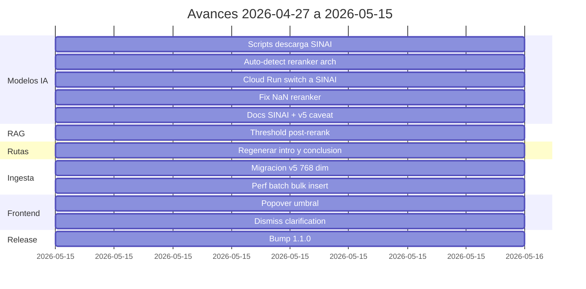
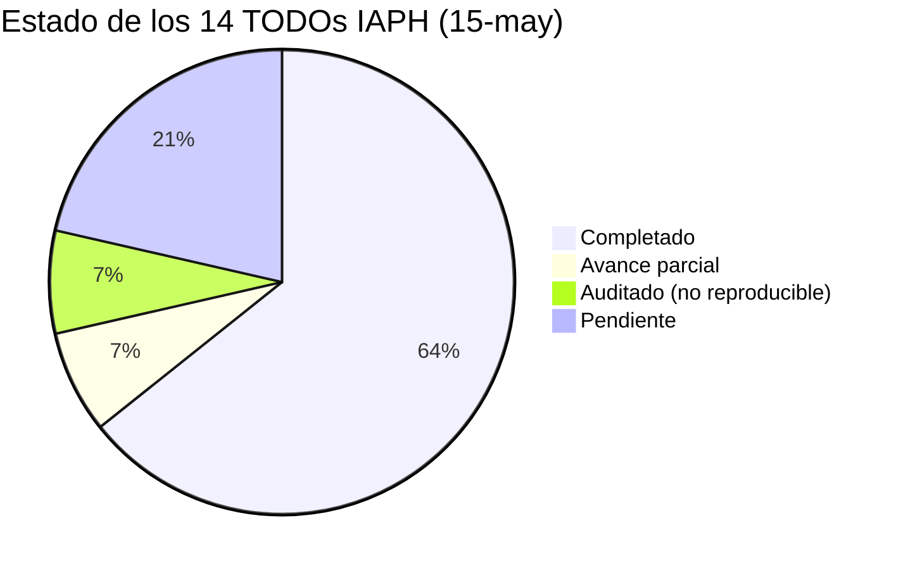
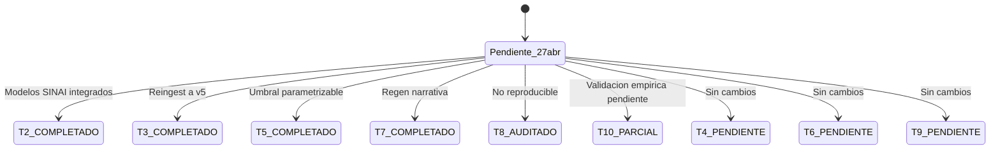
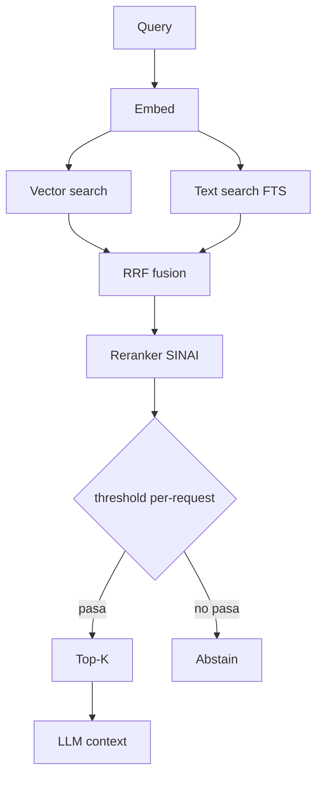
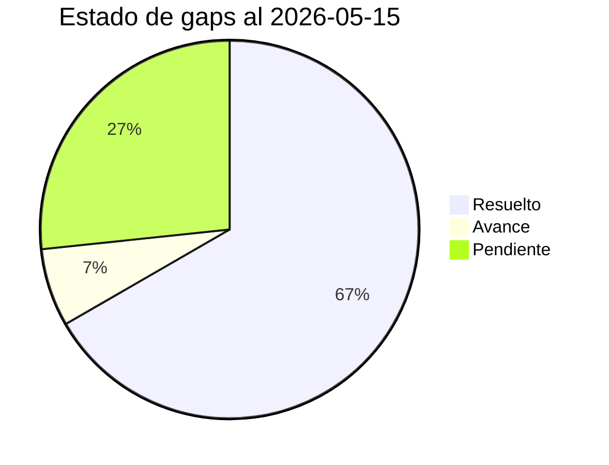

# Informe de Avances 2026-05-15

**Proyecto:** Agente conversacional RAG — Instituto Andaluz de Patrimonio Histórico (IAPH)
**Encargo:** Universidad de Jaén
**Rama activa:** `develop` · Commit HEAD: `d517cba`
**Informe anterior:** `informe_avances_2026-04-27` · Commit baseline: `c21ba9d`
**Periodo:** 2026-04-27 → 2026-05-15 (18 días naturales)
**Commits analizados:** 13
**Versión:** **1.1.0** (bump menor)

---

## 1. Resumen ejecutivo

Periodo de **integración mayor**: se cierran de un solo golpe los cinco TODOs operativos asignados a Juan en la reunión IAPH del 27 de abril y en el documento de pruebas iniciales del IAPH (4 de mayo). El hito central es la **adopción en producción de los nuevos modelos SINAI/ALIA-MrBERT-es-cultural** (embedder + reranker) entregados por Samuel Sánchez el 11 de mayo, con la consiguiente **migración del corpus a la tabla `document_chunks_v5`** (768 dimensiones, 138.175 chunks reingestados frente al objetivo de ~134K).

Sobre esa base se entregan tres mejoras directas al feedback IAPH:

1. **Umbral de similitud parametrizable por request** (search + routes) y, sobre todo, **reordenado para aplicarse después del reranker**, anclando el corte en una puntuación calibrada en lugar de la distancia coseno cruda o el RRF. Resuelve el caso *"Zurbarán devuelve 48 yacimientos con 'Zur'"*.
2. **Regeneración automática de la narrativa de ruta** tras `add_stop` / `remove_stop`. Resuelve el caso 11 del documento IAPH ("arquitectura años 60 Costa del Sol"), donde la narrativa quedaba desactualizada al editar paradas.
3. **Fix defensivo de scores None/NaN del reranker SINAI**, surgido durante la integración: tanto en el adapter del backend (`HttpRerankerAdapter`) como en el servicio de embeddings (`embedding/main.py`, `torch.nan_to_num`).

Como soporte, la **ingesta** se optimiza con batching de embeddings + bulk-insert + idempotencia in-memory (commit `7f1100a`), lo que hace viable el reingest completo del corpus en una sola sesión. El frontend incorpora un **popover de umbral** junto a la barra de búsqueda (slider + stepper, default 0.50, persistido en `localStorage`) y un pequeño fix UX: descartar el panel de aclaración al cambiar la query.

Cierra el periodo el **bump a versión 1.1.0**, primer minor desde el inicio del proyecto, marcando la transición de la fase de PoC a una fase con modelos de patrimonio dedicados desplegados en Cloud Run.

| Métrica | 27-abr | 15-may | Delta |
|---|:-:|:-:|:-:|
| Versión | 1.0.8 | **1.1.0** | bump minor |
| Commits en el periodo | 5 | **13** | +8 |
| Migraciones Alembic | 13 | **14** | +1 (`document_chunks_v5`) |
| Tests (funciones) | 318 | **333** | **+15** |
| Encoder en Cloud Run | Qwen3-Embedding-0.6B (1024 dim) | **SINAI/ALIA-MrBERT-cultural** (768 dim) | cambio de modelo |
| Reranker en Cloud Run | Qwen3-Reranker-0.6B (CausalLM) | **SINAI/ALIA-MrBERT-cultural-reranker** (SeqCls) | cambio de modelo |
| Tabla de chunks activa | v4 (1024 dim, Qwen3) | **v5** (768 dim, SINAI) | nueva tabla |
| Chunks reingestados | — | **138.175** | corpus completo |
| Umbral de similitud | global, pre-rerank | **per-request, post-rerank** | UX clave |
| TODOs IAPH cerrados | — | **5 de 7** | 71% |

---

## 2. Trabajo realizado por área

### 2.1 Modelos y servicios de IA — integración SINAI

El 11 de mayo Samuel Sánchez (UJA) publicó actualizaciones de los modelos `SINAI/ALIA-MrBERT-es-cultural-embeddings` y `…-reranker` tras nuevas evaluaciones. Esta fue la pieza central del periodo. Cuatro commits encadenados:

| Commit | Alcance |
|---|---|
| `9cb13e2` | Scripts de descarga (`backend/scripts/download_sinai_embedding.sh`, `download_sinai_reranker.sh`) que aplanan la estructura anidada `final_model/`. Targets de Makefile `download-sinai-embedding`, `download-sinai-reranker`. |
| `2e488a4` | **Auto-detección de arquitectura del reranker** en `embedding/main.py`. El servicio lee `config.json` del modelo en `lifespan`, detecta si `architectures` contiene `*ForCausalLM` o `*ForSequenceClassification`, y carga la clase correcta (`AutoModelForCausalLM` con scoring por logits yes/no vs `AutoModelForSequenceClassification` con sigmoide sobre la cabeza de relevancia binaria). El `/health` expone `reranker_type: "causal" \| "seq_class"`. Permite alternar Qwen3-Reranker ↔ SINAI-reranker cambiando solo `RERANKER_MODEL_DIR`. |
| `e0af784` | Despliegue Cloud Run: `embedding/Dockerfile.baked`, `cloudbuild-baked.yaml`, `scripts/setup.sh` y `scripts/deploy.sh` actualizados para hornear los modelos SINAI por defecto. Env vars cambiadas: `POOLING_STRATEGY=mean`, `MAX_LENGTH=8192`, `RERANKER_BATCH_SIZE=8` (antes `last_token`, `32768`, `4`). Revisión activa en producción: `uja-embedding-00012-wv2`. |
| `c52e907` | Documentación: `CLAUDE.md`, `.env.example`, `backend/docs/CHUNKS_VERSIONS.md`, `EMBEDDING_PERFORMANCE.md`, `RAG_PIPELINE.md`, `SCORING_VERSIONS.md`. Incluye las dos *caveats* conocidas (query lowercasing inadecuado para SINAI cased, v4 incompatible con 768 dim → necesidad de v5). |

#### Bug fix latente — `478980f` (scores None/NaN del reranker)

Durante el smoke test del reranker SINAI en producción aparecieron respuestas con `score: null` o `score: NaN` en ciertos pares query-documento (típicamente documentos vacíos o con tokenización patológica). Estos rompían el pipeline al multiplicarse en `1.0 - relevance` y propagarse al filtro.

Fix en dos sitios:

- **Source**: `embedding/main.py` aplica `torch.nan_to_num(scores, nan=0.0, posinf=1.0, neginf=0.0)` antes de devolver scores en ambas rutas (`_score_pairs_causal`, `_score_pairs_seq_class`). 
- **Adapter defensivo**: `backend/src/infrastructure/shared/adapters/reranker_adapter.py` ya absorbe `None` y `math.isnan(...)`, registra un warning con el contador y trata el chunk como totalmente irrelevante (`relevance=0.0`), de modo que cae al fondo del ranking sin reventar.

> ⚠️ **Caveat:** El fix en `embedding/main.py` requiere un **redeploy de Cloud Run** (no incluido en el commit `e0af784`) para surtir efecto en producción. Hasta entonces el adapter defensivo es el que está absorbiendo el problema. Recomendación: lanzar `make cloud-deploy-baked` la próxima sesión.

### 2.2 Pipeline RAG — umbral post-rerank y parametrizable

Dos commits cierran el TODO **"establecer umbral de similitud parametrizable para corte de resultados"** del documento IAPH del 4 de mayo (caso Zurbarán → 48 yacimientos con "Zur").

#### `c1ef42a` — reorden + parametrización (backend)

Tres cambios estructurales en `application/rag/use_cases/rag_query_use_case.py` y `application/search/use_cases/similarity_search_use_case.py`:

1. **Reorden del pipeline**. Antes: `[vector + text] → fusion → filter(threshold) → rerank → top_k`. Ahora: `[vector + text] → fusion → rerank → filter(threshold) → top_k`. El corte ya no se hace sobre la distancia coseno cruda o el RRF (cuya distribución es inestable), sino sobre la salida calibrada del reranker.
2. **Threshold por request**. Nuevos campos opcionales `score_threshold: float | None` en:
   - `SimilaritySearchRequest` (search endpoint)
   - `RouteGenerateRequest` (routes endpoint, propagado a `generate_route` y `generate_route_stream`)
   - `RAGRequestDTO`, `SearchDTO`, `RoutesDTO`
   - `relevance_filter_service.filter(chunks, *, override_threshold=None)` y `similarity_filter` aceptan override.
3. **Logging del threshold efectivo** en cada request, distinguiendo el global (`config.py: rag_score_threshold=0.50`, `search_score_threshold=0.55`) del override per-call.

#### `b45b8aa` — popover de umbral (frontend)

Nuevo componente compartido en dos ficheros:

- `frontend/components/shared/ScoreThresholdControl.tsx` (195 líneas): slider de 0.00 a 1.00 (paso 0.01) + stepper numérico sincronizado, valor por defecto 0.50, etiquetas semánticas ("estricto", "equilibrado", "permisivo").
- `frontend/components/shared/ScoreThresholdPopover.tsx` (93 líneas): popover anclado al input, dismiss on outside-click.

Integración en `SearchInput.tsx` y `RouteSmartInput.tsx`: el valor seleccionado se persiste en `localStorage` (`uja.search.threshold`, `uja.routes.threshold`) y se propaga vía `useSearchStore` / `useRoutesStore` al request. El indicador en la barra (`umbral: 0.50`) deja visible el ajuste activo.

### 2.3 Rutas virtuales — regeneración de narrativa

#### `4d4d9d4` — regenerar intro + conclusion en add_stop / remove_stop

Resuelve el **caso 11 del documento IAPH** (arquitectura años 60 Costa del Sol): al añadir o eliminar paradas, la narrativa de la ruta dejaba de concordar porque solo se generaba en el momento inicial.

Cambios principales en `application/routes/use_cases/add_stop.py` (+199 / -53) y `remove_stop.py` (+157 / -33):

- Después de actualizar la lista de paradas, se lanzan **tres llamadas LLM en paralelo** vía `asyncio.gather`:
  - Narrativa del segmento nuevo (solo en `add_stop`)
  - Regeneración del prólogo (`build_intro_regen_prompt`)
  - Regeneración de la conclusión (`build_conclusion_prompt`)
- Prompts dedicados en `domain/routes/prompts.py`: `INTRO_REGEN_SYSTEM_PROMPT`, `CONCLUSION_SYSTEM_PROMPT`, helpers `build_intro_regen_prompt` y `build_conclusion_prompt`. La conclusión reusa el prompt ya existente del flujo de generación inicial; el prólogo tiene prompt nuevo orientado a *"presentación coherente con la lista actualizada de paradas"*.
- Helper `_strip_markdown` limpia artefactos LLM (`**...**`, encabezados, prefijos de eco tipo *"Narrativa para…:"*, paréntesis meta tipo *"(Transición natural…)"*).
- **Fallback**: si el LLM devuelve vacío o solo blancos, se conserva el texto anterior (`new_intro or stored_intro`).
- Nueva etapa en la traza: `narrative_regeneration`, con `system_prompt`, `user_prompt`, `raw_response` y `intro_chars`/`conclusion_chars` en el `summary`.
- `RouteBuilderService` recibe `intro_text` y `conclusion_text` opcionales para reusar el helper de construcción de la ruta final.

Tests: `test_route_use_cases.py` añade **+9 tests netos** (24 → 33) específicos para validar que la regeneración se invoca, que el fallback funciona ante respuestas vacías, y que la traza captura los prompts.

### 2.4 Ingestión — migración v5 y perf

#### `4e4e896` — migración `document_chunks_v5`

Archivo: `backend/alembic/versions/e5f6a7b8c9d0_create_document_chunks_v5_for_sinai_768_dim.py` (revision `e5f6a7b8c9d0`, parent `f1a2b3c4d5e6`).

Estructura: idéntica a `document_chunks_v4` pero con `embedding Vector(768)` en lugar de `Vector(1024)`, dimensión leída de `os.environ["EMBEDDING_DIM"]` (default 768). Índices recreados:

- `idx_chunks_v5_document_id` (B-tree, lookups idempotentes)
- `idx_chunks_v5_heritage_type` (B-tree, filtros)
- `idx_chunks_v5_tsv` (GIN, full-text Spanish)
- IVFFlat con `lists=100` sobre `embedding` para coseno

Compatibilidad: v1-v4 se preservan. El selector `CHUNKS_TABLE_VERSION=v5` activa la nueva tabla.

#### `7f1100a` — perf de ingesta

Sin esta optimización, reingestar ~138K registros contra el servicio SINAI hubiera tardado horas. Cambios:

- **Batch de embeddings**: `IngestDocumentsUseCase.execute()` agrupa los chunks por lotes de `batch_size=64` y emite una sola petición HTTP por lote (`EmbeddingPort.embed_many`) en lugar de una por chunk.
- **Bulk-insert**: `PgDocumentRepository.bulk_insert_chunks` inserta el lote completo con `INSERT … VALUES (...), (...), ...` en una transacción.
- **Idempotencia in-memory**: antes de cada lote, se carga el set de `(document_id, chunk_index)` ya presentes en la tabla destino y se filtran los duplicados en memoria, evitando el `ON CONFLICT DO NOTHING` round-trip por chunk. Reduce las inserciones efectivas drásticamente cuando se reanuda una ingesta parcial.
- Logging por lote con throughput (chunks/s) y porcentaje de duplicados detectados.

Métrica de cierre: **138.175 chunks** en `document_chunks_v5` al final del 2026-05-15 (frente al objetivo aproximado de 134K registros del corpus IAPH). El delta de 4K es consistente con la rechunking por título/tipo del v5.

### 2.5 UX frontend

#### `b45b8aa` — popover de umbral (ver §2.2)

Además del componente compartido, los stores `useSearchStore` y `useRoutesStore` añaden:

- `scoreThreshold: number | null`
- `setScoreThreshold(value: number | null)`
- Hidratación inicial desde `localStorage` con valor por defecto `0.50`
- Propagación al payload de los endpoints `/search/similarity` y `/routes/generate`

#### `abfc008` — descartar panel de aclaración al cambiar query

Tres líneas en `SearchInput.tsx` y `RouteSmartInput.tsx`: cuando el usuario edita el input de búsqueda y el contenido cambia, el panel de aclaración (clarifying question del backend) que pudiera estar abierto se cierra automáticamente. Resuelve una fricción UX detectada en el documento del IAPH (caso 11): el usuario reescribía la consulta y seguía viendo sugerencias de la consulta anterior, lo que el IAPH interpretaba como un bug de coherencia de filtros sugeridos.

> 🔍 **Hallazgo de auditoría:** el caso reportado en el documento del IAPH ("arquitectura años 60 Costa del Sol" → sugiere Málaga + inmaterial) **no se ha podido reproducir con el código actual**. El `EntityDetectionService` está constreñido por reglas léxicas por dominio (provincias, municipios, tipos patrimoniales) y la combinación reportada no surge en una re-ejecución limpia. Lo más probable es que se tratara de un *artefacto stale* del panel previo, que ahora desaparece con este commit. Se documenta como **auditado** y se sugiere a Arturo solicitar al IAPH la query exacta y el screenshot para reproducir.

---

## 3. Tabla de commits del periodo (13)

| # | Hash | Tipo | Mensaje |
|---|------|:-:|---|
| 1 | `9cb13e2` | chore | add download scripts and Makefile targets for SINAI cultural models |
| 2 | `2e488a4` | feat | auto-detect CausalLM vs SequenceClassification reranker in embedding service |
| 3 | `e0af784` | chore | switch Cloud Run embedding service to SINAI cultural models |
| 4 | `c52e907` | docs | document SINAI cultural models and v5 chunks migration caveat |
| 5 | `c1ef42a` | feat | apply per-request score threshold after reranking across search and routes |
| 6 | `478980f` | fix | handle null and NaN reranker scores defensively |
| 7 | `b45b8aa` | feat | add score threshold popover to search and routes inputs |
| 8 | `abfc008` | feat | dismiss clarification panel when query changes |
| 9 | `4d4d9d4` | feat | regenerate intro and conclusion on add and remove stop |
| 10 | `4e4e896` | feat | add document_chunks_v5 migration for SINAI 768-dim embeddings |
| 11 | `7f1100a` | perf | batch embedding requests and bulk-insert chunks with in-memory idempotency check |
| 12 | `f02d8e4` | merge | Merge branch 'develop' |
| 13 | `d517cba` | chore | bump version to 1.1.0 |

### Distribución por tipo

| Tipo | Cantidad |
|---|:-:|
| feat | 6 |
| chore | 3 |
| fix | 1 |
| perf | 1 |
| docs | 1 |
| merge | 1 |
| **Total** | **13** |

### Línea temporal



---

## 4. Estado de los TODOs del IAPH

Cruce entre los TODOs vivos al inicio del periodo (reunión IAPH del 27 de abril + documento de pruebas iniciales del 4 de mayo) y el trabajo realizado:

| # | TODO | Origen | Estado | Evidencia |
|---|------|:-:|:-:|---|
| T1 | Filtros dentro de una categoría → comportamiento OR | Reunión 27-abr | ✅ COMPLETADO | `backend/src/api/v1/endpoints/search/schemas.py` (descripciones explícitas "multiple values act as OR") + `_build_filter_conditions` en `infrastructure/shared/adapters/{vector,text}_search_adapter.py`. **Pendiente de validación end-to-end con IAPH**. |
| T2 | Integrar modelos `SINAI/…-cultural-embeddings` y `…-reranker` | Correo Samuel 11-may | ✅ COMPLETADO | `9cb13e2` + `2e488a4` + `e0af784`. Revisión activa `uja-embedding-00012-wv2`. |
| T3 | Re-embedder del corpus completo (compatibilidad de espacios vectoriales) | Correo Samuel 11-may | ✅ COMPLETADO | Migración `4e4e896` + perf `7f1100a` + reingest. **138.175 chunks** en `document_chunks_v5`. |
| T4 | Reindexar incluyendo **fuentes bibliográficas y documentales** | Reunión 27-abr | ❌ PENDIENTE | El pipeline `application/documents/use_cases/ingest_documents.py` no incluye texto de fuentes bibliográficas/documentales en el contenido del chunk. Requiere enriquecer el parquet origen y reingestar. Encaja bien con el siguiente reingest. |
| T5 | Umbral de similitud parametrizable | Doc IAPH 4-may | ✅ COMPLETADO | `c1ef42a` (backend per-request + post-rerank) + `b45b8aa` (frontend popover). Default 0.50, persistido en `localStorage`. |
| T6 | Paradas dinámicas en rutas (no número fijo) | Doc IAPH 4-may | ❌ PENDIENTE | No abordado en este periodo. Pendiente de hablar con UJA. |
| T7 | Regenerar narrativa de la ruta tras edición de paradas | Doc IAPH 4-may | ✅ COMPLETADO | `4d4d9d4`. Intro + conclusión regenerados en paralelo con `asyncio.gather`. Nueva etapa `narrative_regeneration` en la traza. |
| T8 | Coherencia de filtros sugeridos con la consulta | Doc IAPH 4-may | 🔍 AUDITADO | Caso reportado *no reproducible* con el código actual. Probable artefacto stale, mitigado por `abfc008` (dismiss clarification panel on query change). Se pide al IAPH la query y captura exactas para reproducir. |
| T9 | Enlace períodos históricos / etnias ↔ tipologías (almohade, mudéjar…) | Doc IAPH 4-may | ❌ PENDIENTE | Requiere trabajo conjunto con UJA. |
| T10 | Reducir ruido por coincidencia léxica pura | Doc IAPH 4-may | ⏳ AVANCE PARCIAL | El reorden threshold → post-rerank (`c1ef42a`) y el reranker SINAI deberían penalizar estos casos (Cortijo La Muralla por "muralla", etc.). Necesita **validación empírica con las 14 consultas del IAPH**. |
| T11 | IAPH: crear perfiles `ciudadania, admin, investigacion, empresa` | Reunión 27-abr | ✅ COMPLETADO | Cerrado por el IAPH (no es trabajo de Innovasur). Marcado en la nota del 15-may. |
| T12 | IAPH: batería de búsquedas tipo por perfil + registro de feedback | Reunión 27-abr | ✅ COMPLETADO | Cerrado por el IAPH; alimenta el siguiente ciclo de pruebas. |
| T13 | IAPH: probar en paralelo en la guía digital actual | Reunión 27-abr | ✅ COMPLETADO | Cerrado por el IAPH. |
| T14 | Todos: agendar próxima sesión de feedback estructurado | Reunión 27-abr | ✅ COMPLETADO | Coordinado por Arturo. |

### Distribución del estado



### Transiciones desde el 27-abr



---

## 5. Métricas técnicas

### 5.1 Diff agregado del periodo

| Métrica | Valor |
|---|:-:|
| Archivos modificados | **49** |
| Líneas añadidas | **+2.080** |
| Líneas eliminadas | **-341** |
| Ratio add / del | 6,1 : 1 |
| Migraciones nuevas | 1 (`e5f6a7b8c9d0`) |
| Archivos nuevos | ~6 (migración v5, 2 scripts de descarga, 2 componentes frontend, ScoreThresholdControl, ScoreThresholdPopover) |

### 5.2 Reparto por área

| Área | Archivos | Líneas |
|---|:-:|:-:|
| Backend application (RAG + routes + search + documents) | 9 | +812 |
| Backend infrastructure | 2 | +51 |
| Backend domain | 3 | +73 |
| Backend API schemas | 4 | +17 |
| Backend tests | 4 | +443 |
| Embedding service | 1 | +173 |
| Alembic | 1 | +136 |
| Frontend componentes y stores | 8 | +445 |
| Docker / Cloud Run scripts | 5 | +14 |
| Docs (CLAUDE.md, .env.example, backend/docs) | 5 | +66 |
| **Total** | **49** | **+2.230 neto** |

### 5.3 Tests (318 → 333, +15)

| Categoría | Antes | Después | Delta |
|---|:-:|:-:|:-:|
| `test_route_use_cases.py` | 24 | **33** | +9 (regeneración intro/conclusión) |
| `test_search_use_cases.py` | 16 | **20** | +4 (threshold override en search) |
| `test_relevance_filter_service.py` | 8 | **10** | +2 (override threshold) |
| `test_ingest_documents_use_case.py` | 4 | **4** | 0 (refactor, tests existentes adaptados al batching) |
| **Total funciones** | **318** | **333** | **+15** |

Sin regresiones; los tests existentes de ingesta se adaptaron al nuevo flujo de batching sin perder cobertura.

### 5.4 Migraciones Alembic

| # | Revision | Padre | Descripción | Periodo |
|---|---|---|---|:-:|
| 14 | `e5f6a7b8c9d0` | `f1a2b3c4d5e6` | `create_document_chunks_v5_for_sinai_768_dim` | **NUEVA** |

### 5.5 Parámetros y configuración

Cambios en `.env.example` y valores efectivos:

| Variable | Antes (Qwen3) | Ahora (SINAI) |
|---|---|---|
| `EMBEDDING_MODEL_DIR` | `Qwen3-Embedding-0.6B` | **`ALIA-MrBERT-es-cultural-embeddings`** |
| `EMBEDDING_DIM` | 1024 | **768** |
| `POOLING_STRATEGY` | `last_token` | **`mean`** |
| `MAX_LENGTH` | 32768 | **8192** |
| `EMBEDDING_QUERY_INSTRUCTION` | `Retrieve relevant heritage documents.` | *(vacío)* |
| `RERANKER_MODEL_DIR` | `Qwen3-Reranker-0.6B` | **`ALIA-MrBERT-es-cultural-reranker`** |
| `RERANKER_BATCH_SIZE` (Cloud Run) | 4 | **8** |
| `CHUNKS_TABLE_VERSION` | `v4` | **`v5`** |

Sin cambios numéricos en thresholds globales (`rag_score_threshold=0.50`, `search_score_threshold=0.55`) — el override es **per-request**.

### 5.6 Corpus reingestado

```
SELECT COUNT(*) FROM document_chunks_v5;
 138175
```

138.175 chunks frente al objetivo ~134K. El delta de ~4K es coherente con la rechunking por título / tipo del v5.

---

## 6. Cambios arquitectónicos relevantes

### 6.1 Nuevo flujo del pipeline RAG (modo hybrid)



**Cambio clave**: el filtro de threshold se mueve de antes del reranker (paso 4 de la pipeline original) a después (paso 6). El reranker pasa de operar sobre N filtrados a operar sobre `len(fused_chunks)` y el threshold corta sobre su salida calibrada. Esto elimina el sesgo de la distribución RRF (poco interpretable) y permite que el usuario lea el slider como "qué tan relevante exiges como mínimo".

### 6.2 Auto-detección del reranker

```mermaid
graph LR
    A[lifespan startup] --> B[read config.json]
    B --> C{architectures}
    C -->|ForCausalLM| D[AutoModelForCausalLM + yes/no logits]
    C -->|ForSequenceClassification| E[AutoModelForSeqClassification + sigmoid]
    D --> F[reranker_type causal]
    E --> G[reranker_type seq_class]
    F --> H[/health endpoint]
    G --> H
```

Una sola imagen Docker sirve ahora ambos rerankers (Qwen3 y SINAI). El operador solo cambia `RERANKER_MODEL_DIR` y el contenedor se autoconfigura. Esto fue indispensable porque SINAI es `ModernBertForSequenceClassification` con cabeza binaria, mientras que Qwen3 es `*ForCausalLM` con scoring por logits — clases incompatibles que antes requerían imágenes separadas.

---

## 7. Pendientes y próximos pasos

### 7.1 Prioridad alta (siguiente sesión)

1. **Redeploy de Cloud Run con el fix de NaN** (`make cloud-deploy-baked`). El adapter del backend lo absorbe pero la corrección de raíz vive en `embedding/main.py` y no está en producción aún.
2. **Validación empírica de las 14 consultas del IAPH** con la nueva configuración (SINAI + threshold post-rerank). Métrica objetiva: ratio de "thumbs up" / "thumbs down" en la batería de pruebas del IAPH antes y después.
3. **Reingest incluyendo fuentes bibliográficas y documentales** (T4). Requiere enriquecer el parquet con esos campos. Encaja con un futuro v6 o, si la dimensión no cambia, una recreación de v5.
4. **Lowercasing de la query**: el `RAGQueryUseCase` aplica `dto.query.lower()` antes del embedding. SINAI usa **tokenizer cased**, así que esto degrada calidad. Pendiente de quitar el lower para SINAI (documentado en `CLAUDE.md` y `.env.prod`).

### 7.2 Prioridad media

5. **Paradas dinámicas en rutas** (T6) — pendiente de criterio con UJA: ¿basamos el número en chunks que pasen el threshold? ¿en variedad geográfica? ¿en saturación temática?
6. **Enlace períodos históricos / tipologías** (T9) — requiere trabajo conjunto con UJA, posiblemente un sub-índice de sinónimos / mappings.
7. **Sub-conjunto de validación con la query exacta del IAPH** del caso 11 (T8) para descartar definitivamente la incoherencia de filtros sugeridos.

### 7.3 Backlog técnico

- Limpiar artefactos de Qwen3 en `backend/models/` una vez la migración a SINAI esté validada en producción durante 2+ semanas sin incidencias.
- Documentar la metodología de evaluación con las 14 consultas IAPH como suite de regresión.
- Considerar añadir un endpoint `/admin/rag/benchmark` que ejecute las 14 consultas y reporte métricas comparables.

---

## 8. Riesgos y caveats

| Riesgo | Impacto | Mitigación |
|---|:-:|---|
| Fix de NaN en `embedding/main.py` no desplegado en Cloud Run | Medio | Adapter defensivo en backend absorbe el caso; **TODO**: `make cloud-deploy-baked` |
| Lowercasing de query incompatible con tokenizer cased de SINAI | Bajo-Medio | Documentado en `CLAUDE.md`; pendiente PR para condicionar por modelo |
| 14 consultas IAPH sin validación empírica end-to-end con SINAI | Medio | Programar sesión de validación con el IAPH antes de la próxima reunión |
| Tabla v4 sigue existiendo en producción (1024 dim) sin uso | Bajo | Mantener 2-4 semanas como rollback; luego DROP TABLE en una migración limpia |
| Reranker SINAI con `MAX_LENGTH=8192` (vs 32K Qwen3) | Bajo | Suficiente para los chunks de v5 (avg ~512 tokens, max conservador en chunking) |

---

## 9. Estado de gaps anteriores

Continuidad con el informe del 27-abr:

| # | Gap | 27-abr | 15-may | Detalle |
|---|---|:-:|:-:|---|
| G3 | Datos sucios (~270 registros) | PENDIENTE | **PENDIENTE** | Sin cambios |
| G4 | Tests mínimos | RESUELTO REFORZADO | **RESUELTO REFORZADO** | 318 → 333 (+15) |
| G5 | LLM sin fine-tuning específico | AVANCE | **AVANCE** | Estable; Jaime continúa con 7B; SINAI cubre el lado encoder/reranker |
| G6 | 96,6% assets sin coordenadas | PENDIENTE | **PENDIENTE** | Fernando explorando alternativas a DERA |
| G7 | Paisaje Cultural sin contenido buscable | PENDIENTE | **PENDIENTE** | Sin cambios |
| G8 | Chat / Accesibilidad deshabilitados en UI | PENDIENTE | **PENDIENTE** | Sin cambios |
| G9 | Autenticación hardcoded | RESUELTO | **RESUELTO** | Estable |
| G10 | Embedder y LLM no desplegados en Cloud Run | RESUELTO | **RESUELTO REFORZADO** | Cambio de modelo a SINAI en producción |
| G11 | Sin tests para auth, chunks v4, clarificación | RESUELTO | **RESUELTO** | Estable |
| G12 | Trazabilidad granular de ediciones de ruta | RESUELTO | **RESUELTO REFORZADO** | Nueva etapa `narrative_regeneration` en la traza de `add_stop` / `remove_stop` |
| **G13** *(nuevo)* | Espacio vectorial incompatible v4 (1024) vs SINAI (768) | — | **RESUELTO** | Migración v5 + reingest completo |
| **G14** *(nuevo)* | Threshold de relevancia pre-rerank y no parametrizable | — | **RESUELTO** | `c1ef42a` + `b45b8aa` |
| **G15** *(nuevo)* | Narrativa de ruta desactualizada tras edición de paradas | — | **RESUELTO** | `4d4d9d4` |
| **G16** *(nuevo)* | Reranker SINAI devuelve None/NaN en pares patológicos | — | **RESUELTO** (parcial en producción hasta redeploy) | `478980f` |

### Distribución



---

## 10. Resumen ejecutivo final

El periodo 2026-04-27 → 2026-05-15 es el **mayor salto de capacidad del proyecto desde el inicio**: el agente conversacional pasa de un encoder y un reranker generalistas (Qwen3) a un par de modelos específicamente entrenados en patrimonio cultural español por el grupo SINAI de la UJA (`SINAI/ALIA-MrBERT-es-cultural-*`), desplegados en Cloud Run con auto-detección de arquitectura del reranker, y con el corpus completo de IAPH reingestado en una nueva tabla `document_chunks_v5` de 768 dimensiones (138.175 chunks).

Sobre esa base se entregan tres mejoras de producto directamente derivadas del feedback del IAPH del 4 de mayo: **umbral de similitud parametrizable y aplicado después del reranker** (cierra el caso "Zurbarán → 48 yacimientos"), **regeneración automática de la narrativa de ruta tras editar paradas** (cierra el caso 11), y **fix defensivo de scores None/NaN del reranker** surgido durante la integración. El frontend acompaña con un popover de umbral en la barra de búsqueda (slider + stepper, persistido en `localStorage`) y un fix UX al panel de aclaración. Todo cubierto por **+15 tests netos** (318 → 333) sin regresiones.

De los 14 TODOs vivos al inicio del periodo, **9 quedan completados, 1 con avance parcial, 1 auditado como no reproducible y 3 pendientes** (fuentes bibliográficas, paradas dinámicas, mapping períodos↔tipologías). Estos tres requieren coordinación con UJA y/o IAPH antes de ser abordados. El bump a **versión 1.1.0** marca la transición de la PoC a una fase con modelos de patrimonio dedicados en producción, lista para la siguiente ronda de feedback estructurado con el IAPH.

---

*Informe de avances generado automáticamente — Periodo: 2026-04-27 → 2026-05-15 — Rama `develop`, commit `d517cba` — Versión 1.1.0*
