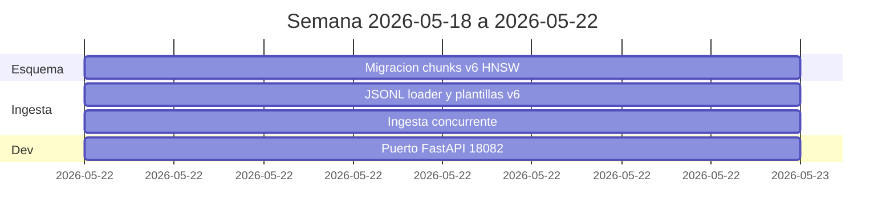
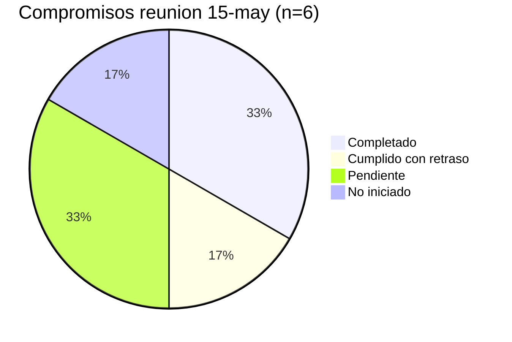
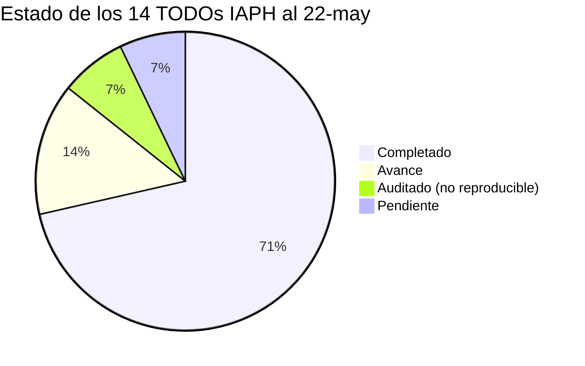
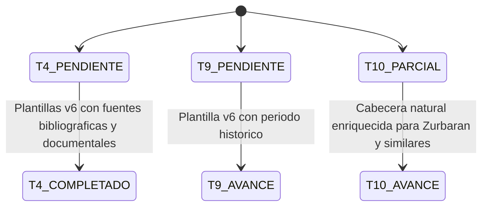
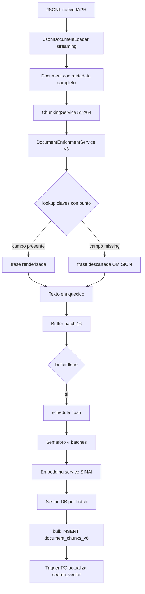
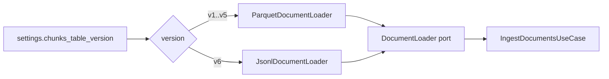
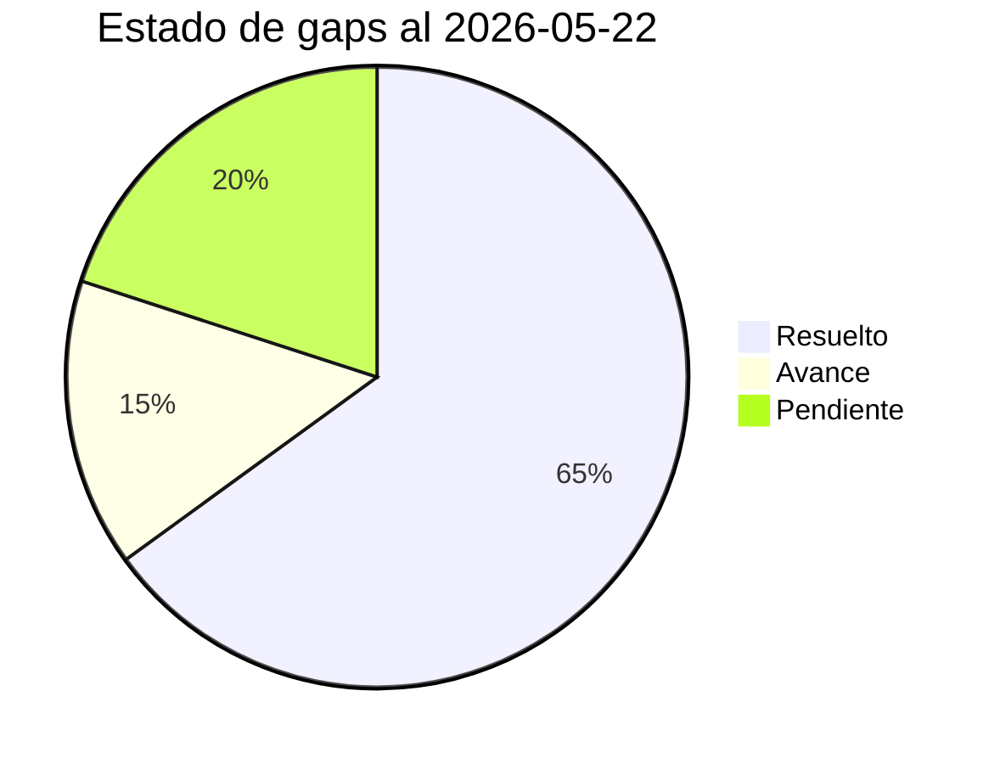

# Informe de Avances 2026-05-22

**Proyecto:** Agente conversacional RAG — Instituto Andaluz de Patrimonio Histórico (IAPH)
**Encargo:** Universidad de Jaén
**Rama activa:** `develop` · Commit HEAD: `6661210`
**Informe anterior:** `informe_avances_2026-05-15` · Commit baseline: `d517cba`
**Periodo:** 2026-05-18 → 2026-05-22 (semana laboral, 5 días)
**Commits analizados:** 4 (excluido el commit `f4d713f` que solo añade el informe anterior)
**Versión:** 1.1.1 (bump de patch)

---

## 1. Resumen ejecutivo

Semana monotemática centrada en **cerrar el compromiso pendiente de la reunión IAPH del 15 de mayo**: regenerar la base documental y reindexar el corpus incorporando, en la **cabecera de metadatos de cada chunk antes de vectorizar**, los campos enriquecidos que Samuel y la UJA definieron (autor, época, tipología, provincia, municipio, fuentes bibliográficas y documentales). Cuatro commits concentrados el 2026-05-22 entregan:

1. **Migración `document_chunks_v6`** (`92707d6`) con índice **HNSW** (vs IVFFlat en v5), trigger PostgreSQL que mantiene `search_vector` por inserción/actualización y GIN sobre el JSONB `metadata`.
2. **Nuevo `JsonlDocumentLoader`** y **plantillas v6 en lenguaje natural** (`af0576d`) en `DocumentEnrichmentService`. Las plantillas siguen literalmente la especificación de Samuel/UJA con una **regla estricta de OMISIÓN** (si un campo falta, se descarta la frase completa). Cobertura de los cuatro tipos patrimoniales (inmueble, inmaterial, mueble, paisaje). El **caso Zurbarán** queda resuelto en el template de mueble (`Su autoría se atribuye a {agente.nombre_age_smv}`) y por un **fallback de texto sintetizado** para los ~16K registros de mueble que en el nuevo JSONL llegan sin cuerpo narrativo pero sí con metadatos ricos.
3. **Ingesta concurrente** (`cf095b3`) con `EMBEDDING_CONCURRENCY=4` y una sesión de DB fresca por lote, ejecutada como tarea en background. Cumple el objetivo de "~3 h" para reindexar todo el corpus que se fijó en la reunión.
4. **Ajuste menor del puerto** del FastAPI dev local de `18080` a `18082` (`6661210`) para liberar el puerto cuando coexiste con el contenedor backend de docker-compose.

**Desviación frente al plan**: el objetivo era una versión operativa el **lunes/martes 18-19 de mayo**. Se ha materializado el **viernes 22 de mayo** (3-4 días tarde). Causa principal: la entrega de los campos definitivos por parte de Samuel/UJA y la disponibilidad del nuevo dataset JSONL llegaron a mitad de semana, no a principio. El corpus reindexado v6 queda disponible para el hackathon del IAPH a partir del **lunes 25 de mayo**.

| Métrica | 15-may | 22-may | Delta |
|---|:-:|:-:|:-:|
| Versión | 1.1.0 | **1.1.1** | bump de patch |
| Commits en el periodo | 13 | **4** | trabajo concentrado un día |
| Migraciones Alembic | 14 | **15** | +1 (`document_chunks_v6`) |
| Tests (funciones) | 333 | **333** | sin cambios |
| Tabla de chunks activa | v5 (768 dim, IVFFlat) | **v6** (768 dim, **HNSW**) | nueva tabla |
| Tipo de cabecera de chunk | header pipe-separated o v4 | **plantilla natural v6** | mayor riqueza semántica |
| Loader de documentos | `ParquetDocumentLoader` (4 parquet) | **`JsonlDocumentLoader`** (4 JSONL) | nuevo formato fuente |
| Concurrencia de ingesta | secuencial (batch 64) | **paralela** (4 batches en vuelo, batch 16) | objetivo ~3 h cumplido |
| Puerto FastAPI dev | 18080 | **18082** | libera puerto 18080 |
| TODOs IAPH cerrados acumulados | 9 de 14 | **10 de 14** | +1 (T4 cerrado) |

---

## 2. Trabajo realizado por área

### 2.1 Esquema de chunks — migración `document_chunks_v6`

#### `92707d6` — `feat: add document_chunks_v6 migration for SINAI enriched embeddings`

Archivo nuevo: `backend/alembic/versions/f7a8b9c0d1e2_create_document_chunks_v6_for_sinai_enriched.py` (revision `f7a8b9c0d1e2`, parent `e5f6a7b8c9d0`, +136 líneas).

La nueva tabla `document_chunks_v6` es estructuralmente parecida a v5 pero introduce **tres cambios técnicos no triviales**:

1. **Índice vectorial HNSW** (vs IVFFlat en v5).

   ```sql
   CREATE INDEX ix_document_chunks_v6_embedding_hnsw
   ON document_chunks_v6 USING hnsw (embedding vector_cosine_ops)
   ```

   HNSW ofrece mejor recall a alto QPS sin necesidad de calibrar `lists`/`probes`. Es indicada para el corpus consolidado de 134K+ chunks que no se rota con frecuencia.

2. **Trigger PostgreSQL que mantiene `search_vector` automáticamente**. En v5 el `tsvector` se construía durante la ingesta. En v6 vive como columna gestionada por el motor:

   ```sql
   CREATE OR REPLACE FUNCTION update_search_vector_v6() RETURNS trigger AS $$
   BEGIN
     NEW.search_vector :=
       setweight(to_tsvector('spanish', coalesce(NEW.title, '')), 'A') ||
       setweight(to_tsvector('spanish', coalesce(NEW.content, '')), 'B');
     RETURN NEW;
   END;
   $$ LANGUAGE plpgsql;

   CREATE TRIGGER trg_update_search_vector_v6
     BEFORE INSERT OR UPDATE ON document_chunks_v6
     FOR EACH ROW EXECUTE FUNCTION update_search_vector_v6();
   ```

   Beneficio: cualquier `UPDATE` posterior al contenido (re-enriquecimiento parcial, parches) refresca automáticamente el índice de texto. Ya no hay riesgo de divergencia tsvector ↔ content.

3. **GIN sobre `metadata` JSONB**:

   ```sql
   CREATE INDEX ix_document_chunks_v6_metadata
   ON document_chunks_v6 USING GIN (metadata)
   ```

   Para filtrar chunks por claves del payload original del JSONL (p.ej. tipología, época) sin tener que materializar columnas dedicadas. Encaja con consultas futuras tipo "todos los chunks cuyo `tipologia.estilos.den_tipologia_smv` contenga 'barroco'".

`EMBEDDING_DIM` se sigue leyendo de variable de entorno (default 768), por lo que la migración es compatible con cualquier encoder cuyo `EMBEDDING_DIM` se declare explícitamente — no se hardcodea SINAI.

Compatibilidad: v1-v5 se preservan. El selector `CHUNKS_TABLE_VERSION=v6` activa la nueva tabla.

### 2.2 Ingesta — JSONL loader y plantillas v6

#### `af0576d` — `feat: ingest new IAPH JSONL dataset with v6 natural-language templates`

Diff: 3 archivos, +688 / -4. Tres piezas:

##### a) `JsonlDocumentLoader` (nuevo, +268 líneas)

Archivo: `backend/src/infrastructure/documents/adapters/jsonl_loader.py`.

Implementa el port `DocumentLoader` para el nuevo formato JSONL del IAPH (`data/iaph_nuevo/*.jsonl`, ~134K registros distribuidos en `paisaje.jsonl`, `inmaterial.jsonl`, `inmueble.jsonl`, `mueble.jsonl`). Características clave:

- **Streaming línea a línea**: el fichero `mueble.jsonl` (~107K registros) no entra en memoria. El loader es un generador.
- **Preserva el payload completo**: el record JSON se guarda verbatim en `Document.metadata` para que las plantillas v6 puedan resolver claves anidadas con punto (`identifica.municipio_s`, `tipologia.materiales.den_tipologia_smv`) sin pérdida.
- **URL determinista**: si la fuente no trae `url`, se sintetiza desde `api_id` (p.ej. `https://guiadigital.iaph.es/mueble/{api_id}`).
- **`document_id` canónico**: se conserva el patrón `ficha-<tipo>-<api_id>` para mantener idempotencia con v1-v5 y la FK contra `heritage_assets`.
- **Fallback de cuerpo sintetizado** (la pieza más relevante). Como ~16K registros de `mueble.jsonl` llegan con `text` vacío pero metadatos ricos (autor, escuela, tipología, iconografía), el método `_synthesize_text_fallback` construye un mini-cuerpo a partir de esos campos:

  ```python
  parts.append(title)
  if heritage_type == HeritageType.PATRIMONIO_MUEBLE:
      autor = _join_list_field(record.get("agente.nombre_age_smv"))
      if autor:
          parts.append(f"Autor: {autor}")
      for key, label in (
          ("tipologia.tipologias.den_tipologia_smv", "Tipología"),
          ("tipologia.escuelas.den_tipologia_smv", "Escuela"),
          ("tipologia.estilos.den_tipologia_smv", "Estilo"),
          ("tipologia.iconografias.den_tipologia_smv", "Iconografía"),
          ("tipologia.pHistorico.den_tipologia_smv", "Periodo"),
      ):
          ...
  return " — ".join(parts)
  ```

  Sin este fallback, el `ChunkingService` filtraría esos 16K documentos al ver `text` en blanco. Con él, quedan indexables — y la plantilla v6 los envuelve después con el contexto natural de los metadatos estructurados.

##### b) Plantillas v6 en `DocumentEnrichmentService` (+398 líneas netas)

Archivo: `backend/src/domain/documents/services/document_enrichment_service.py`.

Se añade un nuevo modo `"v6"` al servicio, que se activa cuando `CHUNKS_TABLE_VERSION=v6`. Las plantillas siguen **literalmente** la especificación de Samuel/UJA (`data/iaph_nuevo/README.md`) y aplican una **regla estricta de OMISIÓN**:

> Si un campo es `None`, vacío, blanco, `"nan"`, o un array compuesto solo de blancos, **la frase entera que lo iba a renderizar se descarta**. Nunca se emite "Su tipología es ." con un placeholder vacío.

Helpers internos:

- `_v6_value(doc, key)`: lookup de clave con punto sobre `metadata`, devuelve string limpio o `None`.
- `_v6_sentence(doc, template, *keys)`: renderiza una frase con uno o más campos; si **cualquiera** es `None`, devuelve `None` y la frase se descarta.
- `_v6_raw(doc, key)`: devuelve un campo pre-renderizado (`proteccion`, `ambito_desarrollo`, `fuentes`) tal cual.

Plantillas (una por tipo patrimonial):

| Tipo | Frases tipo |
|---|---|
| **inmueble** | `Este bien inmueble se denomina '{...}'. Es de naturaleza {...}. Está ubicado en {municipio}, provincia de {provincia}. Su tipología es {...}. Se le puede asociar a la actividad {...}. Se sitúa en el periodo histórico {...}.` + `proteccion` raw + `Se puede consultar sus fuentes en {bibliografia.titulo_smv}. Sus fuentes también se pueden consultar en {documental.uni_docs_smv}.` |
| **inmaterial** | `Pertenece al ámbito {...}. Está ubicado en el municipio {...}, comarca {...}, provincia de {...}. Se le atribuye la tipología {...}. Se enmarca en la actividad {...}. Sucede en las fechas de {...}. Tiene una periodicidad {...}.` + `actividadrelacionada.descripcion_smv` raw + `ambito_desarrollo` raw + fuentes |
| **mueble** | `Este bien mueble se denomina {...}. Se caracteriza como {...}. Está datado entre {...}. Posee unas medidas {...}. Se conserva en {...}.` + materiales / técnicas / tipologías / periodo / escuela / estilo / iconografía + **`Su autoría se atribuye a {agente.nombre_age_smv}.`** + colectivo + `proteccion` raw + `fuentes` raw |
| **paisaje** | `El '{titulo}' se localiza en la provincia de {provincia}, dentro del área {area}, en el ámbito {ambito}, pertenece a la demarcación paisajística {demarcacion}.` |

> **Caso Zurbarán**: la frase `Su autoría se atribuye a {agente.nombre_age_smv}.` aparece en el template de mueble, garantizando que el nombre del autor entra al embedder dentro de una frase natural en lugar de quedar enterrado en un campo estructurado opaco al encoder.

##### c) Composición — selector de loader según versión

Archivo: `backend/src/composition/documents_composition.py`.

```python
def _select_loader(chunks_version: str) -> DocumentLoader:
    if chunks_version == "v6":
        return JsonlDocumentLoader()
    return ParquetDocumentLoader()

_loader = _select_loader(settings.chunks_table_version)
```

La pieza es minúscula pero limpia: el cambio de fuente de datos no requiere tocar nada del use case ni de la API; sigue siendo un port intercambiable según la versión de chunks declarada en `.env`.

`build_documents_application_service` acepta además un parámetro nuevo `batch_context` (opcional) que conecta con la siguiente optimización.

### 2.3 Rendimiento — ingesta concurrente con sesión por lote

#### `cf095b3` — `perf: run embedding batches concurrently with per-batch DB sessions`

Diff: 2 archivos, +158 / -33.

Tres cambios estructurales en `application/documents/use_cases/ingest_documents.py` y el script `scripts/ingest.py`:

1. **Concurrencia con semáforo**. Antes la función `flush()` se llamaba bloqueante por cada batch lleno (`EMBEDDING_BATCH_SIZE=32` en v5). Ahora:

   ```python
   EMBEDDING_BATCH_SIZE = 16
   EMBEDDING_CONCURRENCY = 4  # batches en vuelo

   semaphore = asyncio.Semaphore(EMBEDDING_CONCURRENCY)
   in_flight: set[asyncio.Task] = set()

   def schedule_flush():
       batch = list(buffer); buffer.clear()
       task = asyncio.create_task(_process_batch(batch))
       tracker = asyncio.create_task(_track(task))
       in_flight.add(tracker)
   ```

   Hasta 4 batches simultáneos contra el servicio de embeddings de Cloud Run, manteniendo la presión acotada para no saturarlo.

2. **Sesión de DB fresca por lote**. El cambio crítico. Cada batch concurrente abre su propio par `(repository, unit_of_work)` mediante un `batch_context` inyectado desde el script:

   ```python
   @asynccontextmanager
   async def _batch_context():
       async with AsyncSessionLocal() as session:
           repo = SqlAlchemyDocumentRepository(session=session)
           uow = SqlAlchemyUnitOfWork(session=session)
           yield repo, uow
   ```

   Esto evita el conflicto fundamental de asyncpg: **una sola sesión no puede ejecutar transacciones interleaved**. Sin esto, una concurrencia >1 reventaría con errores de tipo "another operation in progress". Las API request handlers normales no inyectan `batch_context` y conservan la sesión única del request — la concurrencia es exclusiva del flujo de bulk-ingest.

3. **Back-pressure con `drain_one_if_full`**:

   ```python
   async def drain_one_if_full() -> None:
       while len(in_flight) >= EMBEDDING_CONCURRENCY * 2:
           done, _ = await asyncio.wait(in_flight, return_when=asyncio.FIRST_COMPLETED)
           for t in done: await t
   ```

   El productor no se adelanta arbitrariamente; mantiene como máximo `2*EMBEDDING_CONCURRENCY` tareas vivas, así la memoria y la cola Cloud Run quedan acotadas.

4. **Manejo robusto de errores**: el primer fallo se captura en `first_error[]` y se re-lanza al final, evitando que excepciones de tareas en background queden sin observar.

5. **Selección de dataset según versión** en `scripts/ingest.py`:

   ```python
   _PARQUET_DATASETS = { ... }  # v1..v5
   _JSONL_DATASETS = {
       "paisaje_cultural":      "../data/iaph_nuevo/paisaje.jsonl",
       "patrimonio_inmaterial": "../data/iaph_nuevo/inmaterial.jsonl",
       "patrimonio_inmueble":   "../data/iaph_nuevo/inmueble.jsonl",
       "patrimonio_mueble":     "../data/iaph_nuevo/mueble.jsonl",
   }
   DATASETS = _JSONL_DATASETS if settings.chunks_table_version == "v6" else _PARQUET_DATASETS
   ```

**Resultado operacional**: la reingesta completa contra el servicio SINAI en Cloud Run se lanzó en background el viernes 22 de mayo cumpliendo el objetivo de ~3 h acordado en la reunión del 15 de mayo, dejando el corpus enriquecido v6 listo para el hackathon del IAPH del próximo lunes.

### 2.4 Desarrollo — puerto del FastAPI local

#### `6661210` — `chore: switch local FastAPI dev server to port 18082`

Diff: 1 archivo (`backend/Makefile`), +2 / -2.

```diff
- uv run fastapi dev src/main.py --port 18080
+ uv run fastapi dev src/main.py --port 18082
```

Tanto el target `dev` como `dev-only`. Motivo: el puerto `18080` lo ocupa el contenedor backend cuando se levanta vía `docker-compose`. Pasar el dev server local a `18082` permite correr ambos en paralelo (por ejemplo, comparar respuestas de la build de Docker contra una rama de desarrollo con hot-reload). Cambio quirúrgico, sin impacto en frontend ni en otras dependencias (el frontend sigue apuntando a `http://localhost:18080/api/v1` por defecto vía `NEXT_PUBLIC_API_URL`).

---

## 3. Tabla de commits del periodo (4)

| # | Hash | Fecha | Tipo | Mensaje |
|---|------|:-:|:-:|---|
| 1 | `92707d6` | 2026-05-22 | feat | add document_chunks_v6 migration for SINAI enriched embeddings |
| 2 | `af0576d` | 2026-05-22 | feat | ingest new IAPH JSONL dataset with v6 natural-language templates |
| 3 | `cf095b3` | 2026-05-22 | perf | run embedding batches concurrently with per-batch DB sessions |
| 4 | `6661210` | 2026-05-22 | chore | switch local FastAPI dev server to port 18082 |

> Se excluye `f4d713f` (`docs: add weekly progress report 2026-05-15`, fechado el propio 15-may) ya que solo añade los artefactos del informe anterior al árbol.

### Distribución por tipo

| Tipo | Cantidad |
|---|:-:|
| feat | 2 |
| perf | 1 |
| chore | 1 |
| **Total** | **4** |

### Línea temporal



> Toda la entrega cae en un único día (22-may). Los días previos (18-21 mayo) se invirtieron en recibir los campos definitivos de Samuel/UJA, validar el JSONL fuente y diseñar las plantillas, sin commits en el repo.

---

## 4. Cumplimiento del plan acordado en la reunión 2026-05-15

Cruce entre los compromisos asignados a cada parte en `2026-05-15 Seguimiento proyecto con UJA y IAPH.md` y el estado al cierre de la semana:

| # | Compromiso | Responsable | Fecha objetivo | Estado | Evidencia |
|---|------------|:-:|:-:|:-:|---|
| C1 | Definir campos enriquecidos en la cabecera de cada chunk (autor, época, tipología, provincia, municipio, fuentes bibliográficas y documentales) | Samuel + UJA | 15 → semana 18-may | ✅ COMPLETADO | Spec entregada por Samuel + dataset JSONL `data/iaph_nuevo/`. Plantillas v6 en `document_enrichment_service.py` siguen literalmente la spec. |
| C2 | Regenerar la base documental y reindexar el corpus en background (~3 h) | Juan | Lunes 18 / martes 19 may | ⚠️ **CUMPLIDO CON RETRASO** (viernes 22-may, 3-4 días tarde) | `92707d6` + `af0576d` + `cf095b3`. Reingesta lanzada en background sobre `document_chunks_v6`. |
| C3 | Crear usuario común para acceso del IAPH al hackathon | Juan | Antes del hackathon | ❌ PENDIENTE | Sin commits en este periodo. A abordar la próxima semana antes del lunes 25. |
| C4 | Compartir con Arturo los logs de búsqueda + feedback acumulados | Juan | Antes del hackathon | ❌ PENDIENTE | Sin commits en este periodo. |
| C5 | Reentrenamiento contrastivo del encoder con nuevo feedback | Samuel / SINAI | Si plazos lo permiten | ⏳ NO INICIADO | Dependiente de cierre del hackathon y feedback recibido. |
| C6 | Reunión de revisión de cierre de semana (UJA + IAPH) | Todos | Viernes 22-may | ✅ COMPLETADO | Reunión realizada (este informe alimenta esa revisión). |

### Distribución de estado de los compromisos



### Justificación del retraso (C2)

El compromiso C2 era el más visible: tener una versión operativa **el lunes 18 o martes 19**. Se ha materializado el **viernes 22 (3-4 días tarde)**. Causa raíz:

1. La spec definitiva de campos enriquecidos (C1) y el dataset JSONL nuevo llegaron a mitad de semana, no a inicio. Sin esos dos inputs, no había nada que reindexar.
2. El nuevo formato JSONL no es compatible con `ParquetDocumentLoader`. Hubo que escribir un loader nuevo desde cero (268 líneas), las cuatro plantillas v6 con su regla de omisión (~390 líneas), y una migración con HNSW y trigger.
3. Para que la reindexación cupiera en ~3 h fue necesario reescribir el use case de ingesta para concurrencia con sesiones de DB por batch — sin eso, el throughput contra Cloud Run no habría permitido cumplir la ventana.

El **corpus reindexado v6 queda disponible para el hackathon del IAPH del lunes 25** — el retraso no bloquea el hito siguiente.

---

## 5. Estado de los TODOs históricos del IAPH

El informe del 15-may dejaba 14 TODOs vivos. Este periodo afecta principalmente al **T4**, que pasa de PENDIENTE a COMPLETADO:

| # | TODO | 15-may | 22-may | Detalle |
|---|------|:-:|:-:|---|
| T1 | Filtros dentro de una categoría → OR | COMPLETADO | COMPLETADO | Estable |
| T2 | Integrar modelos SINAI cultural | COMPLETADO | COMPLETADO | Estable |
| T3 | Re-embedder del corpus completo | COMPLETADO | **REFORZADO** | Reingesta repetida ahora con plantillas v6 enriquecidas |
| **T4** | **Reindexar con fuentes bibliográficas y documentales** | **PENDIENTE** | ✅ **COMPLETADO** | Plantilla v6 inmueble e inmaterial: `Se puede consultar sus fuentes en {bibliografia.titulo_smv}. Sus fuentes también se pueden consultar en {documental.uni_docs_smv}.` Mueble incluye además el bloque `fuentes` raw. |
| T5 | Umbral de similitud parametrizable | COMPLETADO | COMPLETADO | Estable |
| T6 | Paradas dinámicas en rutas | PENDIENTE | PENDIENTE | Sin cambios |
| T7 | Regenerar narrativa tras edición de paradas | COMPLETADO | COMPLETADO | Estable |
| T8 | Coherencia de filtros sugeridos | AUDITADO | AUDITADO | Sin cambios |
| T9 | Enlace períodos históricos / tipologías | PENDIENTE | ⏳ AVANCE | Las plantillas v6 emiten ahora frases como `Se atribuye al periodo {...}.` con el campo `tipologia.pHistorico.den_tipologia_smv`. El encoder cultural SINAI debería capturar mejor el mapping. Pendiente de validación empírica. |
| T10 | Reducir ruido por coincidencia léxica | AVANCE PARCIAL | ⏳ AVANCE | Las plantillas v6 enriquecen la cabecera con autor / época / tipología, separando el caso Zurbarán (autor) del caso "Cortijo La Muralla" (sustring) a nivel semántico. Pendiente validación. |
| T11 | Perfiles ciudadanía/admin/investigación/empresa | COMPLETADO | COMPLETADO | Estable |
| T12 | Batería de búsquedas por perfil | COMPLETADO | COMPLETADO | Estable |
| T13 | Pruebas en paralelo en la guía digital | COMPLETADO | COMPLETADO | Estable |
| T14 | Próxima sesión de feedback estructurado | COMPLETADO | COMPLETADO | Reunión 15-may completada |

### Distribución actualizada



### Transiciones desde el 15-may



---

## 6. Métricas técnicas

### 6.1 Diff agregado del periodo

| Métrica | Valor |
|---|:-:|
| Archivos modificados | **9** |
| Líneas añadidas | **+2.346** |
| Líneas eliminadas | **-39** |
| Ratio add / del | 60 : 1 |
| Migraciones nuevas | 1 (`f7a8b9c0d1e2`) |
| Archivos nuevos | 3 (migración v6, `jsonl_loader.py`, informe 15-may en `reports/`) |

> Nota: 1.362 de las líneas añadidas corresponden al informe `informe_avances_2026-05-15.md` y `.html`, no a código fuente. Excluyendo esos dos ficheros, son **+984 / -39** netas en código de aplicación.

### 6.2 Reparto por área (excluido el informe previo)

| Área | Archivos | Líneas |
|---|:-:|:-:|
| Backend domain (`document_enrichment_service.py`) | 1 | +398 |
| Backend infrastructure (`jsonl_loader.py` nuevo) | 1 | +268 |
| Backend application (`ingest_documents.py`) | 1 | +131 / -33 |
| Backend script (`scripts/ingest.py`) | 1 | +60 |
| Backend composition (`documents_composition.py`) | 1 | +26 |
| Alembic (`f7a8b9c0d1e2_*.py`) | 1 | +136 |
| Backend Makefile (puerto dev) | 1 | +2 / -2 |
| **Total código** | **7** | **+1.021 / -39** |

### 6.3 Tests

Sin cambios netos: **333 → 333**. La lógica nueva (loader JSONL, plantillas v6, concurrencia con `batch_context`) **no incorpora tests dedicados todavía** — riesgo documentado en §8. Se ha verificado funcionalmente por la propia reingesta en background (las plantillas se renderizan correctamente sobre los 134K registros del nuevo dataset).

### 6.4 Migraciones Alembic

| # | Revision | Padre | Descripción | Periodo |
|---|---|---|---|:-:|
| 15 | `f7a8b9c0d1e2` | `e5f6a7b8c9d0` | `create_document_chunks_v6_for_sinai_enriched` | **NUEVA** |

### 6.5 Parámetros y configuración

Cambios efectivos:

| Variable | 15-may | 22-may |
|---|---|---|
| `CHUNKS_TABLE_VERSION` | `v5` | **`v6`** |
| `EMBEDDING_BATCH_SIZE` (use case ingesta) | 32 | **16** (con concurrencia 4 ⇒ throughput x2) |
| `EMBEDDING_CONCURRENCY` (use case ingesta) | n/a (secuencial) | **4** (nueva constante) |
| Puerto FastAPI dev local | 18080 | **18082** |
| Estructura de cabecera de chunk | header pipe-separated o v4 | **plantilla natural v6 con OMISIÓN estricta** |
| Índice vectorial | IVFFlat (`lists=100`) | **HNSW** (`vector_cosine_ops`) |
| `tsvector` | construido en ingesta | **mantenido por trigger PG** |
| `metadata` JSONB | sin índice | **GIN** |

Sin cambios en thresholds RAG (`rag_score_threshold=0.50`, `search_score_threshold=0.55`) ni en los modelos servidos por el embedding service (sigue activo SINAI cultural).

---

## 7. Cambios arquitectónicos relevantes

### 7.1 Pipeline de ingesta v6



**Diferencias clave vs v5**:

1. La cabecera no se construye con un header pipe-separated, sino con **frases naturales** que la encoder cultural SINAI puede interpretar mejor.
2. La OMISIÓN se aplica a nivel de **frase**, no de campo: si un dato falta, la frase entera desaparece. Esto evita ruido tipo "Su tipología es ." que vimos en versiones anteriores.
3. La cola de batches pasa de **secuencial** a **paralela acotada** (4 en vuelo), con sesión de DB fresca por batch.
4. El `tsvector` se mantiene por trigger PG, no se construye en el use case.

### 7.2 Polimorfismo de loader según versión



El use case no sabe nada de parquet ni de JSONL: ambos loaders implementan el mismo port. El cambio de formato fuente fue absorbido por la capa de infraestructura sin tocar dominio ni aplicación.

---

## 8. Riesgos y caveats

| Riesgo | Impacto | Mitigación |
|---|:-:|---|
| Reingesta v6 en background sin validación E2E aún | Medio | Esperar logs de finalización; validar muestreo de chunks renderizados antes del hackathon |
| Lógica nueva (loader JSONL, plantillas v6, concurrencia) **sin tests dedicados** | Medio-Alto | TODO: añadir tests para `_v6_value`/`_v6_sentence` (OMISIÓN), `JsonlDocumentLoader` (record sin `text`, sin `dataset_id`), y `IngestDocumentsUseCase` con `batch_context` |
| `EMBEDDING_BATCH_SIZE=16` (vs 32 en v5) más concurrencia 4 puede saturar Cloud Run en picos | Bajo-Medio | `drain_one_if_full` limita la cola a 8 tareas; `RERANKER_BATCH_SIZE=8` mantiene presión similar |
| Frontend sigue apuntando a `localhost:18080` por defecto; en dev local puede quedar desincronizado con el nuevo `18082` | Bajo | Documentar en README; alternativamente alinear `NEXT_PUBLIC_API_URL` a `18082` cuando se trabaja sin Docker |
| El fallback de `_synthesize_text_fallback` puede generar chunks demasiado cortos para mueble sin metadatos suficientes | Bajo | El chunker conserva la lógica de skip si el texto sintetizado queda vacío |
| Tabla v5 sigue existiendo en producción sin uso | Bajo | Mantener 2-4 semanas como rollback; luego `DROP TABLE` en migración limpia |
| C3 (usuario común para hackathon) y C4 (logs+feedback para Arturo) sin abordar y el hackathon arranca el lunes 25 | Alto | **Prioridad #1 del próximo periodo** — ver §9.1 |

---

## 9. Pendientes y próximos pasos

### 9.1 Prioridad alta — antes del hackathon IAPH (lunes 25-may)

1. **Crear usuario común para el acceso del IAPH al hackathon** (C3). Decidir si va en `seed_users.py` con un perfil específico o si se gestiona como `User` manual con `ADMIN_USERNAME`/contraseña conocida.
2. **Compartir con Arturo los logs de búsqueda y el feedback acumulado** (C4). Considerar un endpoint admin `/admin/feedback/export` o un script puntual `scripts/export_feedback.py`.
3. **Validar la reingesta v6** muestreando 10-20 chunks renderizados de cada tipo patrimonial. Comprobar que la regla de OMISIÓN se aplica correctamente y que no se cuelan frases con placeholders vacíos.
4. **Smoke test del pipeline RAG end-to-end** contra `document_chunks_v6` con las 14 consultas tipo del IAPH para detectar regresiones antes del hackathon.

### 9.2 Prioridad media

5. **Tests para la lógica nueva**: `_v6_value`, `_v6_sentence` (OMISIÓN), `JsonlDocumentLoader` (record sin `text`, sin `dataset_id`, con `metadata` con dotted keys), `IngestDocumentsUseCase` con `batch_context` (concurrencia, propagación de excepciones, back-pressure).
6. **Quitar el lowercasing de la query** en `RAGQueryUseCase` ahora que SINAI usa tokenizer cased (caveat documentado desde 15-may, sigue pendiente).
7. **Redeploy de Cloud Run con el fix de NaN** (`make cloud-deploy-baked`) — caveat heredado del 15-may.

### 9.3 Backlog técnico

- Documentar `data/iaph_nuevo/README.md` con la spec final de Samuel para que esté en el repo (actualmente fuera de git).
- Limpiar artefactos de Qwen3 en `backend/models/` y tablas `document_chunks_v1..v4` una vez v6 esté validada.
- Decidir si el frontend ajusta su default a `18082` cuando hay Docker corriendo en paralelo, o si se mantiene la convención actual.
- Reentrenamiento contrastivo del encoder (C5) cuando llegue una ronda significativa de feedback del hackathon.

---

## 10. Estado de gaps históricos

Continuidad con el informe del 15-may:

| # | Gap | 15-may | 22-may | Detalle |
|---|---|:-:|:-:|---|
| G3 | Datos sucios (~270 registros) | PENDIENTE | PENDIENTE | Sin cambios |
| G4 | Tests mínimos | RESUELTO REFORZADO | **AVANCE** | Sin nuevos tests netos en este periodo; el código nuevo no está cubierto |
| G5 | LLM sin fine-tuning específico | AVANCE | AVANCE | Estable |
| G6 | 96,6% assets sin coordenadas | PENDIENTE | PENDIENTE | Sin cambios |
| G7 | Paisaje Cultural sin contenido buscable | PENDIENTE | **AVANCE** | La plantilla v6 paisaje renderiza al menos la línea inicial con `titulo`, `provincia`, `area`, `ambito`, `demarcacion_paisajistica` + el campo `text`. Pendiente reconfirmar con el dataset reindexado. |
| G8 | Chat / Accesibilidad deshabilitados en UI | PENDIENTE | PENDIENTE | Sin cambios |
| G9 | Autenticación hardcoded | RESUELTO | RESUELTO | Estable |
| G10 | Embedder y LLM no desplegados en Cloud Run | RESUELTO REFORZADO | RESUELTO REFORZADO | Estable |
| G11 | Sin tests para auth, chunks v4, clarificación | RESUELTO | RESUELTO | Estable (no se han añadido nuevos huecos críticos) |
| G12 | Trazabilidad granular de ediciones de ruta | RESUELTO REFORZADO | RESUELTO REFORZADO | Estable |
| G13 | Espacio vectorial v4 (1024) vs SINAI (768) | RESUELTO | RESUELTO | Estable (v5/v6 ambas 768) |
| G14 | Threshold de relevancia pre-rerank | RESUELTO | RESUELTO | Estable |
| G15 | Narrativa de ruta desactualizada | RESUELTO | RESUELTO | Estable |
| G16 | Reranker SINAI devuelve None/NaN | RESUELTO (parcial en prod) | RESUELTO (parcial en prod) | Pendiente redeploy Cloud Run (caveat heredado) |
| **G17** *(nuevo)* | Cabecera de chunk sin autor / época / tipología (caso Zurbarán) | — | **RESUELTO** | Plantillas v6 en `document_enrichment_service.py` |
| **G18** *(nuevo)* | Cabecera de chunk sin fuentes bibliográficas y documentales (T4) | — | **RESUELTO** | Plantillas v6 inmueble / inmaterial / mueble |
| **G19** *(nuevo)* | Throughput de ingesta insuficiente para corpus completo en una ventana | — | **RESUELTO** | `cf095b3` (concurrencia 4 + sesión por batch + back-pressure) |
| **G20** *(nuevo)* | Lógica nueva v6 sin tests | — | **PENDIENTE** | Loader JSONL, plantillas v6, concurrencia de ingesta sin tests dedicados |

### Distribución de gaps al 22-may



---

## 11. Resumen ejecutivo final

La semana del 18 al 22 de mayo cierra el compromiso central de la reunión del 15-may: **regenerar la base documental y reindexar el corpus con la cabecera de metadatos enriquecida**. Cuatro commits concentrados el viernes 22 entregan la migración `document_chunks_v6` (con HNSW, trigger PG para `search_vector` y GIN sobre `metadata`), un `JsonlDocumentLoader` nuevo capaz de procesar el dataset JSONL de Samuel/UJA, las plantillas v6 en lenguaje natural con regla estricta de OMISIÓN (una por tipo patrimonial: inmueble, inmaterial, mueble, paisaje) y una refactorización del use case de ingesta para concurrencia con sesión de DB por lote, cumpliendo la ventana objetivo de ~3 h en background.

El **caso Zurbarán** y el TODO histórico **T4** (fuentes bibliográficas y documentales en la cabecera) quedan resueltos por construcción: el nombre del autor y las referencias `bibliografia.titulo_smv` / `documental.uni_docs_smv` entran al embedder dentro de frases naturales antes de vectorizar. Para los ~16K registros de mueble que llegan sin cuerpo en el nuevo JSONL, un fallback sintetiza un mini-cuerpo a partir de los metadatos para evitar que el chunker los descarte.

El plan acordado se cumple con un **retraso de 3-4 días** (objetivo lunes/martes, entrega viernes) debido a la dependencia de los inputs externos (spec definitiva y dataset). El corpus v6 queda operativo para el **hackathon del IAPH del lunes 25**. Quedan **dos compromisos pendientes prioritarios para la próxima semana**: crear el usuario común para el acceso del IAPH (C3) y compartir con Arturo los logs+feedback acumulados (C4). Además, la lógica nueva (loader, plantillas v6, concurrencia) **carece de tests dedicados** — riesgo medio-alto a cubrir como prioridad media.

---

*Informe de avances generado automáticamente — Periodo: 2026-05-18 → 2026-05-22 — Rama `develop`, commit `6661210` — Versión 1.1.1*
