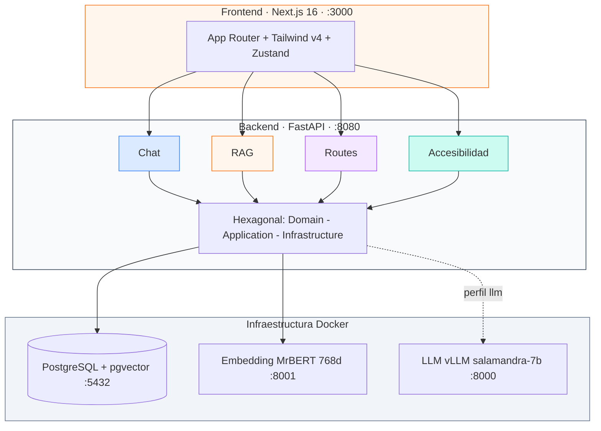
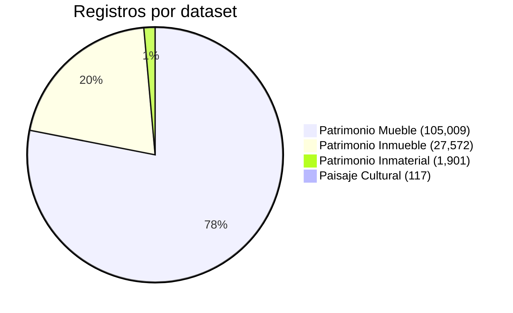
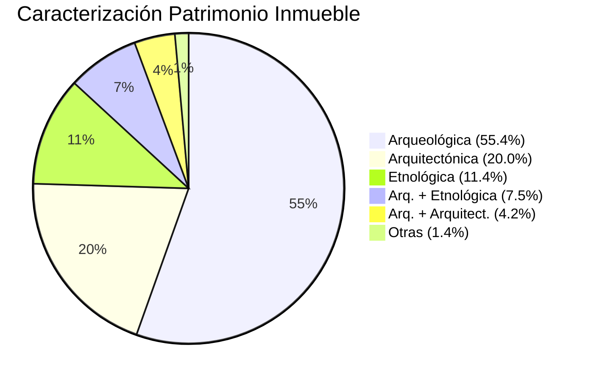
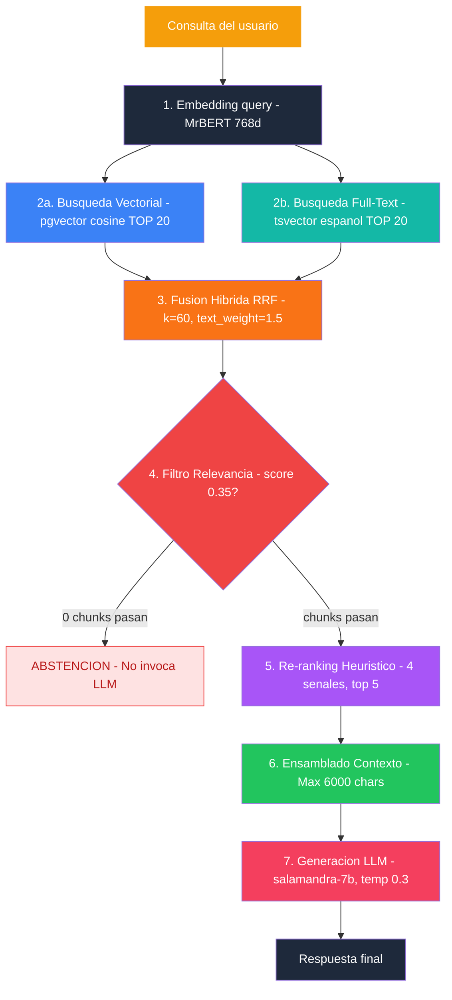
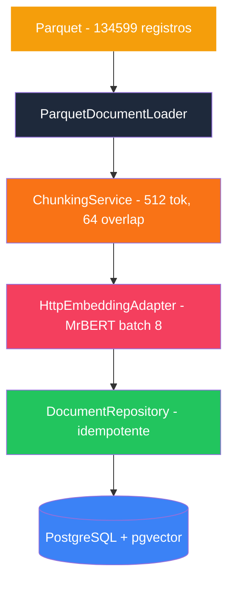
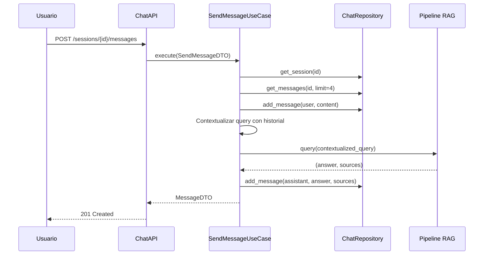
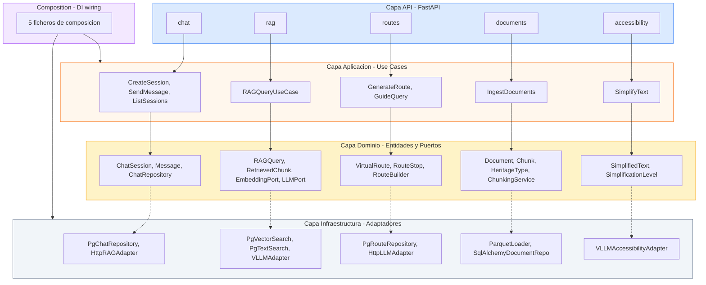

# Informe de Desarrollo 2026-03-13

**Proyecto:** Agente conversacional RAG — Instituto Andaluz de Patrimonio Histórico (IAPH)
**Encargo:** Universidad de Jaén
**Rama activa:** `develop` · Commit: `1d9081d`

---

## 1. Resumen ejecutivo

El sistema IAPH RAG es un agente conversacional de recuperación aumentada (RAG) que permite a los usuarios interactuar con el patrimonio histórico andaluz a través de tres casos de uso: **chat inteligente**, **rutas virtuales personalizadas** y **simplificación de textos** (Lectura Fácil). El backend sigue arquitectura hexagonal estricta sobre FastAPI, con búsqueda híbrida (vectorial + full-text) sobre PostgreSQL/pgvector.

| Métrica | Valor |
|---------|-------|
| Registros patrimoniales | **134,599** |
| Tokens totales del corpus | **~66M** |
| Bounded contexts implementados | **4** (Chat, RAG, Routes, Accessibility) |
| Endpoints API | **14** |
| Páginas frontend | **5** |
| Tests | **20** (unitarios) |

### Arquitectura general



### Distribución del corpus



---

## 2. Modelos de IA

### 2.1 Encoder — MrBERT

| Propiedad | Valor |
|-----------|-------|
| Modelo | `BSC-LT/MrBERT` |
| Arquitectura | ModernBERT |
| Parámetros | 308M |
| Contexto | 8,192 tokens |
| Dimensión embedding | **768** |
| Pooling | **Mean pooling** (promedio sobre todos los tokens, NO CLS) |
| Idiomas | 35 (incluye español) |
| Licencia | Apache 2.0 |
| Servicio | `POST /embed` → `:8001` |

### 2.2 Decoder — Salamandra

| Propiedad | Valor |
|-----------|-------|
| Modelo | `BSC-LT/salamandra-7b-instruct` |
| Parámetros | 7B |
| Serving | vLLM (API OpenAI-compatible) |
| Temperatura | 0.3 |
| Max tokens | 512 |
| Timeout | 120s (retry automático con tokens reducidos) |
| Servicio | `POST /v1/chat/completions` → `:8000` |
| Fine-tuning | **Pendiente** — en progreso |

---

## 3. Corpus de datos

### 3.1 Datasets (Parquet en `data/`)

| Dataset | Registros | Tokens | % del total | Columnas clave |
|---------|-----------|--------|-------------|----------------|
| Patrimonio Mueble | 105,009 | ~41M | 78.0% | `type`, `disciplines`, `styles`, `materials`, `techniques` |
| Patrimonio Inmueble | 27,572 | ~20M | 20.5% | `characterisation`, tipologías en HTML |
| Patrimonio Inmaterial | 1,901 | ~5M | 1.4% | `subject_topic`, `activity_types` |
| Paisaje Cultural | 117 | ~119K | 0.1% | `landscape_demarcation`, `topic`, `area` |
| **Total** | **134,599** | **~66M** | **100%** | |

### 3.2 Tipología del patrimonio

#### Patrimonio Inmueble — Caracterización (campo `characterisation`)



| Categoría | Registros | % |
|-----------|-----------|---|
| Arqueológica | 15,288 | 55.4% |
| Arquitectónica | 5,524 | 20.0% |
| Etnológica | 3,136 | 11.4% |
| Arquitectónica + Etnológica | 2,065 | 7.5% |
| Arqueológica + Arquitectónica | 1,167 | 4.2% |
| Otras | 392 | 1.4% |

#### Patrimonio Inmueble — Tipologías detalladas (extraídas de tablas HTML en `text`)

| Tipología | Registros |
|-----------|-----------|
| Asentamientos | 4,019 |
| Villae | 1,620 |
| Restos de artefactos | 782 |
| Cortijos | 695 |
| Construcciones funerarias | 618 |
| Poblados | 607 |
| Puentes | 591 |
| Castillos | 431 |
| Iglesias | 329 |
| Torres defensivas | 203 |

#### Patrimonio Mueble — Tipos (campo `type`, top 10 de 4,256 valores)

| Tipo | Registros |
|------|-----------|
| Pinturas de caballete | 9,341 |
| Esculturas de bulto redondo | 4,778 |
| Pinturas | 3,585 |
| Fotografías (Contemporánea) | 2,846 |
| Pinturas murales | 2,313 |
| Relieves | 2,257 |
| Retablos | 2,176 |
| Cálices | 1,261 |
| Altorrelieves | 1,062 |
| Azulejos | 1,002 |

#### Patrimonio Inmaterial — Temáticas (campo `subject_topic`)

| Temática | Registros |
|----------|-----------|
| Rituales festivos | 812 |
| Oficios y saberes | 567 |
| Modos de expresión | 292 |
| Alimentación y sistemas culinarios | 228 |

### 3.3 Distribución por provincia (Patrimonio Inmueble)

| Provincia | Registros | % |
|-----------|-----------|---|
| Sevilla | 5,983 | 21.7% |
| Jaén | 3,854 | 14.0% |
| Córdoba | 3,779 | 13.7% |
| Cádiz | 3,494 | 12.7% |
| Granada | 2,805 | 10.2% |
| Málaga | 2,584 | 9.4% |
| Almería | 2,357 | 8.5% |
| Huelva | 2,293 | 8.3% |

### 3.4 Georreferenciación

> **Estado: NO IMPLEMENTADA**

No hay coordenadas geográficas (lat/lon, UTM) en ningún campo estructurado de los parquets. La ubicación se resuelve únicamente por `province` + `municipality`. La ficha web de la Guía Digital IAPH (`guiadigital.iaph.es/bien/inmueble/{id}`) podría contener coordenadas, pero no se extrajeron en el scraping original. Hay ~270 registros con datos sucios (HTML mezclado) en campos de localización.

---

## 4. Pipeline RAG — Flujo completo



### 4.1 Ejemplo de ejecución

**Request:**

```json
POST /api/v1/rag/query
{
  "query": "Qué castillos hay en la provincia de Jaén?",
  "top_k": 5,
  "heritage_type_filter": "patrimonio_inmueble",
  "province_filter": "Jaén"
}
```

**Paso 2a — Búsqueda vectorial (SQL):**

```sql
SELECT id, document_id, title, heritage_type, province,
       municipality, url, content,
       embedding <=> :query_vec AS score
FROM document_chunks_v1
WHERE heritage_type = 'patrimonio_inmueble'
  AND province = 'Jaén'
ORDER BY score ASC
LIMIT 20
```

**Paso 2b — Búsqueda full-text (SQL):**

```sql
SELECT ...,
       ts_rank_cd(search_vector,
         plainto_tsquery('spanish', 'castillos provincia jaen')) AS score
FROM document_chunks_v1
WHERE search_vector @@ plainto_tsquery('spanish', 'castillos provincia jaen')
ORDER BY score DESC
LIMIT 20
```

**Paso 3 — RRF Fusion:**

```
Chunk #1 en ambas listas:
  vector_rrf  = 1.0 / (60 + 0 + 1) = 0.0164
  text_rrf    = 1.5 / (60 + 0 + 1) = 0.0246
  total_rrf   = 0.0410
  normalized  = 0.0  (mejor score posible)
```

**Paso 5 — Re-ranking (chunk con "Castillo" en título):**

```
base_score     = 1.0 - 0.0  = 1.0    × 0.4 = 0.40
title_match    = 1.0                  × 0.3 = 0.30
term_coverage  = 0.67 (2/3 terms)    × 0.2 = 0.13
position       = 0.5 (neutral)       × 0.1 = 0.05
final_score    = 0.88                 → top resultado
```

**Paso 6 — Contexto ensamblado:**

```
[1] Castillo de Baños de la Encina (patrimonio_inmueble, Jaén)
Fortaleza de origen califal del siglo X, construida en tapial sobre un cerro
que domina el valle del Rumblar. Declarada Monumento Nacional en 1931...
Fuente: https://guiadigital.iaph.es/bien/inmueble/12345
---
[2] Castillo de Santa Catalina (patrimonio_inmueble, Jaén)
...
```

**Response:**

```json
{
  "answer": "En la provincia de Jaén se encuentran varios castillos destacados. El Castillo de Baños de la Encina [1] es una fortaleza califal del siglo X...",
  "sources": [
    {"title": "Castillo de Baños de la Encina", "url": "...", "score": 0.12},
    {"title": "Castillo de Santa Catalina", "url": "...", "score": 0.18}
  ],
  "abstained": false
}
```

---

## 5. Pipeline de ingestión



### 5.1 Campos persistidos vs descartados

**Persistidos en BD:**

| Campo BD | Origen |
|----------|--------|
| `document_id` | ← `id` |
| `url` | ← `url` |
| `title` | ← `title` |
| `province` | ← `province` |
| `municipality` | ← `municipality` |
| `content` | ← `text` (fragmentado) |
| `heritage_type` | ← del dataset |
| `chunk_index` | ← de chunking |
| `token_count` | ← de chunking |
| `embedding` | ← MrBERT (768d) |
| `search_vector` | ← trigger PostgreSQL (tsvector) |

**Descartados en la ingestión:**

| Dataset | Campos descartados |
|---------|--------------------|
| Inmueble | `characterisation` |
| Mueble | `type`, `disciplines`, `styles`, `historic_periods`, `chronology`, `materials`, `techniques`, `property`, `dimensions` |
| Inmaterial | `subject_topic`, `activity_types`, `district`, `date`, `frequency` |
| Paisaje | `landscape_demarcation`, `topic`, `area` |

---

## 6. Heurísticas y algoritmos

### 6.1 Reciprocal Rank Fusion (RRF)

```
RRF(d) = Σ wᵢ / (k + rankᵢ(d) + 1)

k         = 60    // constante de suavizado
w_vector  = 1.0   // peso búsqueda vectorial
w_text    = 1.5   // peso búsqueda textual (+50%)
```

El peso extra en texto se justifica porque keywords exactas (ej. "castillo", "retablo") son señal fuerte en un dominio con terminología específica como el patrimonial.

### 6.2 Re-ranking heurístico

```
score(chunk) =
  0.4 × (1 - cosine_dist)         // base relevance
+ 0.3 × title_match(q, title)     // fracción query terms en título
+ 0.2 × coverage(q, content)      // fracción query terms en contenido
+ 0.1 × 0.5                       // posición (neutral, preparado para chunk_index)
```

Tokenización con 23 stopwords españoles + verbos conversacionales ("dame", "dime", "háblame", "cuéntame").

### 6.3 Filtro de relevancia

```
Si chunk.score ≤ 0.35 → pasa
Si chunk.score >  0.35 → descartado

Si len(filtered) == 0 → ABSTENCIÓN (no invoca LLM)
```

Patrón de abstención: si ningún chunk supera el umbral, el sistema responde con un mensaje fijo sin invocar al LLM, previniendo alucinaciones en queries fuera de dominio.

### 6.4 Chunking paragraph-aware

```
chunk_size    = 512 tokens
chunk_overlap = 64  tokens

1. Divide por párrafos (\n\n)
2. Si párrafo > 512 tokens → split por palabras
3. Solapamiento de 64 tokens en fronteras
4. Evita chunks finales diminutos
```

Los chunks se enriquecen con metadata antes de embeber: se prepende título + tipo + provincia + municipio al contenido, mejorando la relevancia semántica del embedding.

---

## 7. Prompts del sistema

### 7.1 RAG — System Prompt

```
Eres un asistente experto en patrimonio histórico andaluz del Instituto
Andaluz de Patrimonio Histórico (IAPH).

REGLAS ESTRICTAS:
1. Responde ÚNICAMENTE con información que aparece en el contexto proporcionado.
2. NUNCA inventes datos, fechas, ubicaciones ni atribuciones que no estén en el contexto.
3. Si la información para responder NO está en el contexto, di exactamente:
   'No dispongo de información suficiente en mis fuentes para responder a esta pregunta.'
4. Cita las fuentes usando el número de referencia [N] que aparece en el contexto.
5. Si el contexto contiene información parcial, indica explícitamente que es parcial.
6. Responde en español de forma clara y precisa.
7. No completes con conocimiento externo bajo ninguna circunstancia.
```

### 7.2 RAG — User Prompt Template

```
<contexto>
{context}
</contexto>

Pregunta: {query}

Responde basándote EXCLUSIVAMENTE en el contexto anterior.
Si no hay información relevante en el contexto, indícalo.

Respuesta:
```

### 7.3 Accesibilidad — Básico (Lectura Fácil, directrices ILSMH)

```
Eres un experto en Lectura Fácil siguiendo las directrices de ILSMH.
Simplifica el texto sobre patrimonio histórico para personas con discapacidad cognitiva.
Reglas estrictas:
- Frases cortas (máximo 15 palabras)
- Una idea por frase
- Vocabulario simple y cotidiano
- Evita metáforas, ironías y expresiones figuradas
- Usa voz activa siempre
- Estructura con párrafos muy cortos (2-3 frases)
- Si hay nombres propios difíciles, explícalos brevemente
```

### 7.4 Accesibilidad — Intermedio

```
Eres un experto en comunicación accesible sobre patrimonio histórico.
Simplifica el texto para que sea comprensible para un público amplio.
Reglas:
- Frases claras y directas (máximo 25 palabras)
- Vocabulario accesible; define términos técnicos brevemente
- Voz activa preferentemente
- Párrafos cortos
```

### 7.5 Rutas — System Prompt + Guía

```
Eres un experto guía turístico del patrimonio histórico andaluz del IAPH.
Genera rutas culturales personalizadas en español, detalladas y atractivas
para el visitante.
```

```
Eres un guía experto del patrimonio histórico andaluz.
Responde preguntas sobre la ruta y los elementos patrimoniales
en español, de forma cercana y detallada.
```

---

## 8. Bounded contexts y API

### 8.1 Chat — Conversaciones con historial

| Método | Endpoint | Descripción |
|--------|----------|-------------|
| `POST` | `/api/v1/chat/sessions` | Crear sesión |
| `GET` | `/api/v1/chat/sessions` | Listar sesiones |
| `PATCH` | `/api/v1/chat/sessions/{id}` | Renombrar sesión |
| `DELETE` | `/api/v1/chat/sessions/{id}` | Eliminar sesión |
| `GET` | `/api/v1/chat/sessions/{id}/messages` | Historial de mensajes |
| `POST` | `/api/v1/chat/sessions/{id}/messages` | Enviar mensaje → RAG → respuesta |

**Flujo:**



### 8.2 RAG — Consulta directa

| Método | Endpoint | Descripción |
|--------|----------|-------------|
| `POST` | `/api/v1/rag/query` | Ejecutar consulta RAG |

Endpoint directo al pipeline sin estado de sesión. Soporta filtros `heritage_type_filter` y `province_filter`.

### 8.3 Routes — Rutas virtuales de patrimonio

| Método | Endpoint | Descripción |
|--------|----------|-------------|
| `POST` | `/api/v1/routes/generate` | Generar ruta (provincia, paradas, tipos, intereses) |
| `GET` | `/api/v1/routes` | Listar rutas |
| `GET` | `/api/v1/routes/{id}` | Detalle de ruta |
| `POST` | `/api/v1/routes/{id}/guide` | Preguntar al guía sobre la ruta |

**Flujo de generación:**


**Modelo de parada:** `RouteStop(order, title, heritage_type, province, municipality, url, description, visit_duration_minutes)`

### 8.4 Accessibility — Lectura Fácil

| Método | Endpoint | Descripción |
|--------|----------|-------------|
| `POST` | `/api/v1/accessibility/simplify` | Simplificar texto |

Dos niveles: `basic` (máx 15 palabras/frase) e `intermediate` (máx 25). Servicio stateless (sin BD).

### 8.5 Documents — Ingestión

| Método | Endpoint | Descripción |
|--------|----------|-------------|
| `POST` | `/api/v1/documents/ingest` | Ingestar parquet |
| `GET` | `/api/v1/documents/chunks/{document_id}` | Ver chunks (debug) |

---

## 9. Arquitectura hexagonal



**Ficheros clave:**

| Capa | Ficheros |
|------|----------|
| API | `api/v1/endpoints/{context}/` — router, schemas, deps |
| Application | `application/{context}/use_cases/`, `dto/`, `services/` |
| Domain | `domain/{context}/entities/`, `ports/`, `services/`, `prompts.py` |
| Infrastructure | `infrastructure/{context}/adapters/`, `repositories/`, `models.py` |
| Composition | `composition/{context}_composition.py` |
| Core | `config.py`, `main.py`, `db/base.py`, `db/deps.py` |
```

---

## 10. Infraestructura Docker

| Servicio | Imagen | Puerto | GPU | Estado |
|----------|--------|--------|-----|--------|
| PostgreSQL + pgvector | `pgvector/pgvector:pg16` | 15432 → 5432 | No | Siempre activo |
| Embedding Service | Custom (MrBERT) | 18001 → 8001 | NVIDIA | Siempre activo |
| API (FastAPI) | Custom | 18080 → 8080 | No | Siempre activo |
| LLM Service (vLLM) | `vllm/vllm-openai` | 18000 → 8000 | NVIDIA | Perfil `llm` (opcional) |

### Migraciones Alembic

| # | Revisión | Descripción |
|---|----------|-------------|
| 1 | `ecfb8a0665c7` | Habilita extensión pgvector |
| 2 | `10ea8c52cb35` | Crea tablas: `document_chunks`, `virtual_routes`, `chat_sessions`, `chat_messages` |
| 3 | `ce98c0e62f84` | Añade columna `search_vector` (tsvector) + índice GIN + trigger auto-update |
| 4 | `ced3f5d3c1d8` | Versiona tabla: `document_chunks` → `document_chunks_v1` + crea `v2` |

---

## 11. Parámetros configurables

| Parámetro | Valor | Fichero | Propósito |
|-----------|-------|---------|-----------|
| `embedding_dim` | 768 | config.py | Dimensión MrBERT |
| `rag_top_k` | 3 | config.py | Chunks finales al usuario |
| `rag_retrieval_k` | 20 | config.py | Candidatos iniciales (pre-filtro) |
| `rag_score_threshold` | 0.35 | config.py | Umbral de relevancia |
| `rag_chunk_size` | 512 | config.py | Tokens por chunk |
| `rag_chunk_overlap` | 64 | config.py | Solapamiento entre chunks |
| `llm_temperature` | 0.3 | config.py | Creatividad (baja → más fiel) |
| `llm_max_tokens` | 512 | config.py | Longitud máxima respuesta |
| `rrf_k_param` | 60 | HybridSearchService | Constante RRF |
| `rrf_text_weight` | 1.5 | HybridSearchService | Peso extra búsqueda textual |
| `max_context_chars` | 6,000 | ContextAssemblyService | Budget contexto para LLM |
| `weight_base` | 0.4 | RerankingService | Peso score base |
| `weight_title` | 0.3 | RerankingService | Peso match en título |
| `weight_coverage` | 0.2 | RerankingService | Peso cobertura términos |
| `weight_position` | 0.1 | RerankingService | Peso señal posición |
| `chunks_table_version` | v1 | config.py | Versión tabla document_chunks |

---

## 12. Frontend

**Stack:** Next.js 16 (App Router) + TypeScript + Tailwind CSS v4 + Zustand + react-leaflet

| Ruta | Descripción | Estado |
|------|-------------|--------|
| `/` | Landing: hero, 3 feature cards, estadísticas del corpus | Completo |
| `/chat` | Chat con sidebar de sesiones, burbujas, fuentes | Completo |
| `/routes` | Formulario generación + listado de rutas | Completo |
| `/routes/[id]` | Detalle de ruta con paradas + guía interactivo | Completo |
| `/accessibility` | Simplificación de texto (Lectura Fácil) | Completo |

**Stores Zustand:**
- `useChatStore` — sessions[], activeSessionId, messages[], loading, sending. UI optimista, filtros heritage_type/province.
- `useRoutesStore` — routes[], activeRoute, loading, generating. Prepend de nuevas rutas.

**API Client** (`lib/api.ts`): tipado completo para todos los endpoints.

---

## 13. Tests

| Suite | Fichero | Tests | Cobertura |
|-------|---------|-------|-----------|
| Chunking domain | `tests/domain/test_chunking_service.py` | 12 | Init, empty, short/long, overlap, IDs |
| Documents API schemas | `tests/api/test_documents_schema.py` | 8 | Validación Pydantic |
| **Total** | | **20** | **Solo chunking + schemas** |

> ⚠️ Sin tests de integración, sin tests del pipeline RAG, sin tests de API endpoints, sin tests de frontend.

---

## 14. Gaps y próximos pasos

### Gaps críticos

| # | Gap | Impacto | Prioridad |
|---|-----|---------|-----------|
| G1 | **Sin georreferenciación** — no hay lat/lon en datos | Rutas sin mapa, react-leaflet sin uso | **Alta** |
| G2 | **Tipología no filtrable** — campos ricos descartados en ingestión | No se puede filtrar por "castillos" o "pinturas de caballete" | **Alta** |
| G3 | **Datos sucios** — ~270 registros con HTML/metadata en province/municipality | Filtros de búsqueda pueden fallar | Media |
| G4 | **Tests mínimos** — solo 20 tests unitarios | Sin confianza en cambios | Media |
| G5 | **LLM sin fine-tuning** — salamandra base sin ajuste al dominio IAPH | Calidad de respuesta limitada | Media |

### Funcionalidades pendientes

| Feature | Descripción | Estado |
|---------|-------------|--------|
| Mapa interactivo | Visualización de rutas y patrimonio con react-leaflet | Bloqueado (sin datos geo) |
| Caso de uso #2 | Por definir | No iniciado |
| Caso de uso #3 | Por definir | No iniciado |
| Fine-tuning Salamandra | Ajuste del LLM al dominio IAPH | En progreso |

---

## 15. Comandos de referencia rápida

```bash
# Desde la raíz del monorepo
make dev              # Todo: infra + API + frontend
make backend          # Solo backend (infra + FastAPI)
make frontend         # Solo Next.js (:3000)
make infra            # Solo postgres + embedding
make infra-llm        # Todo incluyendo LLM (requiere GPU)
make infra-down       # Parar todos los servicios Docker
make migrate          # Aplicar migraciones Alembic
make test             # Ejecutar tests (pytest)
make lint             # Ruff check en src/

# Desde backend/
make ingest           # Ingestar los 4 datasets de patrimonio
make migrate-new MSG="descripcion"  # Nueva migración
```

---

*Informe generado automáticamente — Revisión del repositorio en rama `develop`, commit `1d9081d` — 2026-03-13*
